# Santos e Beatos

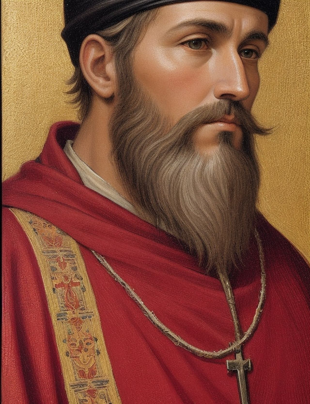

Bem-vindo ao repositório "Santos e Beatos: Preservação da História e Inspiração".

Este projeto tem como objetivo preservar a rica história dos santos e beatos da Igreja Católica e proporcionar uma fonte de inspiração. Aqui, você encontrará uma coleção de imagens antigas, restauradas e colorizadas artificialmente, que mantêm viva a narrativa espiritual e cultural da Igreja Católica.

## Você encontrará

1. **Preservação da História:** Nosso objetivo é preservar a história e a herança espiritual dos santos e beatos da Igreja Católica. Apresentamos imagens históricas que capturam a essência de figuras veneradas ao longo dos séculos.

2. **Inspiração:** As vidas e as histórias dos santos e beatos servem como fonte de inspiração para muitos. Este repositório é um lugar onde você pode se inspirar na devoção, na coragem e na espiritualidade desses notáveis indivíduos.

3. **Imagens Restauradas:** Nossas imagens restauradas são cuidadosamente tratadas para remover imperfeições, manchas e danos, permitindo que a pureza original desses retratos brilhe novamente.

4. **Colorizações Artificiais:** Além das restaurações, você encontrará versões colorizadas artificialmente que trazem à vida esses retratos com cores vibrantes.

5. **Contribuições da Comunidade:** Este é um espaço aberto para colaboração. Se você tem interesse em contribuir com suas próprias restaurações, colorizações, histórias ou imagens de santos e beatos da Igreja Católica, sinta-se à vontade para fazer parte deste projeto.

6. **Contexto Histórico e Espiritual:** Cada imagem é acompanhada de informações históricas e contextuais, permitindo uma apreciação mais profunda da importância desses santos e beatos na tradição católica.

Junte-se a nós nesta jornada de preservação histórica e inspiração espiritual. Explore, colabore e celebre a rica herança visual da Igreja Católica por meio desta coleção de imagens restauradas e colorizadas.

**Contribuições são bem-vindas!**

## Como executar o projeto

Este projeto utiliza [VitePress](https://vitepress.dev/) para gerar a documentação.

### Pré-requisitos
- Node.js instalado (versão 18 ou superior recomendada)

### Instalação
Instale as dependências do projeto:
```bash
npm install
```

### Rodando localmente
Para iniciar o servidor de desenvolvimento:
```bash
npm run docs:dev
```
O site estará disponível em `http://localhost:5173`.

### Construindo para produção
Para gerar os arquivos estáticos:
```bash
npm run docs:build
```
Para visualizar a versão de produção localmente:
```bash
npm run docs:preview
```

## Lista de Santos e Beatos

| Nome | Imagem |
| --- | --- |
| [Alexandrina de Balasar](docs/beatos/alexandrina-de-balasar/index.md) |  |
| [Beata Albertina Berkenbrock](docs/beatos/beata-albertina-berkenbrock/index.md) |  |
| [Beata Assunta Marchetti](docs/beatos/beata-assunta-marchetti/index.md) |  |
| [Beata Benigna](docs/beatos/beata-benigna/index.md) |  |
| [Beata Chiara Luce Badano](docs/beatos/beata-chiara-luce-badano/index.md) |  |
| [Beata Elena Guerra](docs/beatos/beata-elena-guerra/index.md) |  |
| [Beata Isabel Cristina](docs/beatos/beata-isabel-cristina/index.md) |  |
| [Beata Laura Vicuña](docs/beatos/beata-laura-vicuna/index.md) | 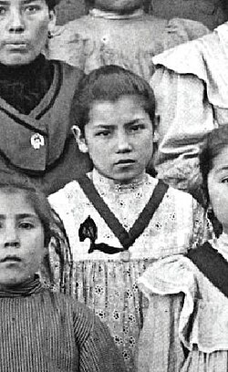 |
| [Beata Lindalva Justo de Oliveira](docs/beatos/beata-lindalva-justo-de-oliveira/index.md) |  |
| [Beata Maria da Conceição](docs/beatos/beata-maria-da-conceicao/index.md) |  |
| [Beata Maria Gabriela da Unidade](docs/beatos/beata-maria-gabriela-da-unidade/index.md) |  |
| [Beata Maria Troncatti](docs/beatos/beata-maria-troncatti/index.md) |  |
| [Beata Sandra Sabattini](docs/beatos/beata-sandra-sabattini/index.md) |  |
| [Beato Miguel Pro](docs/beatos/beato-miguel-pro/index.md) |  |
| [Beato Adílio Daronch](docs/beatos/beato-adilio-daronch/index.md) |  |
| [Beato Álvaro del Portillo](docs/beatos/beato-alvaro-del-portillo/index.md) |  |
| [Beato Franz Jägerstätter](docs/beatos/beato-franz-jagerstatter/index.md) |  |
| [Beato Frederico Ozanam](docs/beatos/beato-frederico-ozanam/index.md) |  |
| [Beato João Paulo I](docs/beatos/beato-joao-paulo-i/index.md) |  |
| [Beato José Gregorio Hernández](docs/beatos/beato-jose-gregorio-hernandez/index.md) |  |
| [Beato Manuel Lozano Garrido](docs/beatos/beato-manuel-lozano-garrido/index.md) |  |
| [Beato Marcel Callo](docs/beatos/beato-marcel-callo/index.md) |  |
| [Beato Mariano de la Mata](docs/beatos/beato-mariano-de-la-mata/index.md) |  |
| [Beato Padre Eustáquio](docs/beatos/beato-padre-eustaquio/index.md) |  |
| [Beato Pier Giorgio Frassati](docs/beatos/pier-giorgio-frassati/index.md) | 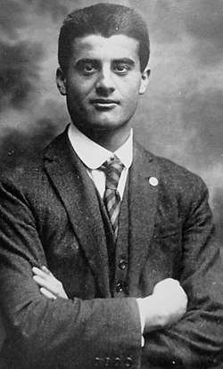 |
| [Beato Rolando Rivi](docs/beatos/beato-rolando-rivi/index.md) |  |
| [Beato Tiago Alberione](docs/beatos/beato-tiago-alberione/index.md) |  |
| [Beato Zeferino Namuncurá](docs/beatos/beato-zeferino-namuncura/index.md) |  |
| [Nhá Chica](docs/beatos/nha-chica/index.md) | 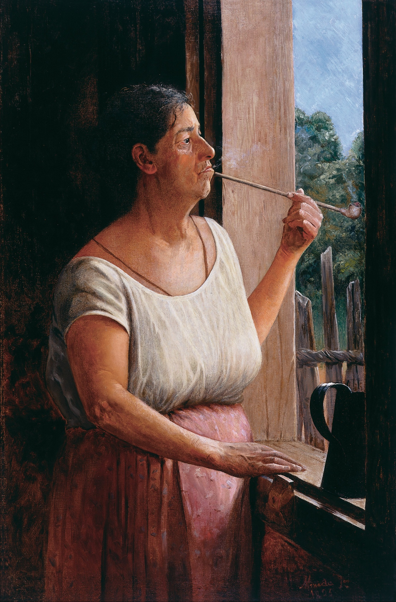 |
| [Padre Donizetti](docs/beatos/padre-donizetti/index.md) |  |
| [Padre Victor](docs/beatos/padre-victor/index.md) | 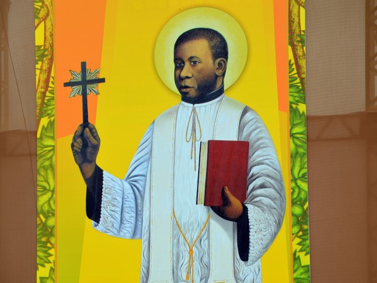 |
| [Santa Inês](docs/santos/santa-ines/index.md) |  |
| [Santa Maria Madalena](docs/santos/santa-maria-madalena/index.md) |  |
| [Santa Dulce dos Pobres](docs/santos/santa-dulce-dos-pobres/index.md) |  |
| [Santa Faustina Kowalska](docs/santos/santa-faustina-kowalska/index.md) | 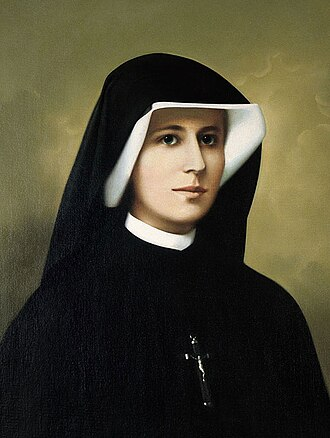 |
| [Santa Rita de Cássia](docs/santos/santa-rita-de-cassia/index.md) | 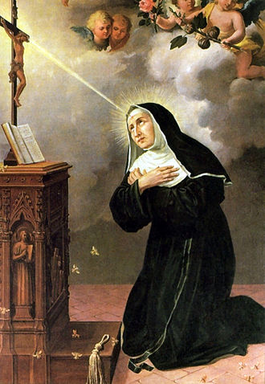 |
| [Santa Teresinha do Menino Jesus](docs/santos/santa-teresinha-do-menino-jesus/index.md) |  |
| [Santo André](docs/santos/santo-andre/index.md) |  |
| [Santo Antônio de Pádua](docs/santos/santo-antonio/index.md) | 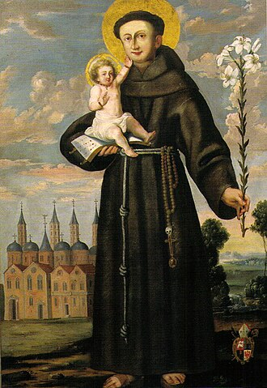 |
| [São Bartolomeu](docs/santos/sao-bartolomeu/index.md) |  |
| [São Carlo Acutis](docs/santos/carlo-acutis/index.md) | 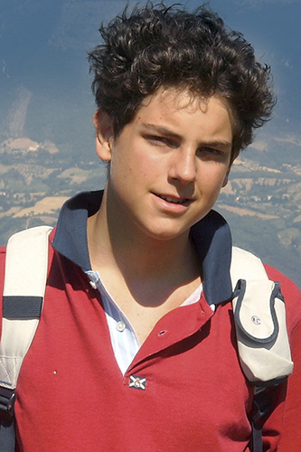 |
| [São Estevão](docs/santos/sao-estevao/index.md) |  |
| [São Filipe](docs/santos/sao-filipe/index.md) |  |
| [São Filipe Neri](docs/santos/sao-filipe-neri/index.md) |  |
| [São Francisco de Assis](docs/santos/sao-francisco-de-assis/index.md) |  |
| [São Geraldo Majella](docs/santos/sao-geraldo-majella/index.md) |  |
| [São João Bosco](docs/santos/sao-joao-bosco/index.md) | 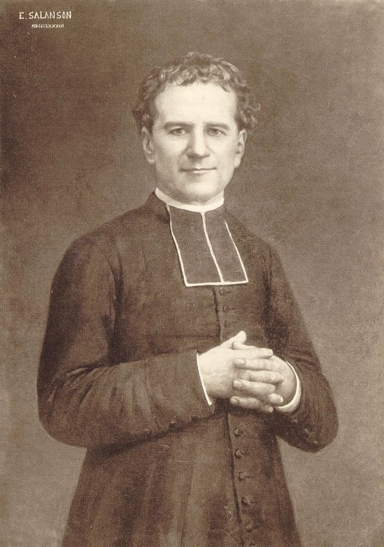 |
| [São João Evangelista](docs/santos/sao-joao-evangelista/index.md) |  |
| [São Jorge](docs/santos/sao-jorge/index.md) |  |
| [São Judas Tadeu](docs/santos/sao-judas-tadeu/index.md) |  |
| [São Lourenço](docs/santos/sao-lourenco/index.md) |  |
| [São Lucas](docs/santos/sao-lucas/index.md) |  |
| [São Marcos](docs/santos/sao-marcos/index.md) |  |
| [São Martinho de Lima](docs/santos/sao-martinho-de-lima/index.md) |  |
| [São Mateus](docs/santos/sao-mateus/index.md) |  |
| [São Matias](docs/santos/sao-matias/index.md) |  |
| [São Maximiliano Kolbe](docs/santos/sao-maximiliano-kolbe/index.md) | 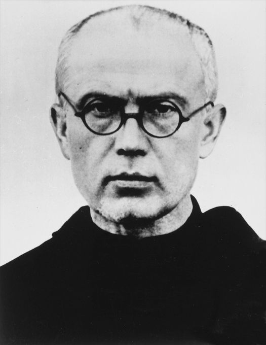 |
| [São Padre Pio](docs/santos/sao-padre-pio/index.md) |  |
| [São Paulo](docs/santos/sao-paulo/index.md) |  |
| [São Pedro](docs/santos/sao-pedro/index.md) |  |
| [São Sebastião](docs/santos/sao-sebastiao/index.md) |  |
| [São Simão](docs/santos/sao-simao/index.md) |  |
| [São Tiago Maior](docs/santos/sao-tiago-maior/index.md) |  |
| [São Tiago Menor](docs/santos/sao-tiago-menor/index.md) |  |
| [São Tomé](docs/santos/sao-tome/index.md) |  |
