# Santos e Beatos da Igreja Católica

Biografias, imagens, milagres e mapas de santos e beatos da Igreja Católica, publicadas como site estático com [VitePress](https://vitepress.dev/).

## Conteúdo

- **163 santos** em [`docs/santos/`](docs/santos/index.md)
- **147 beatos** em [`docs/beatos/`](docs/beatos/index.md)

Cada entrada inclui biografia, contexto histórico, imagens (retrato/capa) e, quando aplicável, mapas de nascimento, morte e milagres.

## Como executar

Pré-requisitos: Node.js 18+.

```bash
npm install
```

Servidor de desenvolvimento:

```bash
npm run docs:dev
```

Site disponível em `http://localhost:5173`.

Build de produção:

```bash
npm run docs:build
npm run docs:preview
```

## Scripts de conteúdo

| Script | Descrição |
| --- | --- |
| `npm test` | Verifica integridade do conteúdo (`scripts/verificar-conteudo.mjs`) |
| `npm run conteudo:indices` | Gera índices de santos e beatos (`scripts/gerar-indices.mjs`) |
| `npm run conteudo:retratos` | Gera retratos SVG (`scripts/gerar-retratos.mjs`) |

## Estrutura

```
docs/
  santos/          # páginas dos santos
  beatos/          # páginas dos beatos
  .vitepress/      # configuração e componentes do site
scripts/           # scripts de verificação e geração de conteúdo
```

## Contribuições

Para adicionar ou corrigir uma entrada, crie/edite a página em `docs/santos/` ou `docs/beatos/`, adicione as imagens em `imagens/` e rode `npm test` para validar.

## Lista de Santos e Beatos

São 172 beatos e 187 santos catalogados.

| Nome | Imagem |
| --- | --- |
| [Beato Adílio Daronch](docs/beatos/beato-adilio-daronch/index.md) | 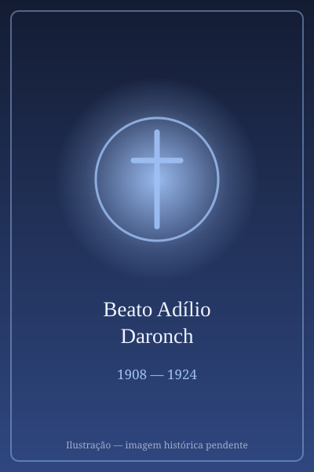 |
| [Beato Agostinho Kazotić](docs/beatos/beato-agostinho-kazotic/index.md) |  |
| [Beato Alano de la Roche](docs/beatos/beato-alano-de-la-roche/index.md) |  |
| [Beata Albertina Berkenbrock](docs/beatos/beata-albertina-berkenbrock/index.md) | 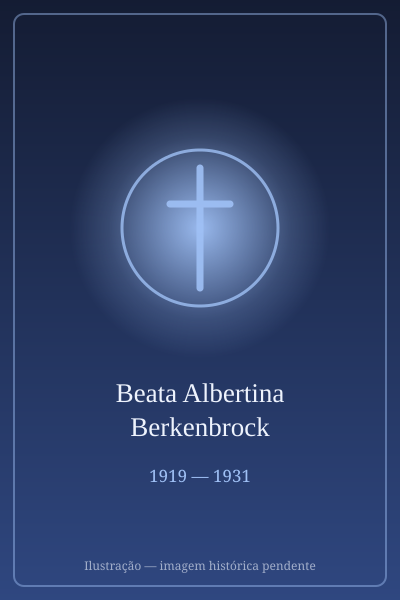 |
| [Beato Alberto Marvelli](docs/beatos/beato-alberto-marvelli/index.md) |  |
| [Beata Alexandrina de Balasar](docs/beatos/alexandrina-de-balasar/index.md) | 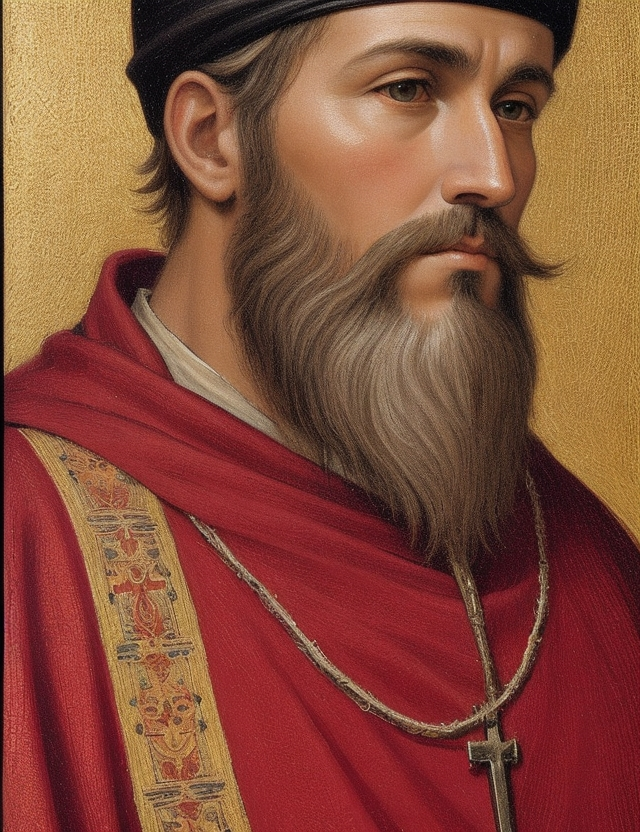 |
| [Beato Alojzije Stepinac](docs/beatos/beato-alojzije-stepinac/index.md) |  |
| [Beato Álvaro del Portillo](docs/beatos/beato-alvaro-del-portillo/index.md) | 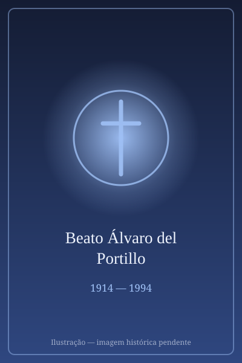 |
| [Beata Ana Catarina Emmerich](docs/beatos/beata-ana-catarina-emmerich/index.md) |  |
| [Beata Ana de Jesus](docs/beatos/beata-ana-de-jesus/index.md) | 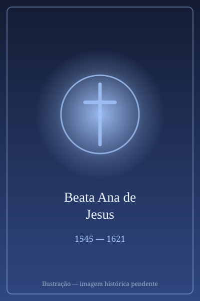 |
| [Beata Ana de São Bartolomeu](docs/beatos/beata-ana-de-sao-bartolomeu/index.md) |  |
| [Beata Ana dos Anjos Monteagudo](docs/beatos/beata-ana-dos-anjos-monteagudo/index.md) |  |
| [Beato Anacleto González Flores](docs/beatos/beato-anacleto-gonzalez-flores/index.md) |  |
| [Beata Anna Kolesárová](docs/beatos/beata-anna-kolesarova/index.md) |  |
| [Beata Anna Maria Taigi](docs/beatos/beata-anna-maria-taigi/index.md) | 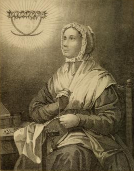 |
| [Beata Anna Rosa Gattorno](docs/beatos/beata-anna-rosa-gattorno/index.md) |  |
| [Beata Antônia Mesina](docs/beatos/beata-antonia-mesina/index.md) |  |
| [Venerável Antonietta Meo (Nennolina)](docs/beatos/beata-antonieta-meo/index.md) |  |
| [Beato Antônio Chevrier](docs/beatos/beato-antonio-chevrier/index.md) |  |
| [Beato Antônio de Categeró](docs/beatos/beato-antonio-de-categero/index.md) |  |
| [Beato Antônio Frederico Ozanam](docs/beatos/beato-antonio-frederico-ozanam/index.md) |  |
| [Beato Antonio Rosmini](docs/beatos/beato-antonio-rosmini/index.md) | 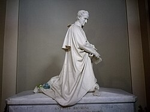 |
| [Beata Anuarite Nengapeta](docs/beatos/beata-anuarite-nengapeta/index.md) |  |
| [Beata Armida Barelli](docs/beatos/beata-armida-barelli/index.md) |  |
| [Beata Assunta Marchetti](docs/beatos/beata-assunta-marchetti/index.md) | 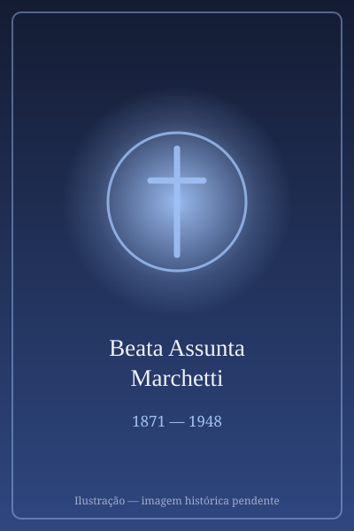 |
| [Beato Augusto Czartoryski](docs/beatos/beato-augusto-czartoryski/index.md) |  |
| [Beata Bárbara Maix](docs/beatos/beata-barbara-maix/index.md) |  |
| [Beata Benedetta Bianchi Porro](docs/beatos/beata-benedetta-bianchi-porro/index.md) |  |
| [Beata Benedita Cambiagio](docs/beatos/beata-benedita-cambiagio/index.md) |  |
| [Beata Benigna](docs/beatos/beata-benigna/index.md) |  |
| [Beato Bernardo de Hoyos](docs/beatos/beato-bernardo-de-hoyos/index.md) |  |
| [Beato Carlo Gnocchi](docs/beatos/beato-carlo-gnocchi/index.md) | 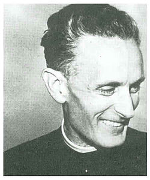 |
| [Beato Carlo Steeb](docs/beatos/beato-carlo-steeb/index.md) |  |
| [Beato Carlos da Áustria](docs/beatos/beato-carlos-da-austria/index.md) |  |
| [Beato Carlos Manuel Rodríguez Santiago](docs/beatos/beato-carlos-manuel/index.md) |  |
| [Beata Catarina de Santo Agostinho](docs/beatos/beata-catarina-de-santo-agostinho/index.md) |  |
| [Beata Catarina Troiani](docs/beatos/beata-catarina-troiani/index.md) |  |
| [Beato Ceferino Giménez Malla](docs/beatos/beato-ceferino-gimenez-malla/index.md) |  |
| [Beata Chiara Luce Badano](docs/beatos/beata-chiara-luce-badano/index.md) |  |
| [Beata Chiquitunga](docs/beatos/beata-chiquitunga/index.md) | 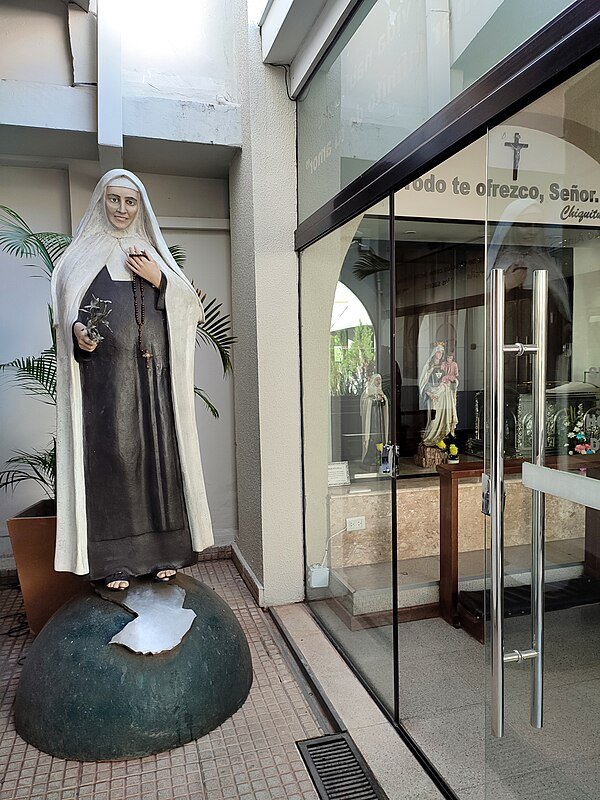 |
| [Beato Cláudio Granzotto](docs/beatos/beato-claudio-granzotto/index.md) |  |
| [Beata Clélia Merloni](docs/beatos/beata-clelia-merloni/index.md) | 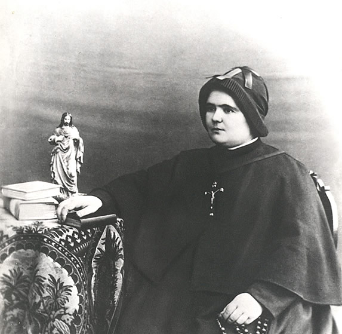 |
| [Beato Clemente August von Galen](docs/beatos/beato-clemente-august-von-galen/index.md) |  |
| [Beato Clemente Marchisio](docs/beatos/beato-clemente-marchisio/index.md) |  |
| [Beato Columba Marmion](docs/beatos/beato-columba-marmion/index.md) |  |
| [Beata Concepción Cabrera de Armida (Conchita)](docs/beatos/beata-maria-da-conceicao/index.md) | 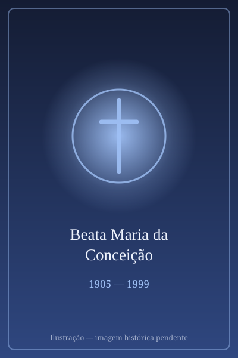 |
| [Beato Contardo Ferrini](docs/beatos/beato-contardo-ferrini/index.md) |  |
| [Beato Crispino de Viterbo](docs/beatos/beato-crispino-de-viterbo/index.md) |  |
| [Beata Dina Bélanger](docs/beatos/beata-dina-belanger/index.md) |  |
| [Beato Diogo José de Cádis](docs/beatos/beato-diogo-jose-de-cadiz/index.md) |  |
| [Beato Domingos da Mãe de Deus](docs/beatos/beato-domingos-da-mae-de-deus/index.md) |  |
| [Beata Edel Quinn](docs/beatos/beata-edel-quinn/index.md) |  |
| [Beato Edmundo Rice](docs/beatos/beato-edmundo-rice/index.md) |  |
| [Beato Eduardo Pironio](docs/beatos/beato-eduardo-pironio/index.md) |  |
| [Beata Edviges Carboni](docs/beatos/beata-edviges-carboni/index.md) |  |
| [Beata Elena Aiello](docs/beatos/beata-elena-aiello/index.md) |  |
| [Beata Elisabetta Canori Mora](docs/beatos/beata-elisabetta-canori-mora/index.md) |  |
| [Beato Estêvão Sándor](docs/beatos/beato-estevao-sandor/index.md) |  |
| [Beata Eurosia Fabris](docs/beatos/beata-eurosia-fabris/index.md) |  |
| [Beata Eusébia Palomino Yenes](docs/beatos/beata-eusebia-palomino-yenes/index.md) |  |
| [Beato Filipe Rinaldi](docs/beatos/beato-filipe-rinaldi/index.md) |  |
| [Beato Fra Angelico (João de Fiesole)](docs/beatos/beato-fra-angelico/index.md) | 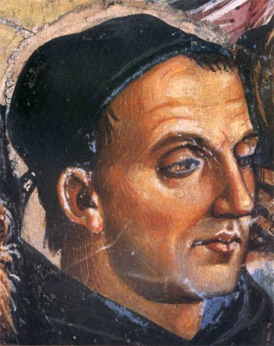 |
| [Beato Francisco Gárate](docs/beatos/beato-francisco-garate/index.md) |  |
| [Beato Francisco Jordan](docs/beatos/beato-francisco-jordan/index.md) |  |
| [Beato Francisco Palau](docs/beatos/beato-francisco-palau/index.md) |  |
| [Beato Francisco Xavier Seelos](docs/beatos/beato-francisco-xavier-seelos/index.md) |  |
| [Beato Franz Jägerstätter](docs/beatos/beato-franz-jagerstatter/index.md) |  |
| [Beato Giuseppe Toniolo](docs/beatos/beato-giuseppe-toniolo/index.md) |  |
| [Beato Gonçalo de Amarante](docs/beatos/beato-goncalo-de-amarante/index.md) | 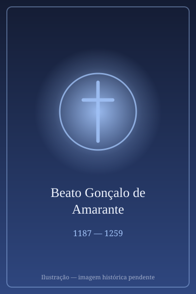 |
| [Beata Guadalupe Ortiz de Landázuri](docs/beatos/beata-guadalupe-ortiz-de-landazuri/index.md) |  |
| [Beato Guido de Montpellier](docs/beatos/beato-guido-de-montpellier/index.md) |  |
| [Beato Guilherme José Chaminade](docs/beatos/beato-guilherme-jose-chaminade/index.md) |  |
| [Beato Henrique Suso](docs/beatos/beato-henrique-suso/index.md) |  |
| [Beato Ildefonso Schuster](docs/beatos/beato-ildefonso-schuster/index.md) |  |
| [Beata Imelda Lambertini](docs/beatos/beata-imelda-lambertini/index.md) |  |
| [Beato Inácio de Azevedo](docs/beatos/beato-inacio-de-azevedo/index.md) |  |
| [Beato Inácio Maloyan](docs/beatos/beato-inacio-maloyan/index.md) | 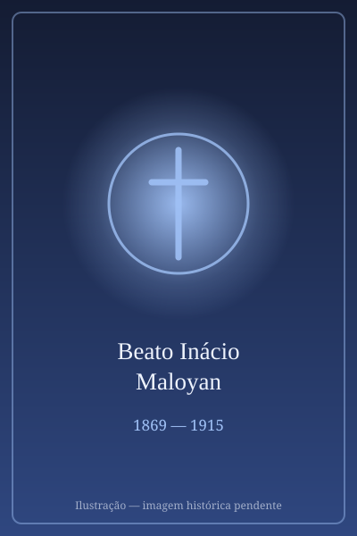 |
| [Beato Inocêncio V](docs/beatos/beato-inocencio-v/index.md) |  |
| [Beato Inocêncio XI](docs/beatos/beato-inocencio-xi/index.md) |  |
| [Beata Isabel Cristina](docs/beatos/beata-isabel-cristina/index.md) |  |
| [Beato Isidoro Bakanja](docs/beatos/beato-isidoro-bakanja/index.md) | 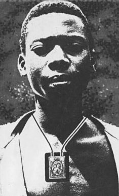 |
| [Beato Ivan Merz](docs/beatos/beato-ivan-merz/index.md) |  |
| [Beato Jacinto Vera](docs/beatos/beato-jacinto-vera/index.md) |  |
| [Beato Jerzy Popiełuszko](docs/beatos/beato-jerzy-popieluszko/index.md) |  |
| [Beato Joan Roig i Diggle](docs/beatos/beato-joan-roig-i-diggle/index.md) |  |
| [Beata Joana de Portugal](docs/beatos/beata-joana-de-portugal/index.md) |  |
| [Beato João Baptista Machado](docs/beatos/beato-joao-baptista-machado/index.md) |  |
| [Beato João Duns Scotus](docs/beatos/beato-joao-duns-scotus/index.md) |  |
| [Beato João Paulo I](docs/beatos/beato-joao-paulo-i/index.md) | 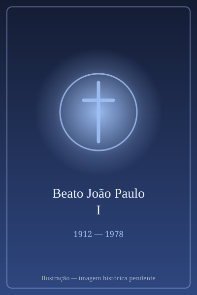 |
| [Beato João Schiavo](docs/beatos/beato-joao-schiavo/index.md) |  |
| [Beato Jordão da Saxônia](docs/beatos/beato-jordao-da-saxonia/index.md) | 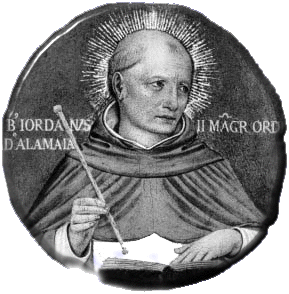 |
| [Beato José Gregório Hernández](docs/beatos/beato-jose-gregorio-hernandez/index.md) |  |
| [Beato Justo Takayama Ukon](docs/beatos/beato-justo-takayama-ukon/index.md) |  |
| [Beato Karl Leisner](docs/beatos/beato-karl-leisner/index.md) |  |
| [Beata Karolina Kózka](docs/beatos/beata-karolina-kozka/index.md) |  |
| [Beata Laura Vicuña](docs/beatos/beata-laura-vicuna/index.md) | 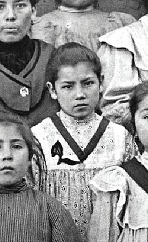 |
| [Beata Lindalva Justo de Oliveira](docs/beatos/beata-lindalva-justo-de-oliveira/index.md) | 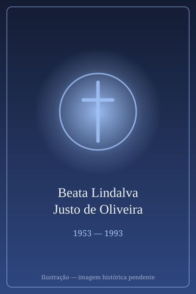 |
| [Beato Lojze Grozde](docs/beatos/beato-lojze-grozde/index.md) |  |
| [Beato Luca Belludi](docs/beatos/beato-luca-belludi/index.md) |  |
| [Beato Luca Passi](docs/beatos/beato-luca-passi/index.md) |  |
| [Beato Luigi Beltrame Quattrocchi](docs/beatos/beato-luigi-beltrame-quattrocchi/index.md) |  |
| [Beato Luigi Maria Monti](docs/beatos/beato-luigi-maria-monti/index.md) |  |
| [Beato Luigi Monza](docs/beatos/beato-luigi-monza/index.md) |  |
| [Beato Luigi Novarese](docs/beatos/beato-luigi-novarese/index.md) |  |
| [Beato Luigi Tezza](docs/beatos/beato-luigi-tezza/index.md) |  |
| [Beato Luis Variara](docs/beatos/beato-luis-variara/index.md) |  |
| [Beata Madre Esperança de Jesus](docs/beatos/beata-madre-esperanca-de-jesus/index.md) |  |
| [Beata Mafalda de Portugal](docs/beatos/beata-mafalda-de-portugal/index.md) |  |
| [Beato Manuel Gómez González](docs/beatos/beato-manuel-gomez-gonzalez/index.md) |  |
| [Beato Manuel Lozano Garrido](docs/beatos/beato-manuel-lozano-garrido/index.md) |  |
| [Beato Marcel Callo](docs/beatos/beato-marcel-callo/index.md) |  |
| [Beato Marcos de Aviano](docs/beatos/beato-marcos-de-aviano/index.md) |  |
| [Beata Maria Assunta Pallotta](docs/beatos/beata-maria-assunta-pallotta/index.md) |  |
| [Beata Maria Bolognesi](docs/beatos/beata-maria-bolognesi/index.md) |  |
| [Beata Maria Cândida da Eucaristia](docs/beatos/beata-maria-candida-da-eucaristia/index.md) |  |
| [Beata Maria Celeste Crostarosa](docs/beatos/beata-maria-celeste-crostarosa/index.md) |  |
| [Beata Maria Clara do Menino Jesus](docs/beatos/beata-maria-clara-do-menino-jesus/index.md) |  |
| [Beata Maria Cristina de Saboia](docs/beatos/beata-maria-cristina-de-saboia/index.md) |  |
| [Beata Maria da Paixão](docs/beatos/beata-maria-da-paixao/index.md) |  |
| [Beata Maria de San José Alvarado](docs/beatos/beata-maria-de-san-jose-alvarado/index.md) |  |
| [Beata Maria do Divino Coração](docs/beatos/beata-maria-do-divino-coracao/index.md) | 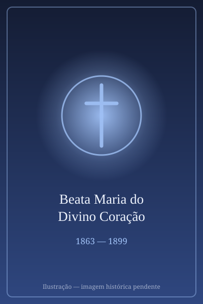 |
| [Beata Maria Gabriela da Unidade](docs/beatos/beata-maria-gabriela-da-unidade/index.md) |  |
| [Beata Maria Laura Mainetti](docs/beatos/beata-maria-laura-mainetti/index.md) |  |
| [Beata Maria Pierina De Micheli](docs/beatos/beata-maria-pierina-de-micheli/index.md) |  |
| [Beata Maria Repetto](docs/beatos/beata-maria-repetto/index.md) |  |
| [Beata Maria Romero Meneses](docs/beatos/beata-maria-romero-meneses/index.md) |  |
| [Beata Maria Teresa de São José](docs/beatos/beata-maria-teresa-de-sao-jose/index.md) |  |
| [Beata Maria Teresa Ledóchowska](docs/beatos/beata-maria-teresa-ledochowska/index.md) |  |
| [Beata Mariana de Jesus](docs/beatos/beata-mariana-de-jesus/index.md) | 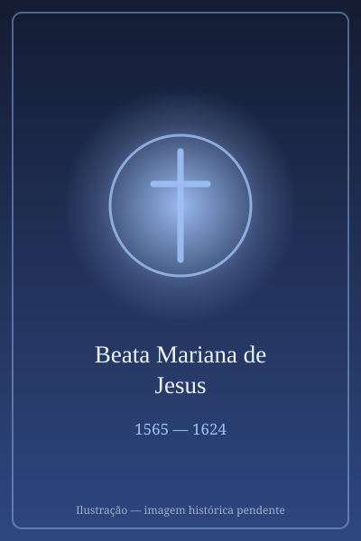 |
| [Beato Mariano de la Mata](docs/beatos/beato-mariano-de-la-mata/index.md) | 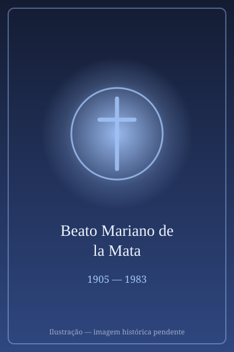 |
| [Beata Marta Le Bouteiller](docs/beatos/beata-marta-le-bouteiller/index.md) |  |
| [Beato Maurício Tornay](docs/beatos/beato-mauricio-tornay/index.md) | 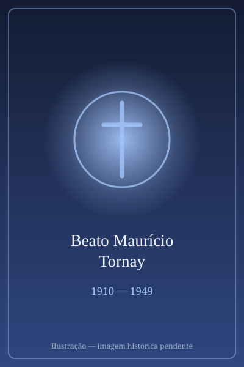 |
| [Beato Michael McGivney](docs/beatos/beato-michael-mcgivney/index.md) |  |
| [Beato Miguel Pro](docs/beatos/beato-miguel-pro/index.md) |  |
| [Beato Miguel Rua](docs/beatos/beato-miguel-rua/index.md) |  |
| [Beato Miguel Sopoćko](docs/beatos/beato-miguel-sopocko/index.md) |  |
| [Beato Miroslav Bulešić](docs/beatos/beato-miroslav-bulesic/index.md) | 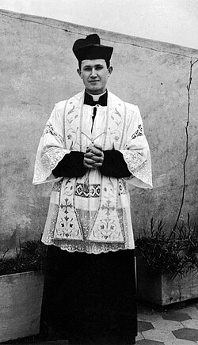 |
| [Beato Moisés Lira](docs/beatos/beato-moises-lira/index.md) | 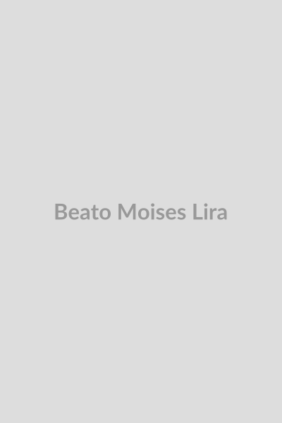 |
| [Beata Nhá Chica](docs/beatos/nha-chica/index.md) | 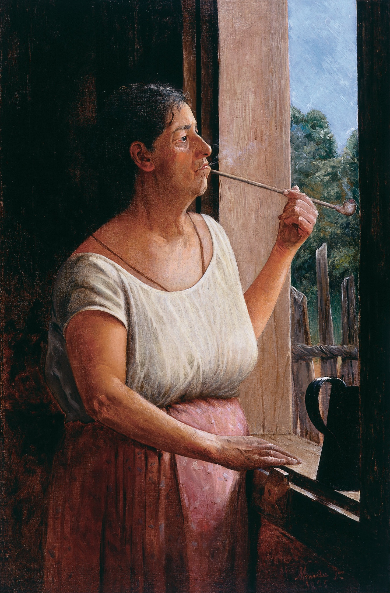 |
| [Venerável Nicola D'Onofrio](docs/beatos/beato-nicola-donofrio/index.md) |  |
| [Beato Nicolau Steno](docs/beatos/beato-nicolau-steno/index.md) |  |
| [Beato Odoardo Focherini](docs/beatos/beato-odoardo-focherini/index.md) |  |
| [Padre Donizetti Tavares de Lima](docs/beatos/padre-donizetti/index.md) |  |
| [Beato Padre Eustáquio](docs/beatos/beato-padre-eustaquio/index.md) | 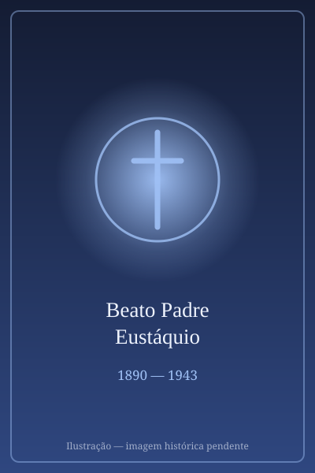 |
| [Beato Padre Victor](docs/beatos/padre-victor/index.md) | 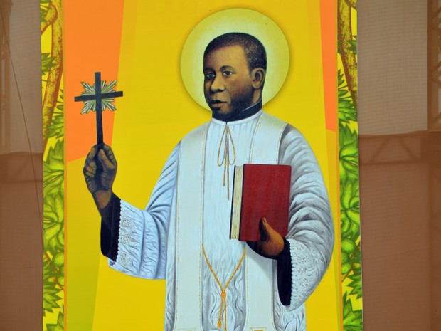 |
| [Beata Paulina Jaricot](docs/beatos/beata-paulina-jaricot/index.md) |  |
| [Beato Pedro Donders](docs/beatos/beato-pedro-donders/index.md) |  |
| [Beato Pedro Vigne](docs/beatos/beato-pedro-vigne/index.md) |  |
| [Beata Pierina Morosini](docs/beatos/beata-pierina-morosini/index.md) |  |
| [Beata Pina Suriano](docs/beatos/beata-pina-suriano/index.md) |  |
| [Beato Pino Puglisi](docs/beatos/beato-pino-puglisi/index.md) |  |
| [Beato Pio IX](docs/beatos/beato-pio-ix/index.md) |  |
| [Beato Raimundo de Cápua](docs/beatos/beato-raimundo-de-capua/index.md) |  |
| [Beato Richard Henkes](docs/beatos/beato-richard-henkes/index.md) |  |
| [Beata Rita Amada de Jesus](docs/beatos/beata-rita-amada-de-jesus/index.md) |  |
| [Beato Rolando Rivi](docs/beatos/beato-rolando-rivi/index.md) | 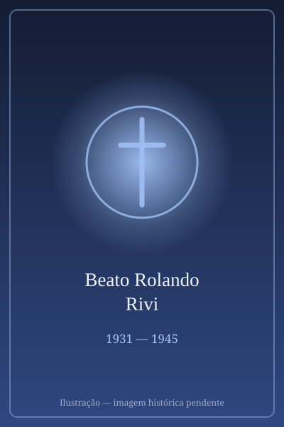 |
| [Beata Rosália Rendu](docs/beatos/beata-rosalia-rendu/index.md) |  |
| [Beato Rosário Livatino](docs/beatos/beato-rosario-livatino/index.md) |  |
| [Beato Rupert Mayer](docs/beatos/beato-rupert-mayer/index.md) |  |
| [Beato Rutilio Grande](docs/beatos/beato-rutilio-grande/index.md) |  |
| [Beata Sancha de Portugal](docs/beatos/beata-sancha-de-portugal/index.md) |  |
| [Beata Sandra Sabattini](docs/beatos/beata-sandra-sabattini/index.md) | 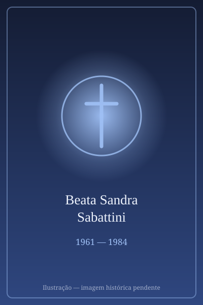 |
| [Beata Savina Petrilli](docs/beatos/beata-savina-petrilli/index.md) | 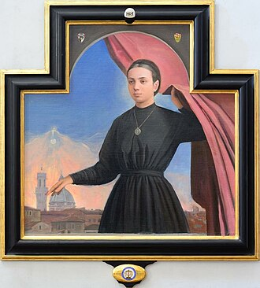 |
| [Beato Solanus Casey](docs/beatos/beato-solanus-casey/index.md) | 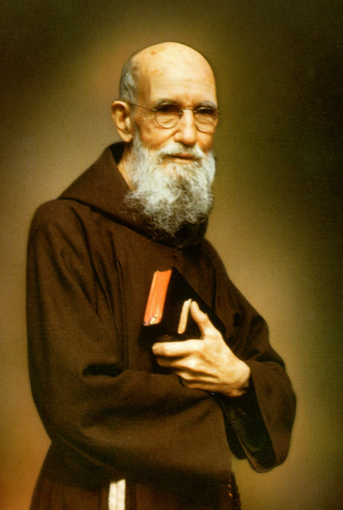 |
| [Beato Stanley Rother](docs/beatos/beato-stanley-rother/index.md) |  |
| [Beato Stefan Wyszyński](docs/beatos/beato-stefan-wyszynski/index.md) |  |
| [Beato Teresio Olivelli](docs/beatos/beato-teresio-olivelli/index.md) |  |
| [Beato Tiago Alberione](docs/beatos/beato-tiago-alberione/index.md) |  |
| [Beato Tiago de Voragine](docs/beatos/beato-tiago-de-voragine/index.md) |  |
| [Beato Tito Zeman](docs/beatos/beato-tito-zeman/index.md) |  |
| [Beato Urbano V](docs/beatos/beato-urbano-v/index.md) |  |
| [Beato Zeferino Namuncurá](docs/beatos/beato-zeferino-namuncura/index.md) | 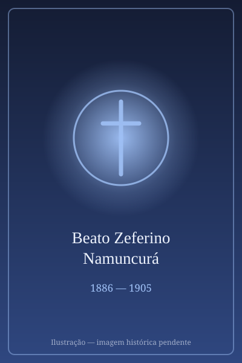 |
| [Santo Afonso Maria de Ligório](docs/santos/santo-afonso-maria-de-ligorio/index.md) |  |
| [Santa Ágata](docs/santos/santa-agata/index.md) |  |
| [Santo Agostinho](docs/santos/santo-agostinho/index.md) | 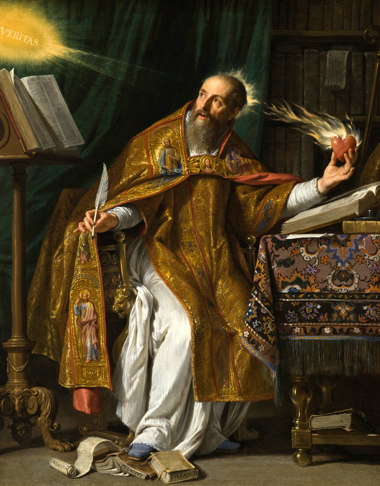 |
| [Santa Águeda](docs/santos/santa-agueda/index.md) |  |
| [Santo Alberto Hurtado](docs/santos/santo-alberto-hurtado/index.md) |  |
| [Santo Alberto Magno](docs/santos/santo-alberto-magno/index.md) |  |
| [Santo Amaro](docs/santos/santo-amaro/index.md) |  |
| [Santo Ambrósio](docs/santos/santo-ambrosio/index.md) |  |
| [Santo André](docs/santos/santo-andre/index.md) | 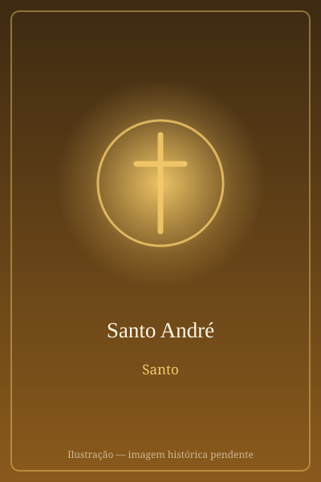 |
| [Santo André Kim Taegõn](docs/santos/santo-andre-kim-taegon/index.md) |  |
| [Santo Anselmo de Cantuária](docs/santos/santo-anselmo/index.md) |  |
| [Santo Antão do Deserto](docs/santos/santo-antao-do-deserto/index.md) |  |
| [Santo Antônio de Pádua](docs/santos/santo-antonio/index.md) | 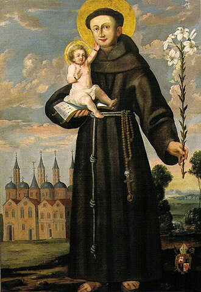 |
| [Santo Antônio de Sant'Ana Galvão](docs/santos/santo-antonio-de-santana-galvao/index.md) |  |
| [Santo Antônio Maria Claret](docs/santos/santo-antonio-maria-claret/index.md) |  |
| [Santa Apolônia](docs/santos/santa-apolonia/index.md) |  |
| [São Artêmides Zatti](docs/santos/sao-artemides-zatti/index.md) |  |
| [Santo Atanásio](docs/santos/santo-atanasio/index.md) |  |
| [Santa Bárbara](docs/santos/santa-barbara/index.md) |  |
| [São Bartolo Longo](docs/santos/sao-bartolo-longo/index.md) |  |
| [São Bartolomeu](docs/santos/sao-bartolomeu/index.md) | 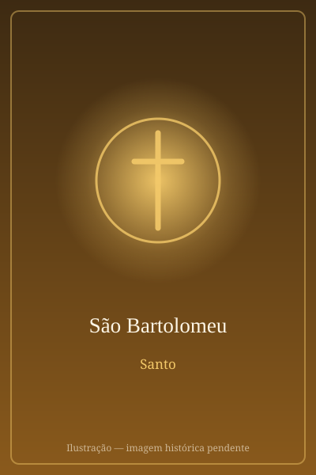 |
| [São Basílio Magno](docs/santos/sao-basilio-magno/index.md) |  |
| [Santa Beatriz da Silva](docs/santos/santa-beatriz-da-silva/index.md) |  |
| [São Beda](docs/santos/sao-beda/index.md) |  |
| [São Benedito](docs/santos/sao-benedito/index.md) |  |
| [São Bento](docs/santos/sao-bento/index.md) | 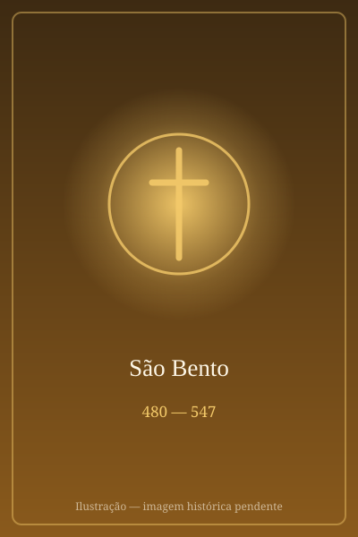 |
| [São Bento Menni](docs/santos/sao-bento-menni/index.md) |  |
| [Santa Bernadete Soubirous](docs/santos/santa-bernadete-soubirous/index.md) | 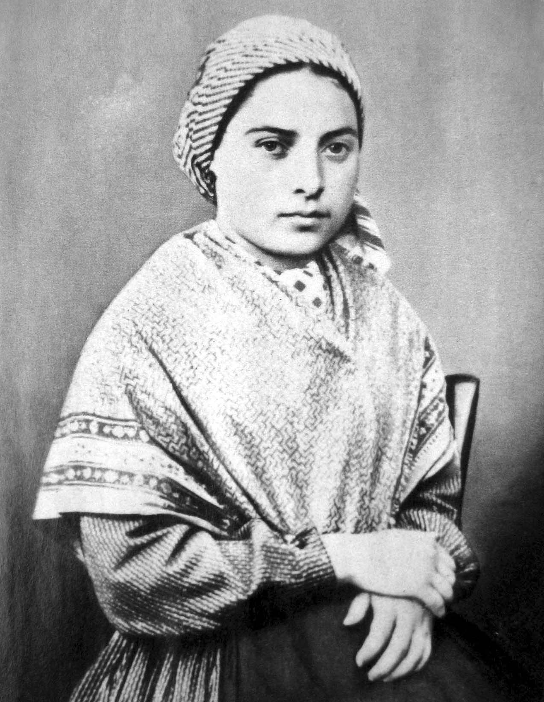 |
| [São Bernardo de Claraval](docs/santos/sao-bernardo/index.md) |  |
| [São Boaventura](docs/santos/sao-boaventura/index.md) |  |
| [São Brás](docs/santos/sao-bras/index.md) |  |
| [Santa Brígida da Suécia](docs/santos/santa-brigida-da-suecia/index.md) |  |
| [São Bruno](docs/santos/sao-bruno/index.md) |  |
| [São Camilo de Lellis](docs/santos/sao-camilo-de-lellis/index.md) |  |
| [São Carlo Acutis](docs/santos/carlo-acutis/index.md) | 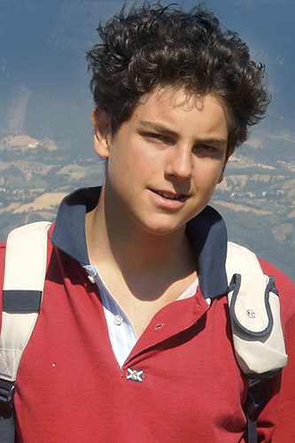 |
| [São Carlos Borromeu](docs/santos/sao-carlos-borromeu/index.md) |  |
| [São Carlos Lwanga](docs/santos/sao-carlos-lwanga/index.md) | 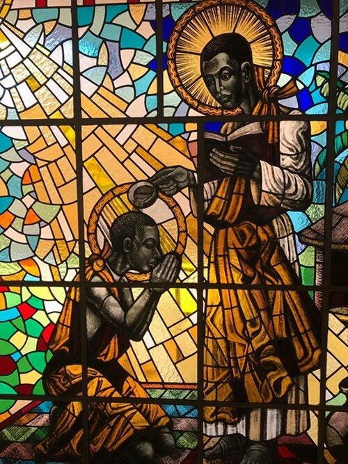 |
| [Santa Catarina de Alexandria](docs/santos/santa-catarina-de-alexandria/index.md) |  |
| [Santa Catarina de Sena](docs/santos/santa-catarina-de-sena/index.md) | 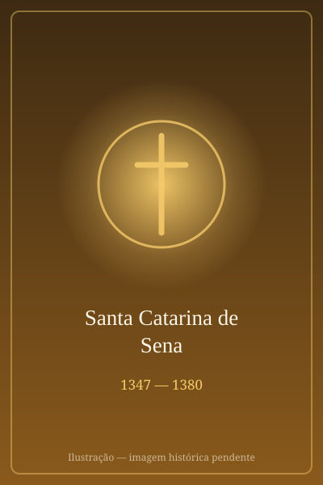 |
| [Santa Catarina Labouré](docs/santos/santa-catarina-laboure/index.md) |  |
| [Santa Cecília](docs/santos/santa-cecilia/index.md) | 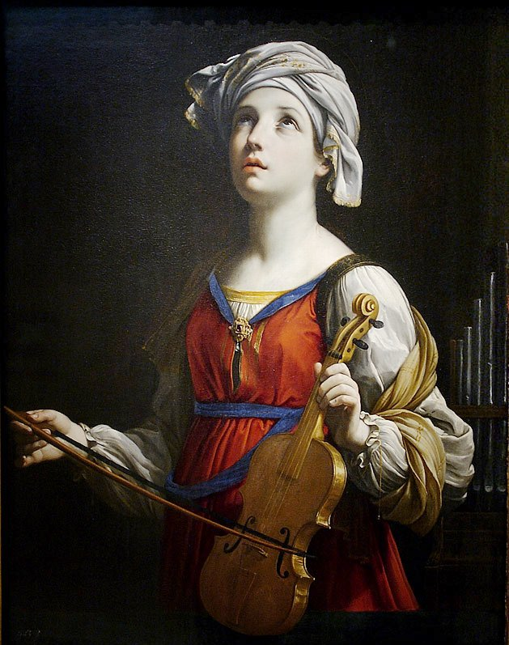 |
| [São Charbel Makhlouf](docs/santos/sao-charbel/index.md) |  |
| [São Charles de Foucauld](docs/santos/sao-charles-de-foucauld/index.md) |  |
| [Santa Clara de Assis](docs/santos/santa-clara-de-assis/index.md) | 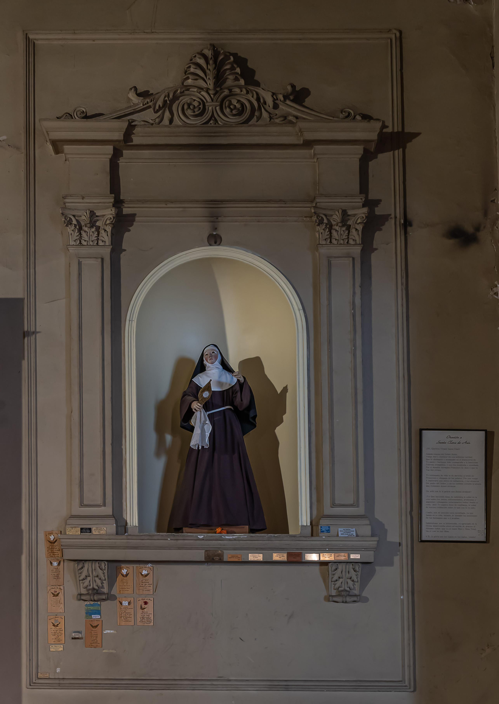 |
| [São Columbano](docs/santos/sao-columbano/index.md) |  |
| [São Cristóvão](docs/santos/sao-cristovao/index.md) |  |
| [São Damião de Molokai](docs/santos/sao-damiao-de-molokai/index.md) |  |
| [São Dimas](docs/santos/sao-dimas/index.md) |  |
| [São Domingos de Gusmão](docs/santos/sao-domingos-de-gusmao/index.md) |  |
| [São Domingos Sávio](docs/santos/sao-domingos-savio/index.md) |  |
| [Santa Dulce dos Pobres](docs/santos/santa-dulce-dos-pobres/index.md) | 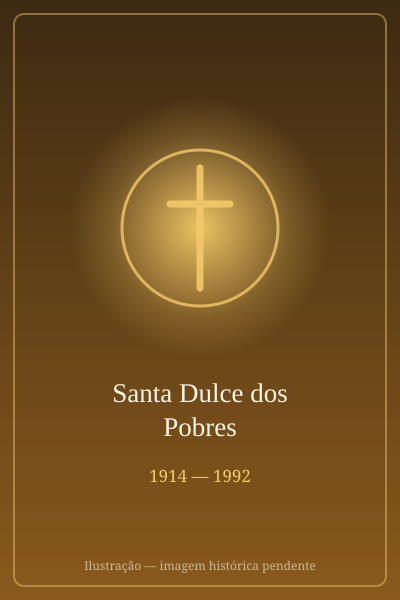 |
| [Santa Edwiges](docs/santos/santa-edwiges/index.md) |  |
| [Beata Elena Guerra](docs/santos/santa-elena-guerra/index.md) | 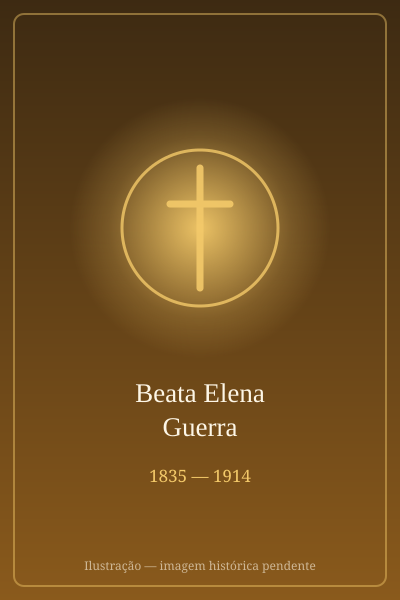 |
| [Santa Escolástica](docs/santos/santa-escolastica/index.md) |  |
| [São Estevão](docs/santos/sao-estevao/index.md) | 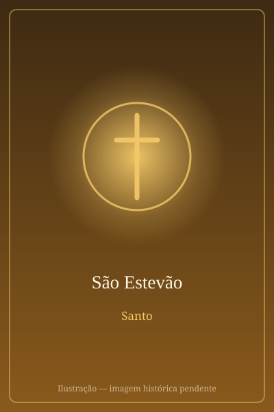 |
| [Santo Expedito](docs/santos/santo-expedito/index.md) |  |
| [Santa Faustina Kowalska](docs/santos/santa-faustina-kowalska/index.md) | 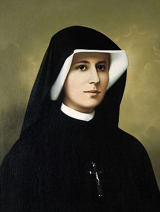 |
| [São Filipe](docs/santos/sao-filipe/index.md) | 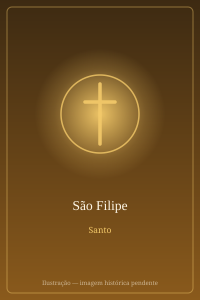 |
| [São Filipe Neri](docs/santos/sao-filipe-neri/index.md) |  |
| [Santa Filomena](docs/santos/santa-filomena/index.md) |  |
| [São Francisco de Assis](docs/santos/sao-francisco-de-assis/index.md) |  |
| [São Francisco de Sales](docs/santos/sao-francisco-de-sales/index.md) |  |
| [São Francisco Marto](docs/santos/sao-francisco-marto/index.md) |  |
| [São Francisco Xavier](docs/santos/sao-francisco-xavier/index.md) |  |
| [São Gabriel de Nossa Senhora das Dores](docs/santos/sao-gabriel-de-nossa-senhora-das-dores/index.md) |  |
| [São Gaspar del Búfalo](docs/santos/sao-gaspar-del-bufalo/index.md) |  |
| [Santa Gemma Galgani](docs/santos/santa-gemma-galgani/index.md) | 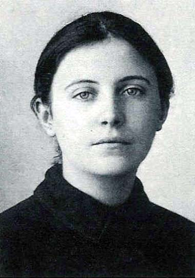 |
| [Santa Genoveva](docs/santos/santa-genoveva/index.md) |  |
| [São Geraldo Majella](docs/santos/sao-geraldo-majella/index.md) |  |
| [Santa Gianna Beretta Molla](docs/santos/santa-gianna-beretta-molla/index.md) |  |
| [São Gregório Magno](docs/santos/sao-gregorio-magno/index.md) |  |
| [Santa Helena](docs/santos/santa-helena/index.md) |  |
| [Santa Hildegarda de Bingen](docs/santos/santa-hildegarda-de-bingen/index.md) | 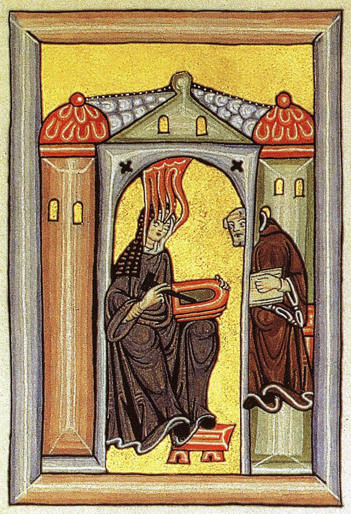 |
| [Santo Inácio de Antioquia](docs/santos/santo-inacio-de-antioquia/index.md) |  |
| [Santo Inácio de Loyola](docs/santos/santo-inacio-de-loyola/index.md) |  |
| [Santa Inês](docs/santos/santa-ines/index.md) | 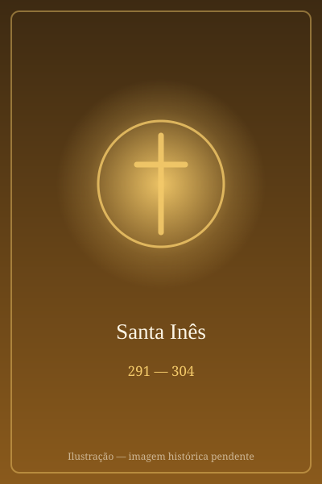 |
| [Santo Ireneu de Lyon](docs/santos/santo-ireneu-de-lyon/index.md) |  |
| [Santa Isabel da Hungria](docs/santos/santa-isabel-da-hungria/index.md) |  |
| [Santo Isidoro de Sevilha](docs/santos/santo-isidoro-de-sevilha/index.md) |  |
| [Santo Ivo de Kermartin](docs/santos/santo-ivo/index.md) |  |
| [Santa Jacinta Marto](docs/santos/santa-jacinta-marto/index.md) |  |
| [São Jerônimo](docs/santos/sao-jeronimo/index.md) |  |
| [Santa Joana d'Arc](docs/santos/santa-joana-d-arc/index.md) |  |
| [Santa Joana de Chantal](docs/santos/santa-joana-de-chantal/index.md) |  |
| [São João Batista](docs/santos/sao-joao-batista/index.md) |  |
| [São João Batista de La Salle](docs/santos/sao-joao-batista-de-la-salle/index.md) |  |
| [São João Bosco](docs/santos/sao-joao-bosco/index.md) | 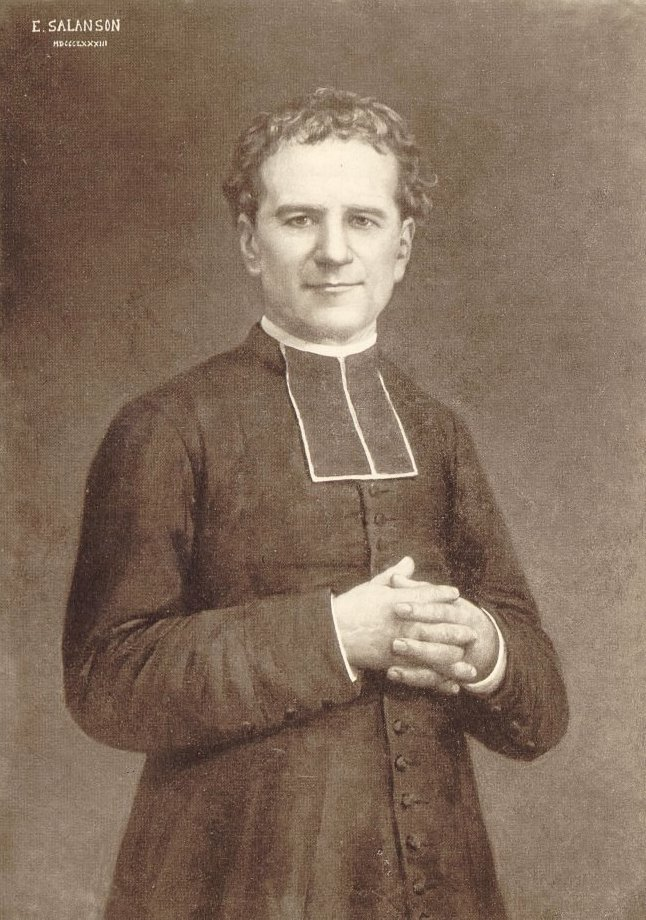 |
| [São João Crisóstomo](docs/santos/sao-joao-crisostomo/index.md) |  |
| [São João da Cruz](docs/santos/sao-joao-da-cruz/index.md) | 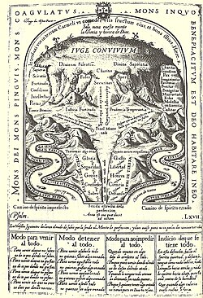 |
| [São João Damasceno](docs/santos/sao-joao-damasceno/index.md) | 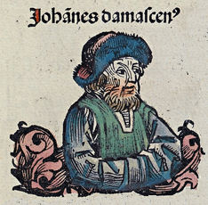 |
| [São João de Ávila](docs/santos/sao-joao-de-avila/index.md) |  |
| [São João de Brito](docs/santos/sao-joao-de-brito/index.md) |  |
| [São João de Capistrano](docs/santos/sao-joao-de-capistrano/index.md) | 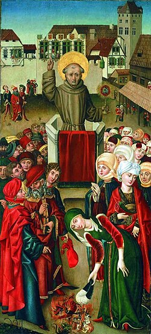 |
| [São João de Deus](docs/santos/sao-joao-de-deus/index.md) |  |
| [São João Diego Cuauhtlatoatzin](docs/santos/sao-joao-diego/index.md) |  |
| [São João Eudes](docs/santos/sao-joao-eudes/index.md) |  |
| [São João Evangelista](docs/santos/sao-joao-evangelista/index.md) | 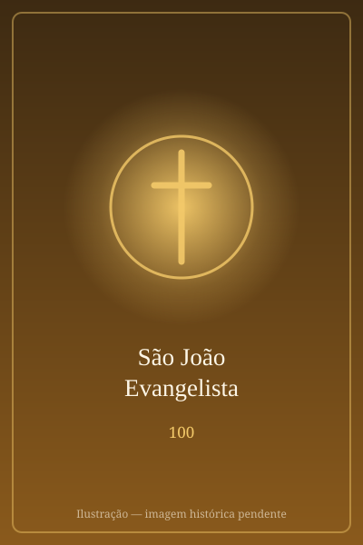 |
| [São João Macías](docs/santos/sao-joao-macias/index.md) |  |
| [São João Maria Vianney](docs/santos/sao-joao-maria-vianney/index.md) |  |
| [São João Neumann](docs/santos/sao-joao-neumann/index.md) |  |
| [São João Paulo II](docs/santos/sao-joao-paulo-ii/index.md) |  |
| [São João XXIII](docs/santos/sao-joao-xxiii/index.md) |  |
| [São Jorge](docs/santos/sao-jorge/index.md) |  |
| [São José](docs/santos/sao-jose/index.md) |  |
| [São José de Anchieta](docs/santos/sao-jose-de-anchieta/index.md) |  |
| [São José de Cupertino](docs/santos/sao-jose-de-cupertino/index.md) |  |
| [São José Gregório Hernández](docs/santos/sao-jose-gregorio-hernandez/index.md) |  |
| [São José Marello](docs/santos/sao-jose-marello/index.md) |  |
| [São José Moscati](docs/santos/sao-jose-moscati/index.md) |  |
| [São José Sánchez del Río](docs/santos/sao-jose-sanchez-del-rio/index.md) |  |
| [Santa Josefina Bakhita](docs/santos/santa-josefina-bakhita/index.md) |  |
| [São Josemaria Escrivá](docs/santos/sao-josemaria-escriva/index.md) | 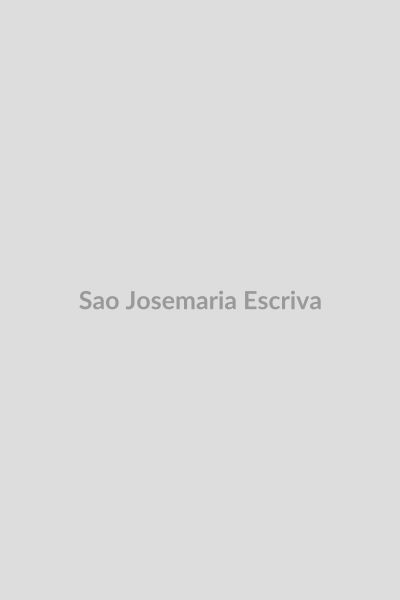 |
| [São Judas Tadeu](docs/santos/sao-judas-tadeu/index.md) |  |
| [São Junípero Serra](docs/santos/sao-junipero-serra/index.md) |  |
| [São Justino Mártir](docs/santos/sao-justino-martir/index.md) | 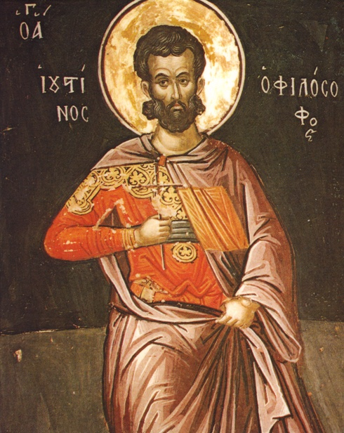 |
| [Santa Kateri Tekakwitha](docs/santos/santa-kateri-tekakwitha/index.md) |  |
| [São Leão Magno](docs/santos/sao-leao-magno/index.md) |  |
| [São Longuinho](docs/santos/sao-longuinho/index.md) |  |
| [São Lourenço](docs/santos/sao-lourenco/index.md) | 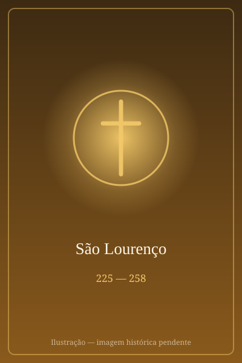 |
| [São Lourenço Ruiz](docs/santos/sao-lourenco-ruiz/index.md) | 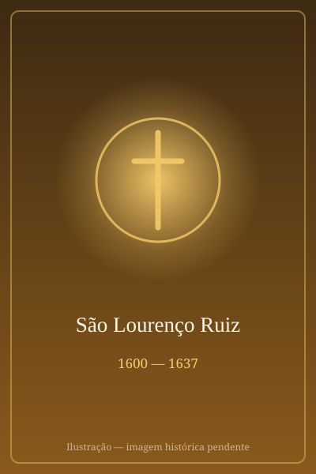 |
| [São Lucas](docs/santos/sao-lucas/index.md) | 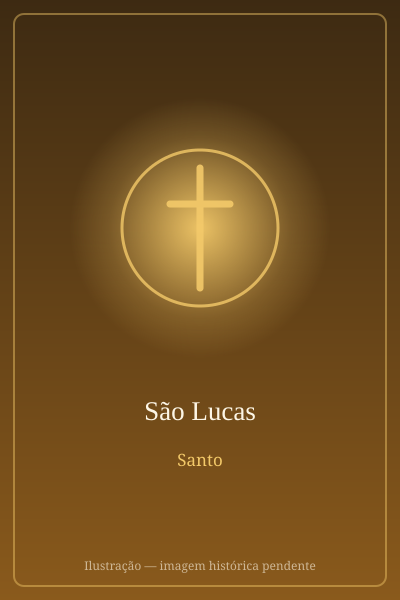 |
| [São Ludovico Pavoni](docs/santos/sao-ludovico-pavoni/index.md) |  |
| [São Luís Gonzaga](docs/santos/sao-luis-gonzaga/index.md) |  |
| [São Luís Maria Grignion de Montfort](docs/santos/sao-luis-maria-grignion-de-montfort/index.md) |  |
| [São Luís Orione](docs/santos/sao-luis-orione/index.md) |  |
| [Santa Luísa de Marillac](docs/santos/santa-luisa-de-marillac/index.md) | 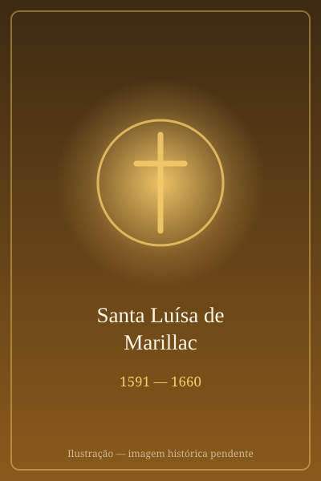 |
| [Santa Luzia](docs/santos/santa-luzia/index.md) | 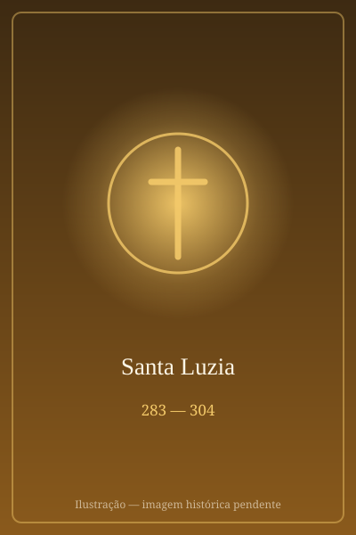 |
| [São Marcos](docs/santos/sao-marcos/index.md) | 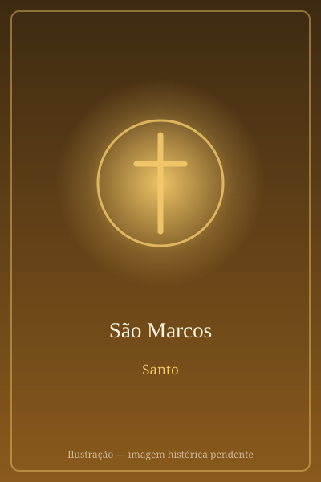 |
| [Santa Margarida Maria Alacoque](docs/santos/santa-margarida-maria-alacoque/index.md) |  |
| [Santa Maria Domingas Mazzarello](docs/santos/santa-maria-domingas-mazzarello/index.md) |  |
| [Santa Maria Goretti](docs/santos/santa-maria-goretti/index.md) |  |
| [Santa Maria Madalena](docs/santos/santa-maria-madalena/index.md) | 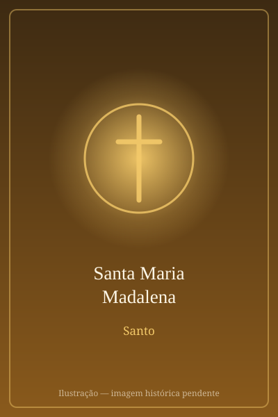 |
| [Santa Maria Troncatti](docs/santos/santa-maria-troncatti/index.md) | 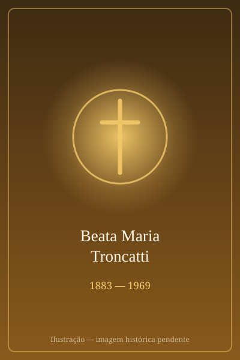 |
| [Santa Marta](docs/santos/santa-marta/index.md) |  |
| [São Martinho de Lima](docs/santos/sao-martinho-de-lima/index.md) | 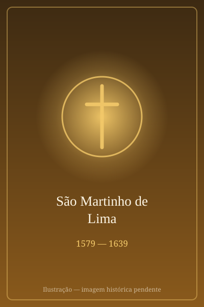 |
| [São Martinho de Tours](docs/santos/sao-martinho-de-tours/index.md) |  |
| [São Mateus](docs/santos/sao-mateus/index.md) | 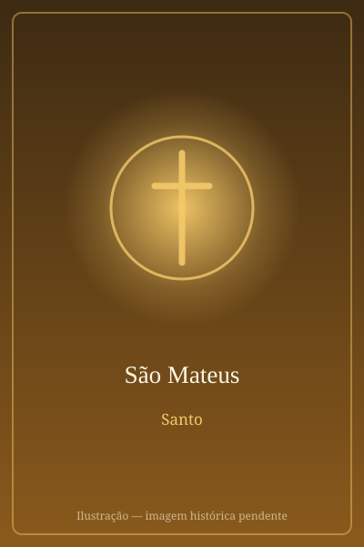 |
| [São Matias](docs/santos/sao-matias/index.md) | 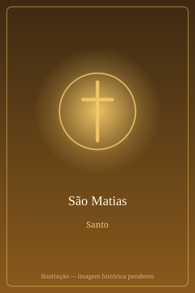 |
| [São Maximiliano Kolbe](docs/santos/sao-maximiliano-kolbe/index.md) | 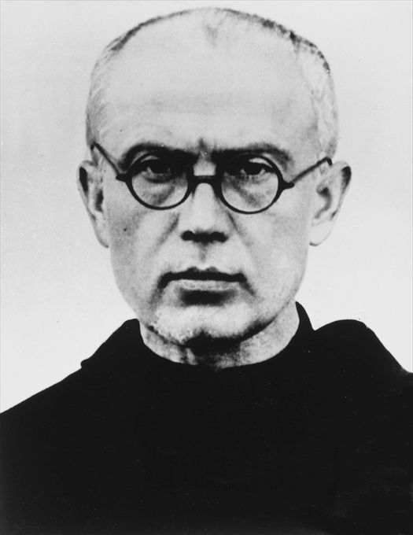 |
| [Santa Mônica](docs/santos/santa-monica/index.md) |  |
| [São Nicolau](docs/santos/sao-nicolau/index.md) | 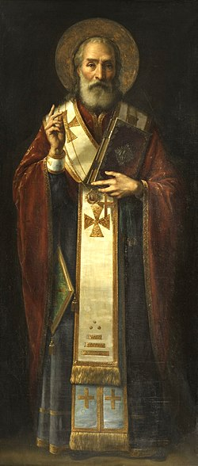 |
| [São Norberto](docs/santos/sao-norberto/index.md) |  |
| [São Nuno de Santa Maria](docs/santos/sao-nuno-de-santa-maria/index.md) |  |
| [São Oscar Romero](docs/santos/sao-oscar-romero/index.md) | 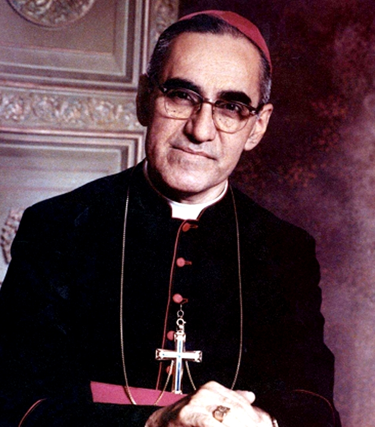 |
| [São Padre Pio de Pietrelcina](docs/santos/sao-padre-pio/index.md) |  |
| [São Pantaleão](docs/santos/sao-pantaleao/index.md) |  |
| [São Patrício](docs/santos/sao-patricio/index.md) |  |
| [Santa Paulina do Coração Agonizante de Jesus](docs/santos/santa-paulina/index.md) |  |
| [São Paulo](docs/santos/sao-paulo/index.md) | 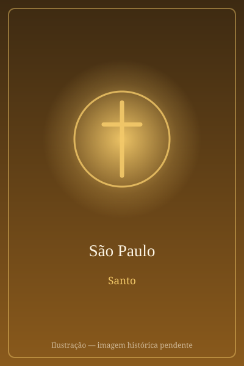 |
| [São Paulo da Cruz](docs/santos/sao-paulo-da-cruz/index.md) | 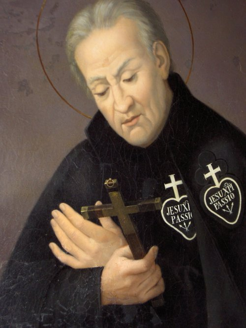 |
| [São Paulo VI](docs/santos/sao-paulo-vi/index.md) |  |
| [São Pedro](docs/santos/sao-pedro/index.md) |  |
| [São Pedro Canísio](docs/santos/sao-pedro-canisio/index.md) |  |
| [São Pedro Claver](docs/santos/sao-pedro-claver/index.md) |  |
| [São Pedro Damião](docs/santos/sao-pedro-damiao/index.md) |  |
| [São Pedro de Alcântara](docs/santos/sao-pedro-de-alcantara/index.md) |  |
| [São Pedro Julião Eymard](docs/santos/sao-pedro-juliao-eymard/index.md) |  |
| [São Peregrino](docs/santos/sao-peregrino/index.md) |  |
| [São Pier Giorgio Frassati](docs/santos/pier-giorgio-frassati/index.md) | 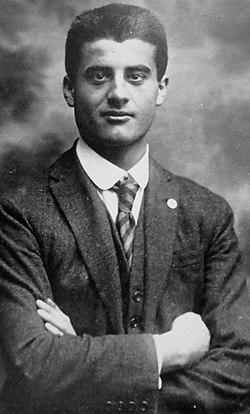 |
| [São Pio V](docs/santos/sao-pio-v/index.md) |  |
| [São Pio X](docs/santos/sao-pio-x/index.md) |  |
| [São Policarpo de Esmirna](docs/santos/sao-policarpo/index.md) |  |
| [Santa Rita de Cássia](docs/santos/santa-rita-de-cassia/index.md) | 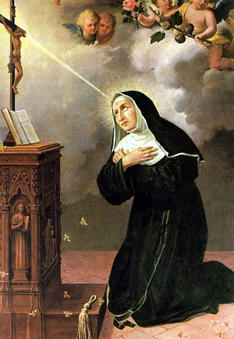 |
| [São Roberto Belarmino](docs/santos/sao-roberto-belarmino/index.md) | 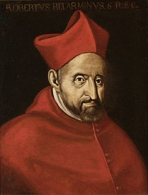 |
| [São Roque](docs/santos/sao-roque/index.md) |  |
| [Santa Rosa de Lima](docs/santos/santa-rosa-de-lima/index.md) |  |
| [São Sebastião](docs/santos/sao-sebastiao/index.md) | 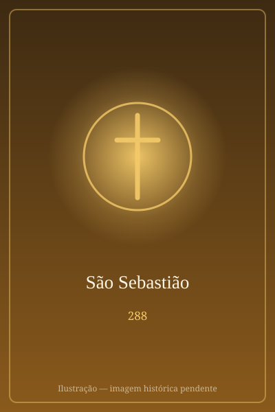 |
| [São Simão](docs/santos/sao-simao/index.md) | 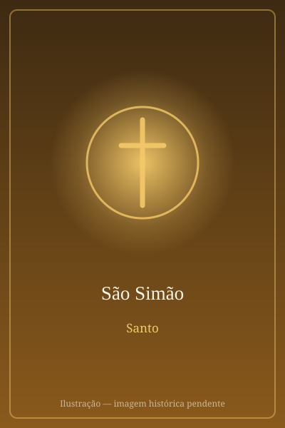 |
| [São Tarcísio](docs/santos/sao-tarcisio/index.md) |  |
| [Santa Teresa Benedita da Cruz](docs/santos/santa-teresa-benedita-da-cruz/index.md) |  |
| [Santa Teresa de Ávila](docs/santos/santa-teresa-de-avila/index.md) |  |
| [Santa Teresa de Calcutá](docs/santos/santa-teresa-de-calcuta/index.md) | 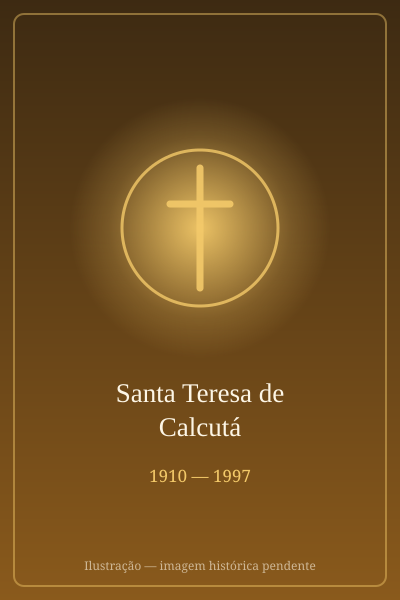 |
| [Santa Teresa dos Andes](docs/santos/santa-teresa-dos-andes/index.md) |  |
| [Santa Teresinha do Menino Jesus](docs/santos/santa-teresinha-do-menino-jesus/index.md) |  |
| [São Tiago Maior](docs/santos/sao-tiago-maior/index.md) | 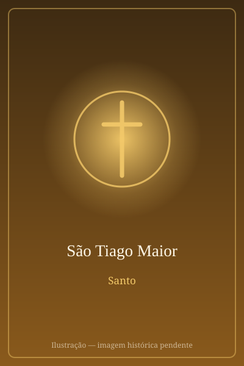 |
| [São Tiago Menor](docs/santos/sao-tiago-menor/index.md) | 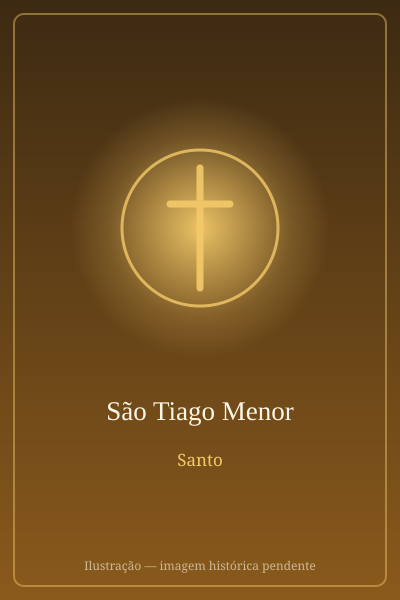 |
| [São Tomás Becket](docs/santos/sao-tomas-becket/index.md) |  |
| [São Tomás de Aquino](docs/santos/sao-tomas-de-aquino/index.md) | 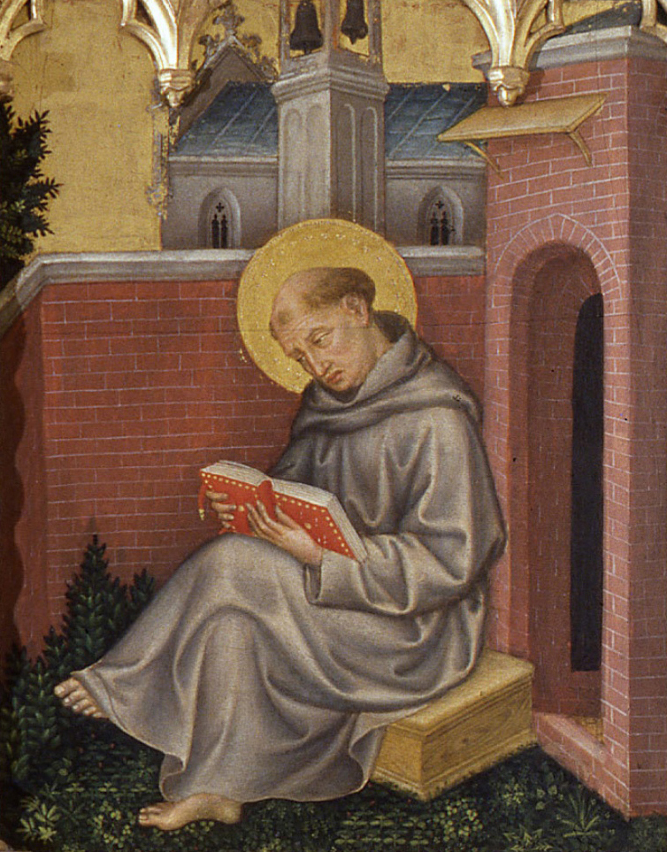 |
| [São Tomás de Vilanova](docs/santos/sao-tomas-de-vilanova/index.md) |  |
| [São Tomás More](docs/santos/sao-tomas-more/index.md) |  |
| [São Tomé](docs/santos/sao-tome/index.md) | 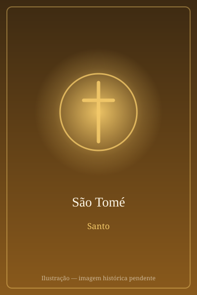 |
| [São Valentim](docs/santos/sao-valentim/index.md) |  |
| [São Venceslau](docs/santos/sao-venceslau/index.md) |  |
| [São Vicente de Paulo](docs/santos/sao-vicente-de-paulo/index.md) | 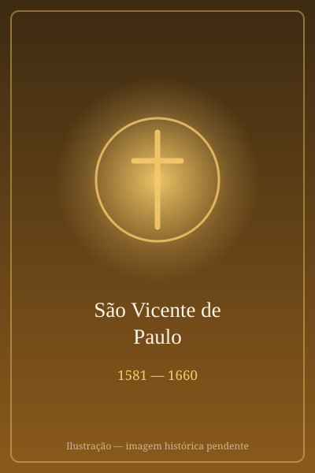 |
| [São Vicente Ferrer](docs/santos/sao-vicente-ferrer/index.md) |  |
| [São Vicente Pallotti](docs/santos/sao-vicente-pallotti/index.md) |  |
| [Santa Zita](docs/santos/santa-zita/index.md) |  |
