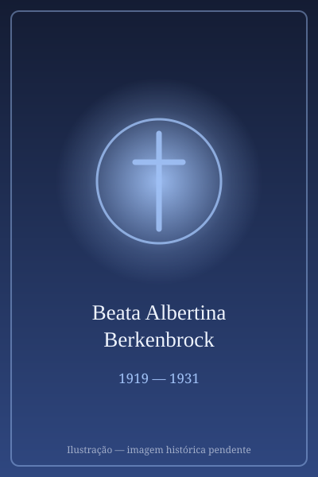

# Beata Albertina Berkenbrock

> "A 'Maria Goretti' brasileira."

- **Nascimento:** 11 de abril de 1919, Imaruí, Brasil
- **Morte:** 15 de junho de 1931, Imaruí, Brasil
- **Beatificação:** 2007, pelo Papa Bento XVI
- **Festa Litúrgica:** 15 de junho

<TextToSpeech />

---

## Biografia

Albertina Berkenbrock nasceu em 11 de abril de 1919, em São Luís, distrito de Imaruí, em Santa Catarina, numa comunidade de colonos alemães. Era a quarta de oito filhos de Henrique e Josefa Berkenbrock, agricultores. Cresceu no ritmo simples da roça: cuidava dos irmãos menores, ajudava no gado e caminhava com a família até a capela da comunidade.

Fez a Primeira Comunhão aos onze anos, depois de insistir com o pároco para ser admitida antes da idade habitual. Era conhecida na vizinhança pela caridade — dividia a merenda, visitava doentes e catequizava crianças menores.

Em 15 de junho de 1931, aos doze anos, saiu à procura de uma vaca desgarrada. Foi seguida por Maneco Palhoça, empregado de confiança da família, que tentou violentá-la. Albertina resistiu com todas as forças e foi degolada. O corpo foi encontrado no dia seguinte pelo pai. O agressor confessou o crime e foi condenado.

## Vida Pessoal e Espiritualidade

A memória da comunidade guarda dela pequenos gestos: a defesa de um colega negro hostilizado na escola, a insistência em rezar antes das refeições, o cuidado com os irmãos. Não deixou escritos nem viveu em convento — sua santidade é a de uma menina do campo. A Igreja reconheceu seu martírio *in odium fidei*, entendendo que morreu defendendo a castidade como parte de sua fé, e foi beatificada em Tubarão (SC) em 20 de outubro de 2007.

## Milagres

Por ter sido reconhecida como mártir, sua beatificação dispensou a comprovação de milagre. Desde os primeiros anos, porém, a comunidade registrou graças atribuídas à sua intercessão, e o local do crime tornou-se ponto de peregrinação espontânea. Quando o corpo foi exumado em 1950 para o traslado à igreja matriz, testemunhas relataram que o sangue recolhido no lenço usado no sepultamento se apresentava ainda vermelho e fluido — episódio nunca submetido a verificação científica, mas conservado pela tradição local.

## Curiosidades

1. **A primeira menina brasileira beatificada:** é a primeira criança nascida no Brasil elevada aos altares.
2. **Santuário em Imaruí:** o Santuário Beata Albertina, em São Luís de Imaruí, recebe romarias durante todo o ano, com concentração maior em junho.
3. **Comparação com Maria Goretti:** sua história é frequentemente aproximada da de Santa Maria Goretti, martirizada em circunstância semelhante três décadas antes, na Itália.
4. **Padroeira:** invocada pelas crianças, adolescentes e vítimas de violência sexual.

## Cidades por onde passou

Toda a sua vida transcorreu em São Luís, distrito de Imaruí, no litoral sul de Santa Catarina, onde nasceu, morreu e onde hoje repousa.

<MiracleMap :items='[
  { lat: -28.3389, lng: -48.8181, type: "nascimento", title: "Santuário Beata Albertina", description: "Local de nascimento (11 de abril de 1919)." },
  { lat: -28.3389, lng: -48.8181, type: "morte", title: "Santuário Beata Albertina", description: "Local da morte (15 de junho de 1931)." },
  { lat: -28.34, lng: -48.82, type: "tumulo", title: "Santuário Beata Albertina", description: "Local do martírio e túmulo em São Luís (Imaruí, SC)." }
]' />

## Impacto Hoje

Albertina tornou-se referência da pastoral da criança e do adolescente no sul do Brasil, e sua história é usada em campanhas diocesanas de enfrentamento à violência sexual contra menores. O santuário de Imaruí consolidou-se como destino de romaria catarinense, e sua figura — uma menina do campo, sem obra escrita nem congregação fundada — é lembrada como sinal de que a santidade não depende de posição nem de instrução.
