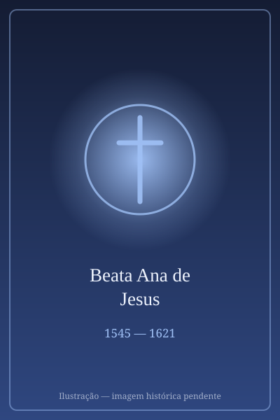

# Beata Ana de Jesus

> "A grande capitã das prioras."** (Santa Teresa de Ávila sobre Ana de Jesus)"

- **Nascimento:** 25 de novembro de 1545, Medina del Campo, Espanha
- **Morte:** 4 de março de 1621, Bruxelas, Bélgica
- **Beatificação:** 29 de setembro de 2024 (Papa Francisco)
- **Festa Litúrgica:** 25 de novembro

<TextToSpeech />

---

## Biografia

**Beata Ana de Jesus**, nascida **Ana de Lobera Torres**, foi uma figura central na história da Ordem dos Carmelitas Descalços. Nascida surda e muda, recuperou milagrosamente a fala e a audição aos sete anos de idade. Desde jovem, demonstrou grande piedade e vocação religiosa.

Em 1570, conheceu Santa Teresa de Ávila em Toledo e ingressou no Carmelo. Santa Teresa logo percebeu suas virtudes excepcionais e capacidade de liderança, chamando-a de "a capitã das prioras". Ana tornou-se uma das colaboradoras mais próximas da reformadora do Carmelo, ajudando nas fundações de novos mosteiros na Espanha (Granada, Madrid).

Após a morte de Santa Teresa, Ana de Jesus continuou a obra de expansão da reforma, levando o Carmelo Descalço para fora da Espanha. Fundou mosteiros na França (Paris, Pontoise, Dijon) e, posteriormente, nos Países Baixos Espanhóis (atual Bélgica), estabelecendo-se em Bruxelas e Louvain.

Sua vida foi marcada por uma profunda união mística com Deus e uma defesa firme do espírito original da reforma teresiana. São João da Cruz, o grande místico carmelita, tinha tanta estima por ela que lhe dedicou seu "Cântico Espiritual".

Ana faleceu em Bruxelas em 1621, deixando um legado de santidade e fidelidade que perdura até hoje.

## Milagres

O processo de beatificação de Ana de Jesus foi longo, iniciado logo após sua morte. Em 14 de dezembro de 2023, o Papa Francisco aprovou um milagre atribuído à sua intercessão, abrindo caminho para a cerimônia de beatificação que ocorreu em Bruxelas, em 29 de setembro de 2024, durante a viagem apostólica do Papa à Bélgica.

## Curiosidades

*   **Guardiã dos Escritos:** Ana de Jesus foi responsável por recolher e preservar os escritos de Santa Teresa de Ávila após sua morte, garantindo que suas obras chegassem às gerações futuras.
*   **Musa de São João da Cruz:** Foi a pedido dela que São João da Cruz escreveu o comentário ao seu poema "Cântico Espiritual", explicando os versos sobre a união da alma com Deus.
*   **Influência Real:** A Infanta Isabel Clara Eugênia, governadora dos Países Baixos, tinha grande veneração por Ana e apoiou a fundação do Carmelo em Bruxelas.

## Cidades por onde passou

<MiracleMap :items='[
  { lat: 41.3068, lng: -4.9144, type: "nascimento", title: "Medina del Campo, Espanha", description: "Cidade natal de Ana de Lobera Torres." },
  { lat: 40.6572, lng: -4.7007, type: "nascimento", title: "Ávila, Espanha", description: "Berço da reforma carmelita onde viveu e trabalhou com Santa Teresa." },
  { lat: 39.8628, lng: -4.0273, type: "vida", title: "Toledo, Espanha", description: "Onde conheceu Santa Teresa e ingressou na ordem." },
  { lat: 48.8566, lng: 2.3522, type: "vida", title: "Paris, França", description: "Liderou a fundação do primeiro Carmelo reformado na França." },
  { lat: 50.8503, lng: 4.3517, type: "morte", title: "Bruxelas, Bélgica", description: "Onde fundou mosteiros e faleceu em 1621. Local de sua beatificação em 2024." }
]' />

## Galeria

| | |
|---|---|
|  |  |
| **Retrato Histórico** | **Com Santa Teresa** |

---
*Beata Ana de Jesus, rogai por nós!*

## Impacto Hoje

Ana de Jesus é a responsável direta pela expansão do Carmelo Descalço para fora da Espanha: os mosteiros que fundou na França e nos Países Baixos deram origem à rede carmelita europeia, da qual descendem comunidades presentes hoje em dezenas de países — incluindo aquelas de onde saíram Santa Teresinha de Lisieux e Santa Teresa Benedita da Cruz.

Seu papel na preservação dos escritos de Santa Teresa de Ávila é igualmente decisivo: sem o cuidado com que reuniu e defendeu os manuscritos, boa parte da obra teresiana poderia ter se perdido. O *Cântico Espiritual* de São João da Cruz, um dos ápices da poesia mística ocidental, foi comentado a pedido dela. Sua beatificação em Bruxelas, em 2024, durante a viagem apostólica do Papa Francisco à Bélgica, recolocou seu nome no debate sobre a autoria feminina na tradição espiritual do Carmelo.
