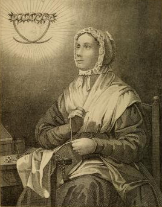

# Beata Anna Maria Taigi

**"Esposa e mãe exemplar, mística da luz divina."**

**Nascimento:** 29 de maio de 1769, Siena, Itália
**Morte:** 9 de junho de 1837, Roma, Itália
**Festa Litúrgica:** 9 de junho
**Beatificação:** 30 de maio de 1920, pelo Papa Bento XV

<TextToSpeech />

---

## Biografia

Anna Maria Giannetti nasceu em Siena, mas mudou-se para Roma com a família quando criança, devido a dificuldades financeiras. Trabalhou como empregada doméstica até se casar, em 1789, com Domenico Taigi, um servente do palácio Chigi. Domenico era um homem trabalhador e honesto, mas de temperamento difícil e rude. Anna Maria foi uma esposa paciente e dedicada, cuidando da casa, dos sete filhos (três faleceram na infância) e ainda ajudando o marido a manter a paz no lar.

Em 1790, após uma conversão espiritual profunda, tornou-se Terciária da Ordem da Santíssima Trindade. A partir de então, sua vida foi um equilíbrio extraordinário entre os deveres matrimoniais e domésticos e uma vida mística intensa. Ela cuidava dos pobres e doentes, mesmo tendo poucos recursos, e transformou sua casa em um santuário de caridade e oração.

## Vida Pessoal e Espiritualidade

Anna Maria provou que a santidade é possível na vida cotidiana de uma mãe de família. Ela nunca negligenciou seus deveres de esposa e mãe por causa de suas devoções. Sua espiritualidade era marcada por uma profunda união com a Santíssima Trindade e uma devoção ardente à Paixão de Cristo. Ela oferecia seus sofrimentos e penitências pela Igreja e pela conversão dos pecadores.

## Milagres e Dons Místicos

Deus concedeu a Anna Maria dons extraordinários. O mais famoso foi a visão de um "sol místico" que a acompanhou por 47 anos. Nesse sol, ela via o estado das almas, eventos futuros, conspirações contra a Igreja e o destino de nações inteiras. Papas, cardeais e nobres (como a Rainha da Etrúria) vinham pedir seus conselhos e orações, impressionados com sua sabedoria sobrenatural, embora ela se mantivesse sempre humilde e simples.

Ela também realizou muitas curas durante sua vida, apenas com o sinal da cruz ou o toque de suas mãos.

## Curiosidades

1.  **Conselheira de Papas:** Mesmo sendo uma mulher simples do povo, foi consultada secretamente por conselheiros de três Papas (Pio VII, Leão XII e Gregório XVI) sobre assuntos graves da Igreja.
2.  **Corpo Incorrupto:** Seu corpo foi encontrado incorrupto anos após sua morte e repousa na Basílica de São Crisógono, em Roma.
3.  **Profecias:** Previu a abdicação de Napoleão, a morte de papas e diversos eventos políticos da Europa.

## Cidades por onde passou

Sua vida transcorreu quase inteiramente na Itália, entre Siena e Roma.

<MiracleMap :items='[
  { lat: 43.3188, lng: 11.3308, title: "Siena, Itália", description: "Cidade onde nasceu em 1769." },
  { lat: 41.9028, lng: 12.4964, title: "Roma, Itália", description: "Cidade onde viveu a maior parte de sua vida, santificou-se no matrimônio e faleceu." }
]' />

## Impacto Hoje

Beata Anna Maria Taigi é um modelo poderoso para as mães e esposas católicas modernas, mostrando como santificar a vida familiar e suportar as dificuldades com paciência e amor. É padroeira das mães de família e das vítimas de violência verbal ou psicológica no casamento.
