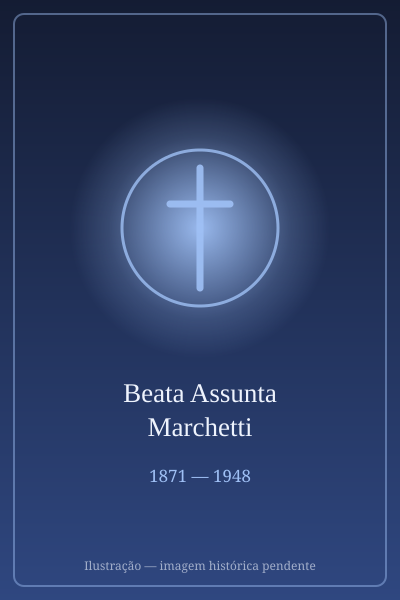

# Beata Assunta Marchetti

> "Mãe dos órfãos e migrantes."

- **Nascimento:** 15 de agosto de 1871, Lombrici di Camaiore, Itália
- **Morte:** 1 de julho de 1948, São Paulo, Brasil
- **Beatificação:** 2014, pelo Papa Francisco
- **Festa Litúrgica:** 1 de julho

<TextToSpeech />

---

## Biografia

Assunta Marchetti nasceu em 15 de agosto de 1871, em Lombrici di Camaiore, na Toscana, numa família camponesa. Era irmã dos padres José e Carlos Marchetti, ambos ligados ao trabalho com emigrantes italianos.

No fim do século XIX, a emigração italiana para o Brasil atingia seu auge, e as condições nas fazendas de café e nos portos deixavam milhares de órfãos. O bispo João Batista Scalabrini, fundador dos Missionários de São Carlos, enviou o padre José Marchetti ao Brasil para cuidar dessas crianças. Assunta partiu com ele em 1895, junto com a mãe e outras três mulheres.

Em São Paulo, assumiram o Orfanato Cristóvão Colombo, no Ipiranga, que chegou a abrigar centenas de crianças filhas de imigrantes. Em 1896, o irmão José morreu de febre aos 26 anos, e o outro irmão, Carlos, veio substituí-lo — morrendo também poucos anos depois. Assunta ficou sozinha à frente da obra.

Foi cofundadora, com Scalabrini e o padre José, das Irmãs Missionárias de São Carlos Borromeo — as Scalabrinianas. Governou a congregação em seus primeiros anos, mas foi depois afastada de cargos diretivos e passou décadas em funções simples: cozinha, lavanderia, cuidado dos doentes. Aceitou sem queixa. Morreu em São Paulo, em 1º de julho de 1948, aos 76 anos.

## Vida Pessoal e Espiritualidade

Madre Assunta é lembrada pela expressão que usava com as irmãs: "façam tudo com muito amor, porque somos mães dos órfãos". Não deixou obra escrita nem discursos. O traço que os processos destacam é a constância — 53 anos no Brasil, quase todos em trabalho manual, depois de ter fundado a congregação. Foi beatificada em São Paulo, em 25 de outubro de 2014.

## Milagres

O milagre reconhecido para a beatificação foi a cura de uma religiosa scalabriniana no Brasil, considerada inexplicável pela comissão médica do Vaticano. O decreto foi assinado pelo Papa Francisco em 2014, e a cerimônia realizou-se no Santuário de Nossa Senhora de Fátima, em São Paulo.

## Curiosidades

1. **Dois irmãos mortos na missão:** perdeu os dois irmãos sacerdotes em poucos anos, ambos vítimas de doenças contraídas no trabalho com imigrantes.
2. **Afastada da direção:** governou a congregação nascente e depois passou décadas em tarefas domésticas, sem nunca reivindicar o cargo.
3. **Primeira beata scalabriniana:** é a primeira religiosa da família scalabriniana elevada aos altares.
4. **Padroeira:** invocada pelos migrantes, pelos órfãos e pelas religiosas dedicadas à assistência social.

## Cidades por onde passou

Nasceu em Lombrici di Camaiore, na Toscana, e viveu de 1895 a 1948 no Brasil, sobretudo em São Paulo, onde está sepultada.

<MiracleMap :items='[
  { lat: 43.94, lng: 10.3, type: "nascimento", title: "Lombrici di Camaiore, Itália", description: "Local de nascimento (15 de agosto de 1871)." },
  { lat: -23.5883, lng: -46.6114, type: "morte", title: "Vila Prudente (São Paulo)", description: "Local onde exerceu seu ministério e faleceu." }
]' />

## Impacto Hoje

As Irmãs Missionárias de São Carlos Borromeo atuam hoje em mais de vinte países no acolhimento de migrantes e refugiados — tema que voltou ao centro da agenda eclesial e internacional. Madre Assunta é apresentada como a primeira a colocar em prática, no Brasil, o carisma scalabriniano de cuidado com quem chega. O Orfanato Cristóvão Colombo, transformado em obra social, continua ativo em São Paulo.
