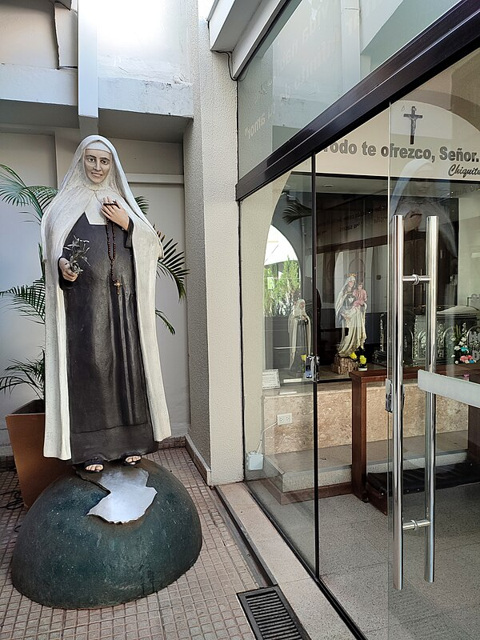

# Beata Chiquitunga

**"Jesus, eu te amo! Que doce encontro! Virgem Maria!"**

- **Nascimento:** 12 de janeiro de 1925, Villarrica (Paraguai)
- **Morte:** 28 de abril de 1959, Assunção (Paraguai)
- **Festa Litúrgica:** 28 de abril
- **Beatificação:** 23 de junho de 2018, em Assunção

<TextToSpeech />

---

## Biografia

Maria Felícia de Jesus Sacramentado, carinhosamente conhecida como "Chiquitunga", nasceu em Villarrica, Paraguai, em uma família proeminente. Desde cedo, demonstrou uma alegria contagiante e uma profunda piedade. Aos 16 anos, ingressou na Ação Católica, dedicando-se com entusiasmo ao apostolado entre os jovens, os estudantes, os trabalhadores e os pobres.

Chiquitunga era conhecida por sua personalidade vibrante e seu sorriso constante. Ela servia aos mais necessitados com amor e dedicação, visitando doentes e idosos, e catequizando crianças. Durante esse período, conheceu Ángel Sauá, um jovem estudante de medicina e membro da Ação Católica, com quem desenvolveu uma profunda amizade espiritual e por quem se apaixonou. No entanto, ambos discerniram que Deus os chamava para caminhos diferentes: Ángel para o sacerdócio (embora tenha seguido a medicina e a vida laical posteriormente) e Maria Felícia para a vida religiosa.

Após um período de discernimento e superando a oposição inicial de sua família, Maria Felícia ingressou no Carmelo de Assunção em 1955, recebendo o nome de Maria Felícia de Jesus Sacramentado.

## Vida Pessoal e Obra

No Carmelo, Chiquitunga viveu com grande generosidade sua entrega a Deus. Sua vida foi breve, mas intensa. Ela oferecia cada pequeno ato e sacrifício pela santificação dos sacerdotes e pela salvação das almas. Sua espiritualidade era marcada pela simplicidade, pela alegria e pelo abandono confiante à vontade de Deus.

Ela costumava dizer: "Ofereço tudo por ti, meu Deus". Sua correspondência e seus diários revelam uma alma mística profundamente apaixonada por Jesus Eucarístico. Em 1959, contraiu hepatite infecciosa e, após um período de sofrimento vivido com paciência e amor, faleceu aos 34 anos, pronunciando suas últimas palavras de amor a Jesus e à Virgem Maria.

## Milagres

O milagre que permitiu sua beatificação foi a cura de um recém-nascido paraguaio, Ángel Ramón, em 2002. O bebê nasceu sem sinais vitais e permaneceu assim por 20 minutos. Após as orações da obstetra pedindo a intercessão de Chiquitunga, o bebê recuperou os sinais vitais e cresceu saudável, sem sequelas neurológicas, o que foi considerado inexplicável pela ciência médica.

## Curiosidades

1.  **Apelido Carinhoso:** Seu pai a chamava de "Chiquitunga" (pequena) por causa de sua estatura miúda, e o apelido pegou, tornando-se o nome pelo qual é conhecida e amada em todo o Paraguai.
2.  **Cérebro Incorrupto:** Durante a exumação de seu corpo, seu cérebro foi encontrado incorrupto e petrificado, o que é considerado um sinal de sua genialidade espiritual e de sua vida de oração.
3.  **Padroeira da Juventude:** Ela é considerada um modelo para a juventude paraguaia por sua alegria, seu compromisso social e sua entrega radical a Cristo.
4.  **Obras de Caridade:** Antes de entrar para o convento, chegou a vender suas próprias roupas e joias para ajudar os pobres.

## Cidades por onde passou

Nasceu e cresceu em Villarrica. Viveu em Assunção, onde estudou e ingressou no Carmelo. Durante a guerra civil de 1947, sua família refugiou-se brevemente em Posadas, na Argentina.

<MiracleMap :items='[
  { lat: -25.7500, lng: -56.4333, title: "Villarrica, Paraguai", description: "Cidade natal de Chiquitunga." },
  { lat: -25.2637, lng: -57.5759, title: "Assunção, Paraguai", description: "Capital onde viveu, entrou para o Carmelo e faleceu." },
  { lat: -27.3671, lng: -55.8961, title: "Posadas, Argentina", description: "Cidade onde sua família buscou refúgio durante a guerra civil." }
]' />

## Impacto Hoje

A Beata Chiquitunga é a primeira beata do Paraguai e uma figura imensamente popular no país. Sua beatificação em 2018 reuniu dezenas de milhares de fiéis em um estádio de futebol. Ela inspira os jovens a viverem a santidade no cotidiano, com alegria e serviço ao próximo. Seu exemplo mostra que é possível ser santo sendo jovem, alegre e comprometido com a realidade social.
