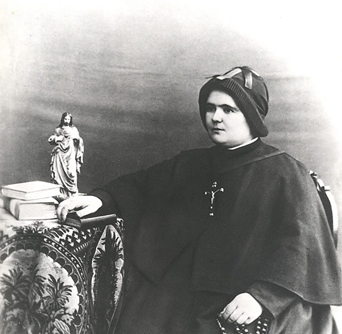

# Beata Clélia Merloni

**"Só Deus... e depois, nada mais!"**

**Nascimento:** 10 de março de 1861, Forlì, Itália
**Morte:** 21 de novembro de 1930, Roma, Itália
**Festa Litúrgica:** 21 de novembro
**Beatificação:** 3 de novembro de 2018, pelo Papa Francisco

<TextToSpeech />

---

## Biografia

Clélia Merloni nasceu em Forlì, Itália, filha de um rico industrial e maçom influente. Desde cedo sentiu o chamado à vida religiosa, enfrentando forte oposição de seu pai, que desejava para ela um futuro de prestígio social. Apesar das dificuldades, perseverou em sua vocação e, em 1894, fundou o Instituto das Apóstolas do Sagrado Coração de Jesus, dedicando-se à caridade, à educação e à reparação ao Sagrado Coração.

Sua obra expandiu-se rapidamente, inclusive para o Brasil e Estados Unidos. No entanto, devido a calúnias e má administração financeira por parte de outros, Clélia foi injustamente acusada e destituída do governo de seu próprio instituto.

## Vida Pessoal e Sofrimento

A vida de Madre Clélia foi marcada por um profundo sofrimento moral. Após ser deposta, viveu anos de exílio e obscuridade, sendo proibida de se comunicar com suas filhas espirituais. Aceitou essa humilhação com heroica humildade e obediência, oferecendo tudo pela conversão de seu pai (que se reconciliou com a Igreja antes de morrer) e pelo bem da Congregação.

Somente anos mais tarde foi readmitida na comunidade, vivendo seus últimos dias em Roma, em oração silenciosa e isolamento.

## Milagres

O milagre que permitiu sua beatificação ocorreu no Brasil, em 1951. O médico Pedro Ângelo de Oliveira Filho foi acometido pela Síndrome de Guillain-Barré, que o deixou tetraplégico e à beira da morte por paralisia respiratória. Após ingerir um pouco de água onde havia sido colocada uma pequena relíquia (um pedaço do véu) de Madre Clélia, ele teve uma melhora súbita e inexplicável. Em poucos dias estava curado e voltou a andar, vivendo por mais 25 anos sem sequelas.

## Curiosidades

1.  **Corpo Incorrupto:** Em 1945, durante a Segunda Guerra Mundial, seu corpo foi exumado e encontrado incorrupto. Hoje, repousa na Capela da Casa Generalícia em Roma, onde pode ser venerado.
2.  **O Perdão:** Sua maior virtude foi a caridade através do perdão. Nunca se defendeu das acusações falsas nem guardou rancor daqueles que a perseguiram, vendo em tudo a vontade de Deus.

## Cidades por onde passou

Clélia nasceu em Forlì, fundou a obra em Viareggio, mas estabeleceu-se posteriormente em Roma.

<MiracleMap :items='[
  { lat: 44.2227, lng: 12.0407, title: "Forlì, Itália", description: "Cidade natal de Madre Clélia." },
  { lat: 43.8668, lng: 10.2505, title: "Viareggio, Itália", description: "Local da fundação do Instituto." },
  { lat: 41.9028, lng: 12.4964, title: "Roma, Itália", description: "Onde viveu seus últimos anos e onde está seu corpo (Casa Generalícia)." }
]' />

## Impacto Hoje

As Apóstolas do Sagrado Coração de Jesus estão presentes em 15 países, com forte atuação no Brasil. Mantêm escolas, hospitais e obras sociais, perpetuando o carisma de levar o amor do Coração de Jesus a todos. A beatificação de Madre Clélia trouxe à luz sua história de superação e santidade, inspirando muitos a confiarem na Divina Providência.
