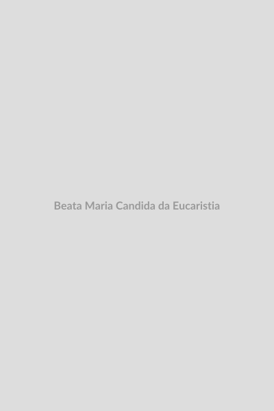

# Beata Maria Cândida da Eucaristia

**"A Eucaristia é o paraíso na terra."**

**Nascimento:** 16 de janeiro de 1884, Catanzaro, Itália 
**Morte:** 12 de junho de 1949, Ragusa, Sicília, Itália 
**Beatificação:** 21 de março de 2004 pelo Papa João Paulo II 
**Festa Litúrgica:** 12 de junho 

---

<TextToSpeech />

## Biografia

Nascida Maria Barba em 1884, na Itália, em uma família profundamente católica e respeitada, sentiu desde cedo um chamado para a vida religiosa. A sua Primeira Comunhão marcou o início de uma imensa devoção à Eucaristia, que se tornaria o centro de toda a sua vida e espiritualidade.

Apesar da sua forte vocação, enfrentou forte resistência da sua família, que se opunha à sua entrada no convento. Durante quase vinte anos, Maria suportou essa provação com paciência e obediência, cultivando sua vida interior e aprofundando seu amor a Deus na oração escondida. Somente após a morte da mãe e com a saúde do pai debilitada é que, finalmente, pôde realizar o seu sonho. Aos 35 anos, entrou no mosteiro das Carmelitas Descalças em Ragusa, Sicília, adotando o nome de Maria Cândida da Eucaristia.

Tornou-se prioresa do convento e foi fundamental na difusão da espiritualidade carmelita na Sicília, ajudando a fundar novos conventos. Sua vida foi um constante ato de amor a Jesus Sacramentado, refletido em seus escritos místicos.

## Vida Pessoal

Sua vida foi um testemunho de espera paciente. O longo período que passou no mundo, antes de poder consagrar-se plenamente a Deus no convento, não foi um tempo perdido, mas uma intensa forja espiritual onde sua humildade e obediência amadureceram. Sua devoção era sempre alegre, e suas irmãs de mosteiro lembravam-se dela como uma alma de grande doçura maternal e caridade.

## Milagres

A beatificação de Maria Cândida da Eucaristia foi impulsionada por milagres atribuídos à sua intercessão, especialmente relacionados a curas inexplicáveis de doentes graves.
- O milagre aceito para sua beatificação envolveu a cura repentina e total de um recém-nascido em coma profundo no hospital de Ragusa, cuja família rezou fervorosamente pedindo sua ajuda.

## Curiosidades

- Maria Cândida foi uma exímia escritora espiritual. O seu livro mais conhecido, "A Eucaristia", detalha sua experiência íntima e amorosa com Jesus na hóstia consagrada, sendo considerado um tratado de profunda teologia mística escrito com a linguagem do coração.

## Cidades por onde passou

- **Catanzaro, Itália:** Cidade onde nasceu e passou seus primeiros anos de vida.
- **Palermo, Itália:** Onde a sua família viveu durante muitos anos, e onde ela esperou pacientemente a permissão para entrar na vida religiosa.
- **Ragusa, Itália:** Local do mosteiro das Carmelitas Descalças onde ela entrou, viveu sua vida religiosa e faleceu.

## Impacto Hoje

No mundo contemporâneo, marcado pela pressa e ansiedade, a Beata Maria Cândida é um farol que aponta para o valor inestimável da Eucaristia. Ela ensina a importância de "saber esperar" o tempo de Deus e mostra que o sofrimento e a oposição podem ser transformados em profunda graça. Seu legado continua a inspirar muitos a buscar em Jesus Sacramentado a fonte de toda a força e paz.

<MiracleMap :items='[
  { lat: 38.9056, lng: 16.5930, title: "Catanzaro", description: "Local de seu nascimento." },
  { lat: 36.9282, lng: 14.7297, title: "Mosteiro em Ragusa", description: "Onde viveu toda a sua vida religiosa como Carmelita Descalça." }
]' />
