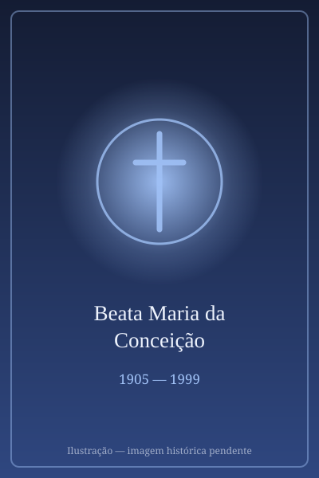

# Beata Concepción Cabrera de Armida (Conchita)

> "Cristo quer reproduzir a sua vida em cada batizado."

- **Nascimento:** 1 de fevereiro de 1905, Granada, Espanha
- **Morte:** 24 de fevereiro de 1999, Madri, Espanha
- **Beatificação:** 2019, pelo Papa Francisco
- **Festa Litúrgica:** 24 de fevereiro

<TextToSpeech />

---

## Biografia

María de la Concepción Cabrera de Armida, conhecida no México como Conchita, nasceu em 8 de dezembro de 1862, em San Luis Potosí, numa família numerosa e abastada. Recebeu educação simples e cresceu no ambiente rural das fazendas da região.

Casou-se em 1884 com Francisco Armida, de quem teve nove filhos. Viveu como esposa, mãe e dona de casa em plena vida social mexicana — ia a bailes, cuidava da casa e da família — e, ao mesmo tempo, desenvolvia uma vida mística de intensidade rara, registrada por ordem de seus confessores em cadernos que somariam cerca de 66 mil páginas manuscritas.

Ficou viúva em 1901, aos 38 anos, com nove filhos, o mais novo com poucos meses. Enfrentou dificuldades financeiras e criou os filhos sozinha. Um deles morreu na juventude; outro tornou-se jesuíta.

Sua experiência espiritual deu origem às chamadas Obras da Cruz — cinco fundações, entre elas os Missionários do Espírito Santo e as Religiosas da Cruz do Sagrado Coração de Jesus — que ela inspirou sem jamais tornar-se religiosa: permaneceu leiga a vida inteira. Morreu na Cidade do México, em 3 de março de 1937, aos 74 anos.

## Vida Pessoal e Espiritualidade

O centro de sua espiritualidade é o que chamava de "encarnação mística": a ideia de que Cristo quer reproduzir sua vida em cada batizado. Escrevia enquanto amamentava, cozinhava ou velava filhos doentes — e essa simultaneidade entre vida doméstica e experiência mística é o que torna seu caso singular. Nunca fez votos, nunca viveu em convento e sempre se apresentou como "uma mãe de família".

## Milagres

O milagre reconhecido para a beatificação foi a cura de uma mulher mexicana que sofria de um quadro clínico grave, considerado sem explicação médica. O Papa Francisco autorizou o decreto, e a beatificação ocorreu na Cidade do México, em 4 de maio de 2019.

## Curiosidades

1. **Sessenta e seis mil páginas:** seus escritos formam um dos maiores corpus místicos já produzidos por uma leiga, hoje objeto de estudo em universidades pontifícias.
2. **Leiga, esposa e mãe:** inspirou cinco fundações religiosas sem nunca ter sido religiosa, caso raríssimo na história das ordens.
3. **Conchita:** o apelido de infância é o nome pelo qual é conhecida no México e nos documentos da causa.
4. **Padroeira:** invocada pelas mães de família, pelas viúvas e pelos leigos com vocação contemplativa.

## Cidades por onde passou

Nasceu em San Luis Potosí, viveu entre as fazendas da região e a Cidade do México, onde morreu e onde está sepultada, na Casa das Obras da Cruz.

<MiracleMap :items='[
  { lat: 37.1773, lng: -3.5985, type: "nascimento", title: "Granada, Espanha", description: "Local de nascimento (1 de fevereiro de 1905)." },
  { lat: 19.4326, lng: -99.1332, type: "vida", title: "Cidade do México", description: "Onde viveu grande parte de sua vida e obra." },
  { lat: 40.4168, lng: -3.7038, type: "morte", title: "Madri, Espanha", description: "Local da morte (24 de fevereiro de 1999)." }
]' />

## Impacto Hoje

Conchita é hoje uma das referências mais citadas quando se fala de santidade leiga e de espiritualidade conjugal — sua beatificação foi lida no México como reconhecimento de que a vida doméstica pode ser lugar de experiência mística plena. As cinco Obras da Cruz atuam em vários países da América, e seus escritos, publicados progressivamente, são estudados por teólogos interessados na espiritualidade dos leigos.
