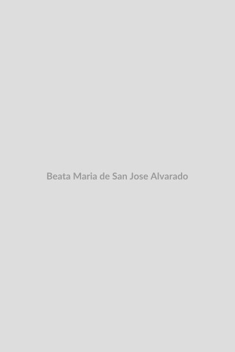

# Beata Maria de San José Alvarado

  
  

    
<em>"Fundadora dedicada aos necessitados da Venezuela."</em>

    
<strong>Nascimento:</strong> 25 de abril de 1875, Choroní, Venezuela 
    <strong>Morte:</strong> 2 de abril de 1967, Maracay, Venezuela 
    <strong>Beatificação:</strong> 7 de maio de 1995 pelo Papa João Paulo II 
    <strong>Festa Litúrgica:</strong> 7 de maio

  

<TextToSpeech />

## Biografia
Laura Evangelista Alvarado Cardozo, conhecida na vida religiosa como Maria de São José, nasceu numa família cristã em Choroní, no estado venezuelano de Aragua. Desde a infância demonstrou profunda vida interior e preocupação com a educação cristã das crianças da sua paróquia, ajudando ativamente o sacerdote local.

Aos dezessete anos, fez votos privados de virgindade, consagrando-se a Deus, e em 1893 começou a trabalhar num hospital de caridade fundado em Maracay pelo Padre Vicente López Aveledo. Esta experiência marcou profundamente o seu coração e a levou a fundar a Congregação das Irmãs Agostinianas Recoletas do Coração de Jesus. A missão da congregação centrava-se no atendimento a doentes, idosos abandonados e no acolhimento de meninas órfãs, sendo pioneira na promoção de serviços sociais e cristãos fundamentais na Venezuela.

Ao longo de toda a sua longa vida, governou a congregação, multiplicando orfanatos e hospitais pelo país. Mesmo quando ficou surda nos seus últimos anos de vida, nunca perdeu o ânimo nem o seu espírito de oração e adoração à Eucaristia.

## Milagres
O milagre que abriu as portas à sua beatificação foi o da Irmã Teresa Silva. Ela sofria de uma grave doença degenerativa nos ossos que a incapacitava de andar. Tendo suplicado pela intercessão da Madre Maria de São José, sentiu um alívio repentino e inexplicável para a medicina. Numa altura em que se previa a sua paralisia total, Irmã Teresa recuperou os seus movimentos integralmente. Anos mais tarde, na abertura do processo de beatificação, o corpo da Madre Maria foi exumado e encontrado perfeitamente incorrupto.

## Curiosidades
1. **Primeira Beata Venezuelana:** Maria de San José Alvarado teve a imensa honra de se tornar na primeira venezuelana a ser elevada aos altares, sendo hoje um orgulho nacional.
2. **Corpo Incorrupto:** Os seus restos mortais encontram-se expostos num relicário de cristal no Santuário da Madre Maria de São José em Maracay, onde milhares de peregrinos acorrem todos os anos.
3. **Mãe dos Órfãos:** Ao longo de sua vida, Maria acolheu e educou milhares de meninas desfavorecidas que a consideravam a sua verdadeira mãe.

## Cidades por onde passou
A sua vida foi dedicada sobretudo à Venezuela, tendo fundado casas em diversas regiões:

* **Choroní (Venezuela):** A sua cidade natal, berço da sua fé e caridade.
* **Maracay (Venezuela):** Onde trabalhou inicialmente num hospital de caridade, fundou a congregação e faleceu. É a sede do seu santuário.
* **Caracas, Valência, e outras cidades (Venezuela):** Onde estabeleceu os diversos hospitais, orfanatos e lares de idosos geridos pelas suas irmãs.

## Impacto Hoje
Madre Maria de San José permanece um símbolo luminoso da caridade e da devoção na Venezuela. A congregação por ela fundada continua a desenvolver o seu trabalho em favor da educação, apoio hospitalar e assistência aos desamparados em vários países. É um testemunho de que a resposta aos problemas sociais, à luz da fé cristã, se faz unindo o trabalho incansável a uma vida de profunda espiritualidade e confiança na Eucaristia.

<MiracleMap :items='[
  { lat: 10.4912, lng: -67.6163, title: "Choroní, Venezuela", description: "Onde nasceu e descobriu a sua vocação religiosa." },
  { lat: 10.2469, lng: -67.5958, title: "Maracay, Venezuela", description: "Onde fundou a sua congregação, viveu, faleceu e hoje repousa o seu corpo incorrupto." }
]' />
