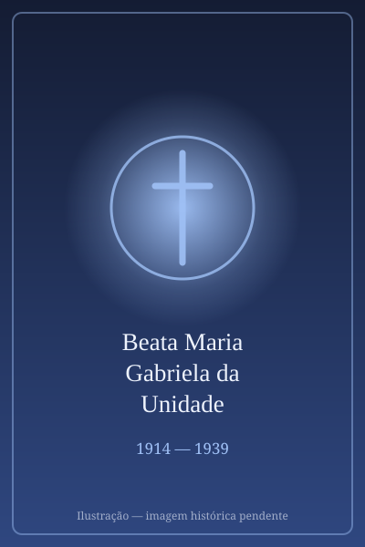

# Beata Maria Gabriela da Unidade

> "Ut unum sint (Para que todos sejam um)."

- **Nascimento:** 23 de abril de 1914, Dorgali, Itália
- **Morte:** 23 de abril de 1939, Vitorchiano, Itália
- **Beatificação:** 1983, pelo Papa João Paulo II
- **Festa Litúrgica:** 23 de abril

<TextToSpeech />

---

## Biografia

Maria Sagheddu nasceu em 17 de março de 1914, em Dorgali, na Sardenha, numa família de pastores. Ficou órfã de pai aos cinco anos e cresceu numa comunidade rural fechada. Na adolescência era conhecida pelo temperamento difícil, crítico e teimoso — traço que ela própria reconhecia.

Aos dezoito anos, a morte da irmã mais nova provocou uma mudança profunda. Entrou para a Ação Católica, passou a dedicar-se à catequese e ao cuidado de doentes e, em 1935, ingressou no mosteiro trapista de Grottaferrata, perto de Roma, recebendo o nome de Maria Gabriela.

O mosteiro mantinha contato com o padre Paul Couturier, pioneiro francês do movimento ecumênico, e com um grupo anglicano interessado na unidade dos cristãos. Em 1938, a abadessa propôs à comunidade a oferta da vida pela causa da unidade. Maria Gabriela se ofereceu, e a oferta foi aceita como voto pessoal.

Na noite da oferta, começou a manifestar sintomas de tuberculose — doença que nunca tivera. Adoeceu rapidamente e morreu quinze meses depois, em 23 de abril de 1939, aos 25 anos, num domingo do Bom Pastor, exatamente enquanto se lia o evangelho "haverá um só rebanho e um só pastor".

## Vida Pessoal e Espiritualidade

Maria Gabriela deixou pouquíssimos escritos: algumas notas e cartas breves. Sua espiritualidade era a trapista, feita de silêncio, trabalho e liturgia. A superiora anotou que ela pedia insistentemente para "não ser lembrada" e que a única coisa que a preocupava era saber se a oferta havia sido aceita. Foi beatificada por João Paulo II em 25 de janeiro de 1983 — data de encerramento da Semana de Oração pela Unidade dos Cristãos, escolhida deliberadamente.

## Milagres

O milagre reconhecido para a beatificação foi a cura de uma religiosa que sofria de um quadro grave e irreversível, atribuída à sua intercessão. A beatificação teve caráter ecumênico incomum: entre os presentes na Basílica de São Paulo Fora dos Muros havia delegações anglicanas e ortodoxas, e João Paulo II apresentou sua oferta como um "dom do Espírito à causa da unidade".

## Curiosidades

1. **Padroeira do ecumenismo:** é a única beata cuja causa está inteiramente ligada à oração pela unidade dos cristãos.
2. **Quinze meses:** entre a oferta da vida e a morte passaram-se pouco mais de quinze meses, período em que a tuberculose avançou de forma atípica.
3. **A data escolhida:** a beatificação em 25 de janeiro liga permanentemente sua memória à Semana de Oração pela Unidade dos Cristãos.
4. **Sardenha:** é uma das figuras mais veneradas da ilha, junto com Antônia Mesina e Edviges Carboni.

## Cidades por onde passou

Nasceu em Dorgali, na Sardenha, e viveu no mosteiro trapista de Grottaferrata, perto de Roma, onde morreu; seus restos foram depois transferidos para o mosteiro de Vitorchiano.

<MiracleMap :items='[
  { lat: 40.29, lng: 9.59, type: "nascimento", title: "Dorgali, Itália", description: "Local de nascimento (23 de abril de 1914)." },
  { lat: 42.4667, lng: 12.1722, type: "morte", title: "Mosteiro de Vitorchiano", description: "Onde viveu e morreu." }
]' />

## Impacto Hoje

Maria Gabriela é citada em praticamente todos os documentos católicos sobre ecumenismo espiritual, incluindo a encíclica *Ut unum sint* de João Paulo II, que a apresenta como exemplo do "ecumenismo da santidade" — a convicção de que a unidade dos cristãos se prepara sobretudo pela oração e pela conversão pessoal. Sua memória é lembrada anualmente na Semana de Oração pela Unidade dos Cristãos, em janeiro.
