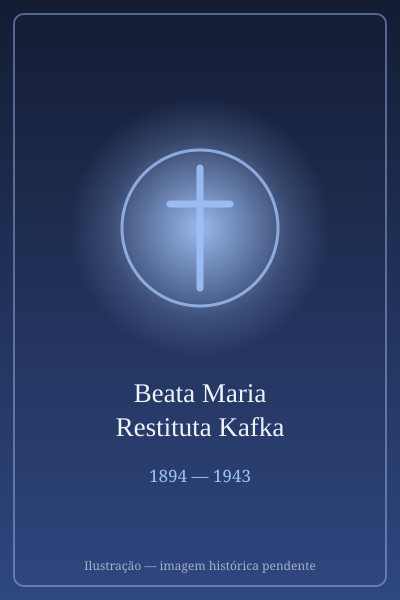

# Beata Maria Restituta Kafka

> "Vivi por Cristo, quero morrer por Cristo."

- **Nascimento:** 1 de maio de 1894, Brno, Áustria-Hungria (atual República Tcheca)
- **Morte:** 30 de março de 1943, Viena, Áustria (Mártir)
- **Beatificação:** 21 de junho de 1998, pelo Papa João Paulo II
- **Festa Litúrgica:** 29 de outubro

<TextToSpeech />

---

## Biografia

Helene Kafka nasceu em Hussowitz, perto de Brno, no que era então o Império Austro-Húngaro. De origem modesta, sua família mudou-se para Viena quando ela tinha dois anos. Trabalhou como vendedora e enfermeira antes de ingressar na congregação das Irmãs Franciscanas da Caridade Cristã (Irmãs de Hartmann) aos 20 anos, recebendo o nome religioso de Maria Restituta.

A Irmã Restituta destacou-se por mais de vinte anos como enfermeira cirúrgica no Hospital de Mödling, em Viena. Ela era conhecida por sua eficiência, compaixão e personalidade forte, ganhando o apelido de "Irmã Resoluta" entre os médicos e pacientes. Com a anexação da Áustria pela Alemanha Nazista em 1938 (Anschluss), a situação dos católicos e da oposição política tornou-se extremamente perigosa.

A Irmã Restituta opôs-se abertamente ao regime nazista. Ela se recusou a retirar os crucifixos das paredes dos quartos do hospital quando as autoridades exigiram e escreveu poemas satíricos criticando Adolf Hitler. Suas ações chamaram a atenção da Gestapo. Ela foi presa na Quarta-feira de Cinzas de 1942, saindo da sala de cirurgia, acusada de traição e de espalhar propaganda subversiva.

## Martírio

Após sua prisão, Maria Restituta permaneceu na prisão em Viena por quase um ano. Mesmo no cativeiro, ela cuidou dos outros prisioneiros com notável coragem e abnegação. Foi condenada à morte por guilhotina em outubro de 1942, em um julgamento onde foi descrita como um perigo para o estado por sua incitação contra o regime.

O Papa Pio XII tentou interceder por ela sem sucesso. Em 30 de março de 1943, foi decapitada, tornando-se a única freira austríaca a ser executada sob o regime nazista por traição e alta traição. Suas últimas palavras registradas refletiram sua fé profunda em Cristo.

## Curiosidades

- O Papa João Paulo II a beatificou durante sua visita a Viena em 1998.
- Uma rua e uma praça em Viena foram nomeadas em sua homenagem após a guerra (Restituta-Gasse).
- A coragem da Irmã Restituta foi tão reconhecida que um de seus captores, impressionado, comentou sobre a serenidade com a qual ela enfrentou a morte.

## Cidades por onde passou

- **Brno, Áustria-Hungria (hoje República Tcheca):** Cidade de seu nascimento.
- **Viena, Áustria:** Cidade onde viveu a maior parte de sua vida, onde serviu como enfermeira em Mödling e onde foi presa e martirizada.

## Impacto Hoje

A Beata Maria Restituta Kafka é lembrada como um símbolo de resistência à tirania e à opressão, e de fidelidade absoluta aos princípios cristãos. Seu exemplo de colocar a fé e a consciência acima do medo é uma inspiração para os católicos, ativistas de direitos humanos e profissionais de saúde. A sua vida é um testemunho da dignidade inalienável da pessoa humana diante de regimes totalitários.

<MiracleMap :items='[
  { lat: 49.2131, lng: 16.6267, title: "Nascimento", description: "Nasceu em Brno, atual República Tcheca.", type: "nascimento" },
  { lat: 48.0861, lng: 16.2822, title: "Serviço como Enfermeira", description: "Trabalhou no Hospital de Mödling, perto de Viena.", type: "vida" },
  { lat: 48.2082, lng: 16.3738, title: "Prisão e Morte", description: "Foi martirizada em Viena, Áustria.", type: "morte" }
]' />
