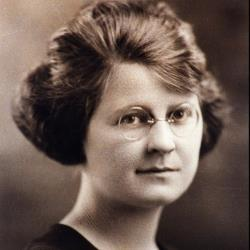

# Beata Miriam Teresa Demjanovich

> "Nossa vida deve ser um contínuo 'Magnificat'"

- **Nascimento:** 26 de março de 1901, Bayonne, Nova Jersey, Estados Unidos
- **Morte:** 8 de maio de 1927, Paterson, Nova Jersey, Estados Unidos
- **Beatificação:** 4 de outubro de 2014 pelo Papa Francisco (cerimônia presidida pelo Cardeal Angelo Amato)
- **Festa Litúrgica:** 8 de maio

<TextToSpeech />

---

## Biografia

Teresa Demjanovich (que mais tarde adotaria o nome religioso de Irmã Miriam Teresa) nasceu em 26 de março de 1901 em Bayonne, Nova Jersey, sendo a caçula de sete filhos de imigrantes ruteno-católicos provenientes de Bardejov, atual Eslováquia. Ela cresceu no seio de uma família profundamente devota pertencente à Igreja Católica Bizantina Rutena, e frequentou as escolas públicas de Bayonne, destacando-se por sua inteligência e devoção espiritual.

Após concluir o ensino médio em 1917, ela expressou o desejo de se juntar aos Carmelitas, mas optou por permanecer em casa para cuidar de sua mãe que havia ficado doente. Após a morte de sua mãe, a conselho de sua família e diretor espiritual, ela ingressou no *College of Saint Elizabeth* em Convent Station, Nova Jersey, graduando-se com honras em Literatura em 1923.

Durante seus anos de faculdade, ela desenvolveu uma profunda vida interior e um ardente desejo de santidade, percebendo que a busca pela perfeição cristã não era exclusiva do clero ou das ordens religiosas, mas um chamado universal para todos os batizados. Após lecionar por um breve período nas Escolas Públicas de Jersey City, ela entrou na Congregação das Irmãs de Caridade de Santa Isabel em 11 de fevereiro de 1925, recebendo o hábito e o nome religioso de Irmã Miriam Teresa.

Mesmo sendo apenas uma noviça, sua profunda sabedoria espiritual foi reconhecida por seu diretor espiritual, o Padre Benedict Bradley. Ele solicitou que ela escrevesse anonimamente as conferências espirituais semanais para as outras noviças, textos que mais tarde foram compilados e publicados no livro "Maior Perfeição" (Greater Perfection).

A saúde da Irmã Miriam Teresa, no entanto, era frágil. Ela foi hospitalizada com problemas de saúde que incluíam apendicite crônica, exaustão e uma miocardite secundária. Após uma breve e intensa vida religiosa de apenas dois anos, ela faleceu em 8 de maio de 1927, com apenas 26 anos de idade, sem ter feito os votos perpétuos. Seus votos foram feitos em seu leito de morte no St. Joseph's Hospital em Paterson.

## Milagres

O milagre que abriu caminho para a sua beatificação ocorreu em 1964 e envolveu um menino de 8 anos chamado Michael Mencer, que estava sofrendo de degeneração macular bilateral irreversível, uma condição que o estava levando à cegueira permanente. Ele usou uma relíquia da Irmã Miriam Teresa (uma mecha de seu cabelo) e rezou pedindo sua intercessão. De forma repentina e medicamente inexplicável, a visão do menino foi perfeitamente restaurada.

Este milagre, minuciosamente investigado pelas comissões médicas do Vaticano, foi formalmente aprovado pelo Papa Francisco em 2013, o que levou à beatificação histórica de Miriam Teresa.

## Curiosidades

- **Primeira Beatificação nos EUA:** A cerimônia de beatificação de Miriam Teresa, realizada em 4 de outubro de 2014 na Basílica Catedral do Sagrado Coração em Newark, Nova Jersey, foi a primeira beatificação a acontecer em solo dos Estados Unidos.
- **Rito Bizantino:** Ela cresceu frequentando a Igreja Católica Bizantina, e só mais tarde ingressou em uma ordem religiosa de rito latino (as Irmãs de Caridade), sendo uma ponte espiritual entre os dois ritos católicos.
- **Autora Anônima:** O famoso livro espiritual *Maior Perfeição*, escrito por ela, só teve a verdadeira autoria revelada após sua morte, surpreendendo a todos que achavam que os profundos textos teológicos e místicos eram de autoria do seu experiente diretor espiritual, o Padre Bradley.
- **Chamado Universal à Santidade:** Suas escritas anteciparam em várias décadas um dos ensinamentos centrais do Concílio Vaticano II: a ideia de que a santidade não é reservada a padres e freiras, mas é a vocação de todos os leigos cristãos.

## Cidades por onde passou

Miriam Teresa Demjanovich viveu e atuou no estado de Nova Jersey, EUA, deixando um impacto profundo e duradouro na região.

<MiracleMap :items='[
  { lat: 40.6687, lng: -74.1143, type: "nascimento", title: "Bayonne, NJ, EUA", description: "Local de nascimento e crescimento de Miriam Teresa." },
  { lat: 40.7818, lng: -74.4533, type: "vida", title: "Convent Station, NJ", description: "Local do College of Saint Elizabeth e da Casa Mãe das Irmãs de Caridade de Santa Isabel." },
  { lat: 40.9168, lng: -74.1718, type: "morte", title: "Paterson, NJ, EUA", description: "Local do St. Joseph Hospital onde fez seus votos no leito de morte e faleceu aos 26 anos." },
  { lat: 40.7523, lng: -74.1804, type: "milagre", title: "Newark, NJ, EUA", description: "Basílica Catedral do Sagrado Coração, onde ocorreu sua cerimônia de beatificação em 2014." }
]' />

## Impacto Hoje

O impacto da Beata Miriam Teresa Demjanovich hoje se manifesta não apenas no milagre que a tornou célebre, mas, sobretudo, na sua mensagem revolucionária e perene sobre a vida espiritual. Seu livro *Maior Perfeição* continua sendo lido, inspirando leigos, religiosos e sacerdotes a buscar uma união mais íntima com Deus em meio às tarefas e desafios do cotidiano.

A congregação da qual ela fez parte, as Irmãs de Caridade de Santa Isabel, e a Igreja nos Estados Unidos, celebram nela um modelo moderno de santidade. Por ser uma mulher jovem, americana, filha de imigrantes e de herança ruteno-católica, ela ressoa fortemente com a experiência católica diversificada nos Estados Unidos. Sua beatificação em solo americano marcou um momento de renovação espiritual para muitos católicos norte-americanos que viram nela a prova de que santos podem surgir de suas próprias cidades e escolas públicas.
