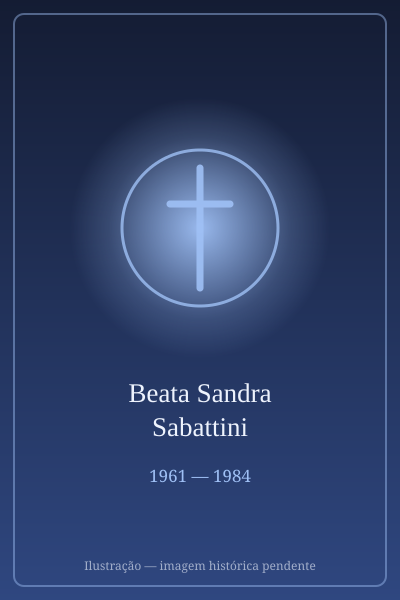

# Beata Sandra Sabattini

> "A santa noiva."

- **Nascimento:** 19 de agosto de 1961, Riccione, Itália
- **Morte:** 2 de maio de 1984, Bolonha, Itália
- **Beatificação:** 2021, pelo Papa Francisco
- **Festa Litúrgica:** 4 de maio

<TextToSpeech />

---

## Biografia

Sandra Sabattini nasceu em 19 de agosto de 1961, em Riccione, na costa adriática italiana, e cresceu em Rimini, onde o tio, padre Giuseppe Bonini, era pároco. A casa paroquial foi seu ambiente de formação: ali conheceu, aos doze anos, dom Oreste Benzi, fundador da Comunidade Papa João XXIII, dedicada ao acolhimento de pessoas com deficiência, dependentes químicos e vítimas de exploração.

Aos catorze anos começou a participar das atividades da comunidade e passou a dedicar os fins de semana e as férias às casas-família. Estudou medicina em Bolonha, com a intenção declarada de tornar-se médica missionária na África. Mantinha um diário espiritual desde os doze anos, que revela uma vida interior intensa e disciplinada, com horários fixos de oração em meio à rotina de estudante.

Namorava Guido Rossi, também da comunidade, e o casal planejava casar-se e partir juntos como missionários. Em 29 de abril de 1984, a caminho de um encontro da comunidade em Igea Marina, foi atropelada por um carro ao atravessar a rua. Ficou três dias em coma e morreu em 2 de maio, aos 22 anos, no hospital de Rimini.

## Vida Pessoal e Espiritualidade

Sandra é o retrato de uma santidade juvenil comum: estudava, namorava, ia à praia, discutia política, e ao mesmo tempo organizava a vida em torno da oração e do serviço aos mais frágeis. Seus diários, publicados depois da morte, tornaram-se leitura frequente em grupos de jovens. Escreveu numa das páginas: "Estou disposta a tudo, mas mostra-me o caminho".

## Milagres

O milagre reconhecido para a beatificação foi a cura de Stefano Vitali, morador de Rimini, que em 2007 sofreu uma grave lesão pulmonar sem perspectiva de recuperação e se restabeleceu inexplicavelmente após orações à sua intercessão. O decreto foi promulgado pelo Papa Francisco, e a beatificação realizou-se na catedral de Rimini em 24 de outubro de 2021.

## Curiosidades

1. **Beata noiva:** é a primeira jovem beatificada estando noiva, e sua causa é citada nos debates sobre a santidade vivida no namoro e no matrimônio.
2. **Os diários:** escreveu do 12 aos 22 anos; os cadernos foram publicados na Itália e traduzidos para várias línguas.
3. **Doação de órgãos:** a família autorizou a doação de suas córneas, gesto lembrado nas campanhas italianas sobre o tema.
4. **Padroeira:** invocada pelos estudantes universitários, pelos jovens noivos e pelos voluntários em dependência química.

## Cidades por onde passou

Nasceu em Riccione, cresceu em Rimini, estudou medicina em Bolonha e morreu em Rimini, onde está sepultada na igreja da Comunidade Papa João XXIII.

<MiracleMap :items='[
  { lat: 43.9989, lng: 12.6558, type: "nascimento", title: "Riccione, Itália", description: "Local de nascimento (19 de agosto de 1961)." },
  { lat: 44.0678, lng: 12.5695, type: "vida", title: "Rimini", description: "Região onde viveu sua fé e caridade." },
  { lat: 44.4949, lng: 11.3426, type: "morte", title: "Bolonha, Itália", description: "Local da morte (2 de maio de 1984)." }
]' />

## Impacto Hoje

A Comunidade Papa João XXIII, hoje presente em dezenas de países, apresenta Sandra como o rosto jovem de sua espiritualidade, e sua beatificação deu novo impulso ao debate sobre a santidade dos leigos em relacionamentos afetivos. Seus diários circulam em grupos de jovens da Itália, da Espanha e da América Latina, e Rimini recebe romarias de estudantes em 2 de maio.
