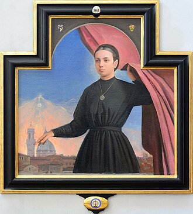

# Beata Savina Petrilli

**"Onde há caridade, aí está Deus."**

**Nascimento:** 29 de agosto de 1851, Siena, Itália
**Morte:** 18 de abril de 1923, Siena, Itália
**Festa Litúrgica:** 18 de abril
**Beatificação:** 24 de abril de 1988, pelo Papa João Paulo II

---

<TextToSpeech />

## Biografia

A Beata Savina Petrilli nasceu em Siena, Itália, em 1851, sendo a segunda filha de uma família rica e devota. Desde jovem, demonstrou grande amor a Cristo e uma profunda sensibilidade para com os pobres. Aos 15 anos, ingressou na Congregação das Filhas de Maria, onde foi presidente.

Em 1869, teve um encontro decisivo com o Papa Pio IX, que a encorajou a seguir os passos de Santa Catarina de Sena. Inspirada por esse conselho e movida pelo desejo de servir aos necessitados, fundou, em 1873, a **Congregação das Irmãs dos Pobres de Santa Catarina de Sena**. A obra começou humildemente na capela de sua casa paterna, com a permissão do Arcebispo de Siena.

A congregação cresceu rapidamente, dedicando-se ao cuidado de órfãos, doentes e necessitados. Savina liderou a expansão da ordem não apenas na Itália, mas também enviando missionárias para o Brasil em 1903, além de Argentina, Índia, Estados Unidos, Filipinas e Paraguai.

## Milagres

Sua beatificação por João Paulo II em 1988 foi possível após o reconhecimento de um milagre atribuído à sua intercessão. A cura inexplicável, validada pela Igreja, confirmou a santidade de sua vida dedicada ao próximo.

## Curiosidades

1.  **Encontro com o Papa:** O encontro pessoal com o Papa Pio IX foi o catalisador para a fundação de sua ordem religiosa.
2.  **Expansão Internacional:** A primeira missão fora da Itália foi estabelecida em Belém do Pará, no Brasil, demonstrando o forte vínculo da congregação com o país.
3.  **Votos Especiais:** Além dos votos tradicionais de pobreza, castidade e obediência, Savina fez votos particulares de total abandono à vontade de Deus e de não negar nada ao Senhor voluntariamente.

## Cidades por onde passou

*   **Siena (Itália):** Cidade onde nasceu, fundou a congregação e faleceu.
*   **Onano (Itália):** Local da primeira casa fundada fora de Siena.
*   **Belém (Brasil):** Destino das primeiras missionárias enviadas por ela.

## Impacto Hoje

O legado da Beata Savina Petrilli vive através das Irmãs dos Pobres de Santa Catarina de Sena, que continuam a servir os mais vulneráveis em diversos países. Sua vida é um testemunho de que a caridade concreta e o abandono à vontade de Deus podem transformar o mundo. No Brasil, sua obra é especialmente forte, com escolas e hospitais que levam seu nome e carisma.

<MiracleMap />
