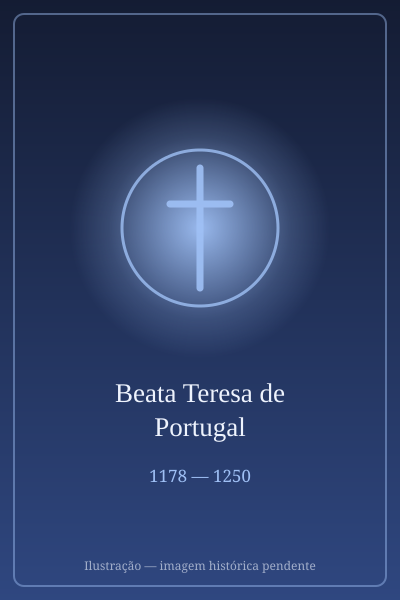

# Beata Teresa de Portugal

> "Desejo viver e morrer unida à cruz de meu Senhor." — Beata Teresa de Portugal (atribuída a sua espiritualidade)

- **Nascimento:** 4 de outubro de 1178, em Coimbra, Portugal.
- **Morte:** 18 de junho de 1250, em Lorvão, Penacova, Portugal.
- **Beatificação:** 13 de dezembro de 1705, pelo Papa Clemente XI.
- **Festa Litúrgica:** 17 de junho.

<TextToSpeech />

## Biografia

A Beata Teresa de Portugal foi a filha primogênita do rei D. Sancho I de Portugal e da rainha D. Dulce de Aragão. Nascida no Paço Real de Coimbra em 1178, ela cresceu recebendo uma excelente educação cristã e cultural, em uma corte que combinava a recém-conquistada estabilidade política de Portugal com a devoção religiosa ibérica medieval.

Em 1191, com apenas 13 anos, Teresa casou-se com o rei Afonso IX de Leão. Desta união nasceram três filhos, incluindo o futuro rei Fernando III de Leão e Castela (mais tarde canonizado como São Fernando). No entanto, o casamento de Teresa e Afonso IX enfrentou problemas com a Igreja. O Papa Celestino III e, posteriormente, Inocêncio III, anularam o matrimônio em 1194 devido a razões de consanguinidade, uma vez que eles eram primos em primeiro grau.

Após a separação forçada e a devolução de seus dotes e territórios, Teresa regressou a Portugal e fixou-se na região do Mosteiro do Lorvão. Inicialmente uma abadia beneditina, Teresa conseguiu permissão papal em 1206 para converter o Lorvão em um mosteiro cisterciense para mulheres. A partir de então, ela se dedicou à vida religiosa e ao mecenato de obras caritativas. Em 1229, Teresa professou os votos religiosos, vivendo as restritas regras de Cister no próprio convento que ajudara a patrocinar.

Seu retorno às questões dinásticas ocorreu apenas brevemente, quando, em um ato notável de diplomacia cristã, intercedeu junto a Berengária de Castela (a segunda esposa de Afonso IX) e conseguiu evitar uma guerra de sucessão entre seus filhos e os da sua sucessora após a morte do ex-marido.

Teresa viveu no mosteiro até a sua morte em 18 de junho de 1250. Foi sepultada em um magnífico túmulo, que permanece como relíquia de grande veneração na igreja do mosteiro que adotara.

## Milagres

Em vida, a Beata Teresa de Portugal foi conhecida por inúmeros atos de caridade e por doações aos pobres da região de Coimbra e Penacova. Ela não se enaltecia como realeza no mosteiro, adotando os trabalhos humildes de monja.

Após sua morte, a fama de sua santidade cresceu na região centro de Portugal. Muitos milagres de curas e intercessões foram reportados por peregrinos que visitavam o Mosteiro de Lorvão e rezavam junto ao seu túmulo.

A canonização de suas irmãs Beata Mafalda e Beata Sancha de Portugal gerou ainda mais apelo pelo reconhecimento oficial de sua própria devoção imemorial, culminando em 1705, com a bula do Papa Clemente XI confirmando o culto público à sua pessoa e elevando-a ao título de Beata.

## Curiosidades

1. **Realeza Santa:** Teresa foi irmã das Beatas Mafalda e Sancha. As três filhas de D. Sancho I escolheram a vida monástica e tornaram-se notáveis intercessoras em Portugal. O grupo é frequentemente conhecido como "as Santas Rainhas" ou "Santas Infantas".
2. **Pacificação:** Seu talento diplomático impediu o derramamento de sangue após a morte de seu ex-marido. Para evitar a guerra, Teresa mediou a sucessão, abrindo mão dos direitos de suas filhas para permitir que a coroa passasse a Fernando III, garantindo a paz entre Leão e Castela.
3. **Mecenato e Reforma:** O Lorvão tornou-se não apenas um modelo de espiritualidade rigorosa sob os Cistercienses, mas também um formidável centro produtor de manuscritos iluminados financiados por sua patronagem.

## Cidades por onde passou

Teresa viveu durante as turbulentas e formadoras primeiras décadas de Portugal como Reino.

- **Coimbra, Portugal:** Capital e cidade berço onde Teresa de Portugal cresceu na corte de Sancho I.
- **Leão, Espanha:** Residiu na corte como rainha consorte durante seu breve casamento com o rei Afonso IX de Leão.
- **Lorvão (Penacova), Portugal:** Onde fundou a comunidade cisterciense feminina, professou votos e viveu a maior parte de sua vida até a sua morte.

## Impacto Hoje

O legado de Beata Teresa de Portugal perdura no reconhecimento de sua profunda resiliência. Apesar de ter suportado o cancelamento do próprio casamento pelo Papa, ela não cultivou amargura; pelo contrário, submeteu-se e canalizou a sua influência real para edificar a Igreja e buscar ativamente a paz política no momento crucial da união das coroas de Leão e Castela.

A devoção ainda está bastante viva na Diocese de Coimbra e no lugar de Penacova. O Mosteiro de Lorvão preserva seu túmulo e mantém viva sua memória litúrgica, reunindo historiadores e católicos que se inspiram na vida monástica e humilde que escolheu em vez do poder da coroa.

<MiracleMap :items='[
  { lat: 40.2115, lng: -8.4292, type: "nascimento", title: "Coimbra, Portugal", description: "Local de nascimento e de residência na corte de Portugal." },
  { lat: 40.2586, lng: -8.3183, type: "morte", title: "Mosteiro do Lorvão, Portugal", description: "Onde viveu reclusa e santificou-se. Local de seu sepultamento." },
  { lat: 42.5987, lng: -5.5671, type: "vida", title: "Leão, Espanha", description: "Onde viveu como Rainha de Leão durante seu casamento." }
]' />
