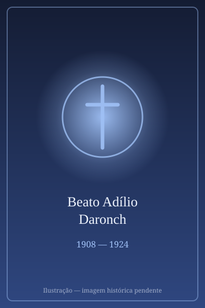

# Beato Adílio Daronch

> "Mártir da juventude."

- **Nascimento:** 25 de outubro de 1908, Dona Francisca, Brasil
- **Morte:** 21 de maio de 1924, Três Passos, Brasil
- **Beatificação:** 2007, pelo Papa Bento XVI
- **Festa Litúrgica:** 21 de maio

<TextToSpeech />

---

## Biografia

Adílio Daronch nasceu em 25 de outubro de 1908, em Dona Francisca, no Rio Grande do Sul, filho de imigrantes italianos. A família mudou-se para Nonoai e depois para a região de Palmitos, no oeste catarinense e norte gaúcho, área de colonização recente e forte tensão política.

Era coroinha e escoteiro, conhecido na comunidade pela seriedade e pela disposição em ajudar. Acompanhava o pároco espanhol Manuel Gómez González nas desobrigas — as longas viagens a cavalo pelas capelas do interior, onde o padre celebrava missas, batizava e confessava. Adílio servia à missa, cuidava dos animais e guiava o caminho.

Em maio de 1924, o Rio Grande do Sul vivia uma revolta armada, e grupos de revolucionários hostis ao clero atuavam na região. Em 21 de maio, padre e coroinha foram interceptados por um bando em Nonoai. Foram levados presos, torturados durante dois dias e mortos a tiros em 21 de maio de 1924, junto a uma estrada. Adílio tinha quinze anos. Segundo os relatos, ofereceram-lhe a vida se abandonasse o padre, e ele recusou.

## Vida Pessoal e Espiritualidade

Adílio é lembrado como o adolescente comum de uma colônia do interior — ajudava na roça, gostava de cavalos, servia no altar. A Igreja reconheceu seu martírio *in odium fidei* junto com o do padre Manuel Gómez González, e ambos foram beatificados em Frederico Westphalen (RS), em 21 de maio de 2013, no aniversário exato da morte.

## Milagres

Por serem mártires, a beatificação dispensou milagre. A comunidade registra desde a década de 1920 graças atribuídas à intercessão dos dois, e o local do martírio, na estrada entre Nonoai e Palmitos, tornou-se ponto de romaria espontânea muito antes do reconhecimento oficial.

## Curiosidades

1. **O coroinha e o pároco:** são raros os casos em que a Igreja reconhece o martírio conjunto de um sacerdote e de um adolescente leigo que o acompanhava.
2. **Patrono da juventude:** foi apresentado como um dos padroeiros da Jornada Mundial da Juventude do Rio de Janeiro, em 2013, poucos meses depois da beatificação.
3. **Escoteiro:** integrava o escotismo católico local, e grupos escoteiros gaúchos o adotaram como patrono.
4. **Padroeiro:** invocado pelos coroinhas, acólitos e jovens do meio rural.

## Cidades por onde passou

Nasceu em Dona Francisca (RS), viveu em Nonoai e na região das missões do norte gaúcho, e foi martirizado nas proximidades de Nonoai.

<MiracleMap :items='[
  { lat: -29.6222, lng: -53.3556, type: "nascimento", title: "Dona Francisca, Brasil", description: "Local de nascimento (25 de outubro de 1908)." },
  { lat: -27.45, lng: -53.93, type: "morte", title: "Santuário dos Mártires (Três Passos, RS)", description: "Local onde repousam seus restos mortais. Local da morte (21 de maio de 1924)." }
]' />

## Impacto Hoje

Adílio é o patrono informal dos coroinhas no Brasil, e sua história é usada na pastoral dos acólitos e do jovem rural. O Santuário dos Mártires, em Três Passos (RS), guarda a memória dos dois beatos e recebe romarias em maio. Sua figura ajudou a trazer para a memória eclesial brasileira o episódio da violência anticlerical durante os conflitos armados dos anos 1920 no Sul.
