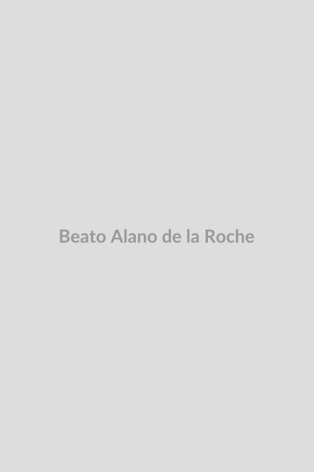

# Beato Alano de la Roche

> "A quem me servir fielmente pela recitação do Rosário, eu prometo graças singulares."

- **Nascimento:** 1428 (Plouër-sur-Rance, Bretanha, França)
- **Morte:** 8 de setembro de 1475 (Zwolle, Países Baixos)
- **Beatificação:** Pré-congregação
- **Festa Litúrgica:** 9 de setembro

<TextToSpeech />

---

## Biografia

O Beato Alano de la Roche (Alanus de Rupe, em latim), nasceu em 1428, na Bretanha, atual França. Ainda muito jovem, ingressou na Ordem dos Pregadores (Dominicanos) em Dinan. Ele se destacou rapidamente por sua brilhante inteligência e profunda devoção mariana. Transferiu-se para o convento dominicano de Saint-Jacques, em Paris, onde estudou filosofia e teologia.

Tornou-se um eminente professor de teologia, lecionando em prestigiadas instituições em Paris, Douai e Rostock. No entanto, o seu maior legado não foi puramente acadêmico, mas sim espiritual. Alano viveu num período em que a devoção ao Rosário, originalmente propagada por São Domingos de Gusmão, havia decaído e estava quase esquecida pelos fiéis.

Em 1460, Alano teve uma visão mística marcante. Jesus Cristo apareceu-lhe, encorajando-o a pregar o Rosário de Maria. Posteriormente, a própria Virgem Maria apareceu-lhe, encarregando-o formalmente de restaurar a devoção ao Santo Rosário. Em resposta a este apelo celeste, Alano dedicou o resto de sua vida a pregar incansavelmente sobre os mistérios do Rosário por Flandres, França e Alemanha.

Ele estruturou o Rosário como o conhecemos, dividindo os 150 Pai Nossos e Ave Marias (o "Saltério de Maria") em 15 dezenas, mediadas pela meditação dos Mistérios Gozosos, Dolorosos e Gloriosos. Para perpetuar a oração, ele fundou as Confrarias do Santo Rosário, a primeira das quais foi estabelecida em Douai (França) em 1470, que rapidamente reuniu dezenas de milhares de membros.

## Vida Pessoal

Alano era conhecido por sua profunda humildade e intenso amor pela Eucaristia e pela Virgem Maria. Apesar do seu vasto conhecimento teológico, a sua pregação era acessível e tocava o coração do povo simples. Ele sofreu com severas provações espirituais, incluindo longos períodos de "noite escura da alma" e desolação, mas perseverou ancorado na oração do Rosário, que ele considerava a "arma mais poderosa" contra as forças do mal e as tentações.

## Milagres

- **As Promessas de Maria:** O maior "milagre" associado a Alano são as 15 Promessas de Nossa Senhora, transmitidas através dele a todos aqueles que rezam o Rosário devotamente. Embora a historicidade exata e o texto exato destas promessas sejam fruto da tradição oral que derivou dos seus escritos, elas têm sustentado a fé de milhões de católicos ao longo dos séculos.
- **A Paz e Conversões:** A sua pregação ardorosa resultou em conversões em massa e pacificação de disputas locais. Onde ele introduzia o Rosário e a Confraria, os relatos da época indicam uma notável diminuição da violência e um aumento na fervorosa prática sacramental.

## Curiosidades

- O título "Beato" lhe é atribuído por tradição e veneração popular desde a sua morte (culto imemorial), não tendo existido um processo formal de beatificação moderno, algo comum para figuras da sua época.
- Embora a tradição mais antiga relacione São Domingos ao Rosário, foi o trabalho organizativo, teológico e apostólico de Alano de la Roche que formatou a oração nas suas quinze dezenas clássicas, estabelecendo a ligação entre a oração vocal e a meditação mental dos mistérios da vida de Cristo.
- Ele faleceu no dia 8 de setembro, dia da Natividade de Nossa Senhora, data considerada providencial para o "Apóstolo do Rosário".

## Cidades por onde passou
- **Plouër-sur-Rance:** Local do seu nascimento na Bretanha.
- **Paris:** Cidade onde estudou e se tornou mestre em teologia.
- **Douai:** Cidade na França onde fundou a primeira Confraria do Santo Rosário em 1470.
- **Zwolle:** Cidade nos Países Baixos onde faleceu.

<MiracleMap :items='[
  { lat: 48.528, lng: -2.016, type: "nascimento", title: "Plouër-sur-Rance", description: "Local do seu nascimento em 1428." },
  { lat: 48.8566, lng: 2.3522, type: "vida", title: "Paris", description: "Onde estudou teologia no Convento de Saint-Jacques." },
  { lat: 50.370, lng: 3.079, type: "vida", title: "Douai", description: "Fundou a primeira Confraria do Rosário em 1470." },
  { lat: 52.516, lng: 6.083, type: "morte", title: "Zwolle", description: "Faleceu em 8 de setembro de 1475." }
]' />

## Impacto Hoje

O impacto de Alano de la Roche é imensurável, pois foi ele o grande catalisador da oração mariana mais rezada no mundo católico: o Santo Rosário. A difusão das Confrarias do Rosário fortaleceu a Igreja Católica num período que precedeu a Reforma Protestante. Hoje, a estrutura por ele delineada e a sua ênfase na meditação dos mistérios de Cristo, orientada por Maria, permanecem a espinha dorsal da espiritualidade dominicana e mariana de toda a Igreja.

## Galeria de Imagens e Restaurações

| Imagem Original | Restauração / Ilustração |
| --- | --- |
|  |  |
