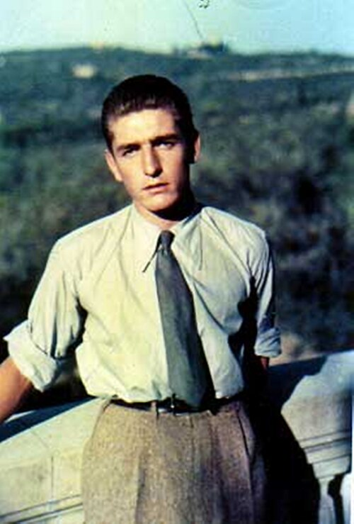

# Beato Alberto Marvelli

> "A vida é uma missão."

- **Nascimento:** 21 de março de 1918, Ferrara (Itália)
- **Morte:** 5 de outubro de 1946, Rimini (Itália)
- **Beatificação:** 5 de setembro de 2004, pelo Papa João Paulo II
- **Festa Litúrgica:** 5 de outubro

<TextToSpeech />

---

## Biografia

Alberto Marvelli nasceu em Ferrara, Itália, o segundo de sete filhos, em uma família cristã dedicada. Durante sua infância, a família mudou-se para Rimini. Lá, Alberto engajou-se fortemente no oratório salesiano e na Ação Católica, desenvolvendo uma profunda vida de oração, combinada com uma grande energia voltada para a ação.

Formou-se em engenharia, mas logo o mundo seria abalado pela Segunda Guerra Mundial. Marvelli não ficou passivo; ele atuou vigorosamente no socorro e assistência aos mais necessitados. Durante os terríveis bombardeios que devastaram Rimini, ele circulava de bicicleta ajudando feridos, resgatando pessoas dos escombros e distribuindo alimentos e cobertores que muitas vezes tirava de sua própria casa ou confiscava dos estoques militares alemães em ações corajosas de salvamento.

Com o fim da guerra, Alberto envolveu-se na reconstrução de sua cidade. Ingressou na política, tornando-se vereador pela Democracia Cristã. Diferente dos estereótipos políticos, ele via o serviço público como um campo para a caridade e a justiça social. Defendeu os pobres e tentou criar cooperativas para trabalhadores, sempre com foco na Doutrina Social da Igreja.

Sua vida, no entanto, foi subitamente interrompida. Aos 28 anos, quando se dirigia de bicicleta para um comício eleitoral, foi atropelado por um caminhão militar das forças aliadas e faleceu devido aos ferimentos.

## Milagres

A causa de beatificação de Alberto Marvelli baseou-se na cura milagrosa de um médico, Tito Malfatti, que em 1991 sofria de uma grave doença vascular incurável. Após orações intercessórias dirigidas a Alberto Marvelli, o médico experimentou uma recuperação completa e inexplicável para a ciência médica da época.

Sua vida inteira, dedicada intensamente ao próximo em tempos de crise, é frequentemente vista como um milagre de caridade.

## Curiosidades

1.  **Engenheiro e Ciclista:** Alberto é frequentemente lembrado andando em sua bicicleta pelas ruas de Rimini. Por sua morte trágica em um acidente de trânsito, é considerado padroeiro da segurança no trânsito e dos motoristas em algumas regiões.
2.  **Santuário:** Seus restos mortais repousam na Igreja de Santo Agostinho, em Rimini, que se tornou um ponto de peregrinação para os jovens locais.
3.  **Diário Espiritual:** Ele manteve um diário íntimo que revela sua profunda espiritualidade, sua devoção à Eucaristia e a Nossa Senhora.

## Cidades por onde passou

A vida de Alberto foi marcada por seu nascimento em Ferrara e, de forma mais significativa, por sua ação heroica e política na cidade de Rimini.

<MiracleMap :items='[
  { lat: 44.8353, lng: 11.6198, type: "nascimento", title: "Ferrara (Itália)", description: "Local de nascimento (21 de março de 1918)." },
  { lat: 44.0594, lng: 12.5683, type: "morte", title: "Rimini (Itália)", description: "Local da morte, atropelado por um caminhão (5 de outubro de 1946)." }
]' />

## Impacto Hoje

O Beato Alberto Marvelli é um exemplo extraordinário para a juventude moderna e para os políticos católicos. Ele demonstrou que a santidade é acessível aos leigos vivendo no meio do mundo, envolvendo-se nas realidades temporais (como a política e a engenharia) e transformando-as através do Evangelho. João Paulo II o chamou de "um campeão de Cristo na política", destacando sua integridade e serviço desinteressado.

> *"Rezar não significa alienar-se do mundo, mas sim inserir-se nele com a força de Deus."* - Beato Alberto Marvelli
