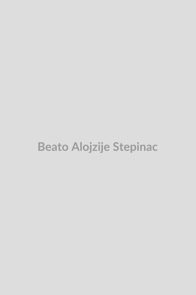

# Beato Alojzije Stepinac

**"Arcebispo e Mártir da Croácia"**

**Nascimento:** 8 de maio de 1898, Krašić (Croácia) 
**Morte:** 10 de fevereiro de 1960, Krašić (Croácia) 
**Festa Litúrgica:** 10 de fevereiro 
**Beatificação:** 3 de outubro de 1998, pelo Papa João Paulo II 

<TextToSpeech />

---

## Biografia

Alojzije Stepinac nasceu no vilarejo de Brezarić, na paróquia de Krašić, a 40 quilômetros de Zagreb, Croácia, o quinto de oito filhos de uma devota família camponesa. Durante a Primeira Guerra Mundial, lutou no exército Austro-Húngaro, foi capturado na Itália, e posteriormente ofereceu-se como voluntário no exército do recém-formado Estado dos Eslovenos, Croatas e Sérvios.

Depois da guerra, estudou em Roma e obteve doutorado em teologia e filosofia. Foi ordenado sacerdote em 1930. Apenas quatro anos depois, o Papa Pio XI nomeou-o Arcebispo Coadjutor de Zagreb. Em 1937, tornou-se o Arcebispo de Zagreb (a mais proeminente sé da Croácia), sendo na época um dos arcebispos mais jovens da Igreja Católica.

Stepinac viveu e liderou a Igreja croata durante períodos extraordinariamente difíceis e sangrentos: a ditadura iugoslava inicial, a Segunda Guerra Mundial e o regime brutal da Ustaše, e, finalmente, o longo terror comunista na Iugoslávia de Tito.

Durante a Segunda Guerra Mundial, Stepinac condenou publicamente as políticas racistas e as atrocidades cometidas pelo regime fascista pró-nazista (a Ustaše). Ele escondeu e organizou o resgate de inúmeros judeus, sérvios e membros de outras minorias perseguidas nos conventos católicos e dentro de seu próprio palácio, além de repreender abertamente as violações de direitos humanos em seus sermões memoráveis.

Após a guerra, a Iugoslávia caiu sob regime comunista implacável de Josip Broz Tito, que desejava criar uma Igreja "nacional" submissa e separada de Roma. Stepinac se recusou categoricamente a cooperar. Em 1946, ele foi preso sob acusações fabricadas de colaboracionismo, em um julgamento fraudulento organizado para puni-lo pela resistência heroica. Ele foi sentenciado a 16 anos de trabalhos forçados. Após cinco anos de dura prisão em Lepoglava, a pressão internacional forçou o governo a transferi-lo para prisão domiciliar em sua aldeia natal de Krašić.

Mesmo isolado, doente e sem poder exercer formalmente o seu cargo, Stepinac continuou a liderar o povo croata espiritualmente, escrevendo milhares de cartas encorajando o povo a suportar a perseguição e a se manterem fiéis a Roma. O Papa Pio XII o nomeou cardeal em 1952. Ele morreu em 1960 em decorrência de doenças agravadas pela sua prisão e pelo envenenamento gradual ao qual as autoridades comunistas supostamente o submeteram.

## Vida Pessoal

A vida pessoal de Stepinac é caracterizada por profundo ascetismo, uma notável devoção a Maria e uma coragem incomparável. Ele vivia de maneira simples e espartana, frequentemente doando o que possuía para caridade. O seu caráter foi talhado pela resiliência e a tenacidade típica de suas origens camponesas; mesmo nos momentos de intenso sofrimento e humilhação por seus carcereiros, ele manteve a paz. "O meu caminho não é o do comunismo. O meu caminho é a verdade, a justiça e o amor ao povo," declarou a seus acusadores. A sua lealdade à unidade da Igreja através do Papado estava acima da própria vida.

## Milagres

Em relação a Stepinac, como mártir (alguém morto devido aos danos infringidos in odium fidei, ou seja, pelo ódio à fé), a prova de um milagre inicial para a beatificação pode ser dispensada. Contudo, há inúmeros relatos de graças e intercessões poderosas na Croácia. Um de seus grandes milagres (embora não do ponto de vista estritamente canônico ou médico) foi a manutenção coesa da fé na Croácia; ele se tornou a pedra e a esperança viva do povo durante décadas de silêncio forçado e opressão severa, um verdadeiro testemunho da glória da resistência espiritual pacífica.

## Curiosidades

- Após a nomeação de Stepinac ao Colégio de Cardeais pelo Papa Pio XII, a Iugoslávia cortou relações diplomáticas com a Santa Sé.
- Ele se recusou repetidamente a deixar a Croácia para ir viver a salvo em Roma ou em qualquer outro lugar; o regime queria que ele fosse exilado para calar a voz da Igreja, mas sua frase marcante sobre o assunto foi: "Somente pela força me arrancarão de meu rebanho".
- Ele está sepultado atrás do altar-mor da majestosa Catedral de Zagreb, num túmulo muito ornamentado onde fiéis se reúnem constantemente; o próprio Beato Papa João Paulo II viajou para orar junto a esse túmulo, momento em que o beatificou.

## Cidades por onde passou

*   **Krašić (Croácia):** Sua aldeia natal, onde nasceu e viveu em confinamento e exílio domiciliar após a libertação da prisão até o fim da vida.
*   **Roma (Itália):** Onde completou os seus estudos acadêmicos e eclesiásticos, moldando o seu profundo amor ao serviço e à teologia.
*   **Zagreb (Croácia):** A capital croata, sendo eleição e sede do seu inabalável apostolado, epicentro dos seus discursos corajosos em defesa das minorias perseguidas e palco do seu injusto julgamento.
*   **Lepoglava (Croácia):** Local do brutal complexo carcerário para onde o enviaram após o seu julgamento pelos comunistas e onde a sua saúde deteriorou significativamente.

## Impacto Hoje

Hoje, o Beato Alojzije Stepinac é reverenciado como um gigante da fé na modernidade. Seu exemplo inspira especialmente nas nações do Leste Europeu que sofreram os flagelos da cortina de ferro comunista. Ele continua a ser lembrado e citado em debates contemporâneos como um exemplo singular de oposição cristã moral, firmeza inabalável dos direitos humanos sob os mais monstruosos totalitarismos do Século XX, e total devoção da liberdade religiosa e consciência sobre quaisquer leis estatais opressivas. Ele figura como herói nacional intocável da Croácia moderna.

<MiracleMap
  :locations="[
    { lat: 45.6457, lng: 15.5135, title: 'Krašić, Croácia', description: 'Local do seu nascimento e de sua prisão domiciliar onde viveu o fim de seus dias e faleceu.' },
    { lat: 45.8150, lng: 15.9819, title: 'Zagreb, Croácia', description: 'Onde serviu heroicamente como arcebispo enfrentando ditaduras nazistas e comunistas.' },
    { lat: 46.2163, lng: 16.0378, title: 'Lepoglava, Croácia', description: 'A notória prisão e campo onde realizou trabalhos forçados.' }
  ]"
/>
