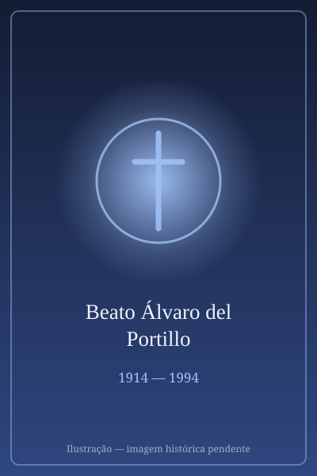

# Beato Álvaro del Portillo

> "Servo bom e fiel."

- **Nascimento:** 11 de março de 1914, Madri, Espanha
- **Morte:** 23 de março de 1994, Roma, Itália
- **Beatificação:** 2014, pelo Papa Francisco
- **Festa Litúrgica:** 12 de maio

<TextToSpeech />

---

## Biografia

Álvaro del Portillo nasceu em Madri, em 11 de março de 1914, o terceiro de oito filhos de uma família de origem espanhola e mexicana. Formou-se engenheiro de Caminhos, Canais e Portos e trabalhou em obras públicas, antes de doutorar-se também em História e em Direito Canônico.

Conheceu São Josemaria Escrivá em 1935 e ingressou no Opus Dei, então recém-fundado. Durante a Guerra Civil Espanhola, escondeu-se com Escrivá em legações estrangeiras em Madri e participou da travessia clandestina dos Pirineus. Foi ordenado sacerdote em 1944, no primeiro grupo de três sacerdotes da instituição.

Tornou-se o colaborador mais próximo de Escrivá por quase quatro décadas. Em Roma, participou intensamente da preparação e da realização do Concílio Vaticano II: foi perito em várias comissões e secretário da comissão sobre a disciplina do clero e do povo cristão, contribuindo para o decreto *Presbyterorum ordinis*.

Com a morte de Escrivá em 1975, foi eleito seu sucessor. Em 1982, João Paulo II erigiu o Opus Dei como prelatura pessoal, e em 1991 ordenou-o bispo. Viajou pelos cinco continentes, impulsionou obras sociais e educativas e conduziu a causa de canonização de seu fundador. Morreu em Roma, em 23 de março de 1994, poucas horas depois de voltar de uma peregrinação à Terra Santa.

## Vida Pessoal e Obra

Quem conviveu com ele destacava sempre a mesma característica: uma serenidade constante e a capacidade de ouvir sem interromper. Escrivá o chamava de *saxum*, "rocha", pela fidelidade. Escreveu diversas obras de teologia e direito canônico, entre elas um estudo sobre os fiéis leigos que antecipou temas do Concílio.

## Milagres

O milagre reconhecido para a beatificação foi a cura de José Ignacio Ureta Wilson, um menino chileno que em 2003, aos poucos meses de vida, sofreu parada cardíaca prolongada durante uma cirurgia e hemorragia maciça, recuperando-se sem sequelas neurológicas após a família invocar sua intercessão. O Papa Francisco autorizou o decreto em 2013, e a beatificação ocorreu em Madri, em 27 de setembro de 2014, com cerca de 200 mil participantes.

## Curiosidades

1. **Engenheiro antes de padre:** trabalhou em projetos de infraestrutura hidráulica na Espanha, e costumava dizer que a engenharia lhe ensinara a paciência dos processos longos.
2. **Perito conciliar:** participou de todas as sessões do Concílio Vaticano II e integrou várias comissões, caso raro para alguém tão jovem à época.
3. **Peregrino até o fim:** morreu na madrugada seguinte ao retorno de uma peregrinação à Terra Santa; João Paulo II foi rezar diante de seu corpo no mesmo dia.
4. **Obras sociais:** impulsionou a criação de hospitais, escolas profissionais e universidades em países da África, da Ásia e da América Latina.

## Cidades por onde passou

Nasceu em Madri, atravessou os Pirineus durante a Guerra Civil, viveu em Roma a partir de 1946 e morreu na capital italiana, onde está sepultado na igreja prelatícia de Santa Maria da Paz.

<MiracleMap :items='[
  { lat: 40.4168, lng: -3.7038, type: "nascimento", title: "Madri, Espanha", description: "Local de nascimento (11 de março de 1914)." },
  { lat: 41.9217, lng: 12.4828, type: "morte", title: "Igreja Prelatícia de Santa Maria da Paz (Roma)", description: "Onde repousam seus restos mortais. Local da morte (23 de março de 1994)." }
]' />

## Impacto Hoje

Como primeiro sucessor de Escrivá, foi quem deu ao Opus Dei sua configuração jurídica atual e sua expansão global, presente hoje em mais de sessenta países. Sua contribuição ao decreto conciliar sobre o clero continua a ser estudada em teologia do sacerdócio. A cerimônia de beatificação em Madri foi uma das maiores realizadas fora de Roma, e seu túmulo recebe visitantes diariamente.
