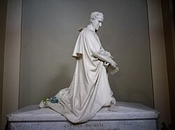
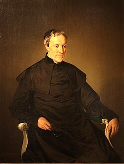

# Beato Antonio Rosmini

**"Adorar, Calar, Gozar."**

**Nascimento:** 24 de março de 1797, Rovereto, Itália
**Morte:** 1 de julho de 1855, Stresa, Itália
**Festa Litúrgica:** 1 de julho
**Beatificação:** 18 de novembro de 2007, pelo Papa Bento XVI

---

## Biografia

Antonio Rosmini-Serbati foi um sacerdote, filósofo e teólogo italiano de grande importância no século XIX. Nasceu em uma família nobre e rica em Rovereto. Desde cedo mostrou grande inteligência e vocação religiosa. Foi ordenado sacerdote em 1821.

Fundou o Instituto da Caridade (Rosminianos) em 1828, no Sacro Monte Calvario de Domodossola, uma congregação dedicada à caridade em todas as suas formas: espiritual, intelectual e temporal. Foi um homem de vasta cultura e profundo amor à Igreja, buscando sempre o diálogo entre fé e razão.

## Vida Pessoal e Espiritualidade

Rosmini viveu em uma época turbulenta para a Igreja e para a Itália (Risorgimento). Sua espiritualidade era baseada na "caridade intelectual" e na obediência à vontade de Deus. Seu lema "Adorar, Calar, Gozar" resume sua atitude de contemplação, humildade e alegria no serviço divino.

Ele enfrentou incompreensões e perseguições dentro da própria Igreja. Algumas de suas obras foram colocadas no Index de Livros Proibidos por um tempo, mas ele aceitou a decisão com total obediência e humildade, sem nunca se rebelar.

## Milagres e Beatificação

A causa de sua beatificação foi introduzida por João Paulo II. O milagre aprovado para sua beatificação foi a cura inexplicável da Irmã Ludovica Noè, uma freira rosminiana, que sofria de uma doença grave.

Sua reabilitação doutrinal, iniciada pelo Papa João XXIII e continuada por Paulo VI e João Paulo II, culminou com a nota da Congregação para a Doutrina da Fé em 2001, assinada pelo Cardeal Ratzinger (futuro Bento XVI), que confirmou a ortodoxia de seu pensamento.

## Curiosidades

1.  **Amizade com Manzoni:** Foi grande amigo do escritor Alessandro Manzoni, autor de "Os Noivos", que o considerava uma das maiores inteligências que já conheceu.
2.  **As Cinco Chagas:** Sua obra mais famosa e polêmica, *Das Cinco Chagas da Santa Igreja*, propunha reformas corajosas para a Igreja de seu tempo, muitas das quais foram adotadas no Concílio Vaticano II (como a maior participação dos leigos na liturgia).
3.  **Filósofo:** É considerado um dos maiores filósofos italianos do século XIX.

## Impacto Hoje

Antonio Rosmini é um modelo de fidelidade à Igreja e de honestidade intelectual. Seu pensamento antecipou muitas questões modernas e continua a inspirar teólogos e filósofos. Ele mostra que é possível ser um pensador livre e profundo e, ao mesmo tempo, um filho obediente da Igreja.

  

    <TextToSpeech />
  

  

    <MiracleMap :items="[
  { title: 'Rovereto', lat: 45.8906, lng: 11.0401, description: 'Cidade natal' },
  { title: 'Stresa', lat: 45.8833, lng: 8.5333, description: 'Onde fundou o Instituto da Caridade' },
  { title: 'Domodossola', lat: 46.1167, lng: 8.2833, description: 'Monte Calvário, centro de sua ordem' },
  { title: 'Milão', lat: 45.4642, lng: 9.1900, description: 'Cidade importante em sua vida' }
]" />
  

<SaintOfTheDay />
