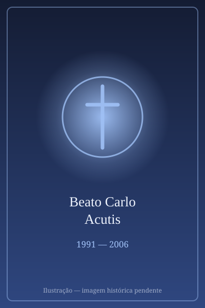

# Beato Carlo Acutis

> "A Eucaristia é a minha autoestrada para o Céu."

- **Nascimento:** 3 de maio de 1991
- **Morte:** 12 de outubro de 2006
- **Beatificação:** 10 de outubro de 2020
- **Festa Litúrgica:** 12 de outubro

<TextToSpeech />

## Biografia

Carlo Acutis nasceu em Londres, Reino Unido, mas mudou-se pouco depois com os pais, Andrea Acutis e Antonia Salzano, para Milão, Itália. Desde muito cedo, Carlo demonstrou um interesse invulgar e profundo pelas coisas de Deus. Apesar de os seus pais não serem particularmente devotos naquela época, o amor fervoroso de Carlo contagiou a sua família e amigos, levando inclusivamente à conversão e ao regresso aos sacramentos de muitos à sua volta, a começar pela sua própria mãe.

Desde a sua Primeira Comunhão, aos sete anos, decidiu ir à missa e rezar o Rosário todos os dias, frequentemente com adoração eucarística. Além da sua profunda vida espiritual, Carlo era um adolescente como qualquer outro: gostava de videojogos, programação informática e de se divertir com os amigos.

O que o distinguia era a forma como utilizava as suas habilidades. Jovem prodígio da informática, construiu um site detalhado catalogando milagres eucarísticos de todo o mundo, querendo provar às pessoas que Cristo está verdadeiramente presente na hóstia consagrada. Ele dizia que "as pessoas muitas vezes estão mais preocupadas com a beleza do corpo do que com a beleza da alma."

No início de outubro de 2006, aos 15 anos, Carlo adoeceu subitamente com o que parecia ser uma gripe, mas logo foi diagnosticado com uma leucemia mieloide aguda extremamente agressiva (LMA tipo M3). Ofereceu todo o seu sofrimento pela Igreja e pelo Papa Bento XVI. Faleceu poucos dias depois, a 12 de outubro de 2006, em Monza, Itália.

## Milagres

A beatificação de Carlo Acutis foi impulsionada por um milagre ocorrido no Brasil em 2013. Matheus, um menino brasileiro de Campo Grande, no Mato Grosso do Sul, sofria de uma grave anomalia congênita (pâncreas anular), uma doença rara que causava vómitos constantes e o deixava perigosamente abaixo do peso e em risco de vida.

Durante um serviço de bênção com uma relíquia de Carlo Acutis (um pedaço do pijama do jovem), Matheus pediu para "parar de vomitar". Imediatamente após tocar a relíquia, o rapaz ficou curado da sua condição. Os exames médicos posteriores não revelaram qualquer anomalia no seu pâncreas, algo inexplicável para a medicina.

Foi aprovado e reconhecido também um segundo milagre por intercessão do Beato Carlo, a cura miraculosa de uma jovem universitária, abrindo caminho para a sua canonização futura.

## Curiosidades

- O corpo do Beato Carlo Acutis encontra-se exposto na igreja de Santa Maria Maggiore em Assis (Santuário do Despojamento). Foi incorretamente descrito como "incorrupto" inicialmente, mas foi na verdade submetido a técnicas de conservação e o rosto está coberto por uma máscara de silicone hiper-realista.
- Ele é o primeiro beato millennial, frequentemente retratado vestido de calças de ganga (jeans), camisola desportiva e ténis Nike.
- Organizava o seu tempo livre para ajudar como voluntário nas ruas, dando cobertores e comida aos sem-abrigo de Milão com as suas próprias poupanças.
- Tinha uma devoção muito particular a São Francisco de Assis, São Domingos Sávio e Santa Jacinta Marto.

## Cidades por onde passou

- Londres, Reino Unido (Nascimento)
- Milão, Itália (Residência)
- Assis, Itália (Férias e local de sepultura)
- Monza, Itália (Hospital onde faleceu)

## Impacto Hoje

O Beato Carlo Acutis tem um impacto monumental sobre os jovens em todo o mundo. O seu testemunho demonstra que a santidade é possível no mundo moderno — e que a internet e os meios digitais podem ser ferramentas poderosas para a evangelização.

A sua exposição sobre os Milagres Eucarísticos continua a viajar pelo mundo. Ele é frequentemente considerado o "padroeiro não oficial da internet", mostrando às novas gerações como manter um coração puro num mundo hiperconectado, e servindo de ponte para muitos que procuram significado na vida espiritual, usando o seu lema: "Todos nascem como originais, mas muitos morrem como fotocópias".

<MiracleMap :items='[
  { lat: 51.5074, lng: -0.1278, title: "Nascimento em Londres", description: "Carlo nasceu em Londres em 1991.", type: "nascimento" },
  { lat: 45.4642, lng: 9.1900, title: "Vida em Milão", description: "Cresceu, estudou e viveu a maior parte da sua vida em Milão.", type: "vida" },
  { lat: 45.5845, lng: 9.2735, title: "Falecimento em Monza", description: "Faleceu de leucemia no hospital de Monza aos 15 anos.", type: "morte" },
  { lat: 43.0699, lng: 12.6185, title: "Santuário do Despojamento", description: "Local onde o seu corpo repousa em Assis, visitado por peregrinos do mundo todo.", type: "tumulo" },
  { lat: -20.4428, lng: -54.6464, title: "Milagre no Brasil", description: "Cura inexplicável do menino Matheus em Campo Grande (MS), que permitiu a sua beatificação.", type: "milagre" }
]' />
