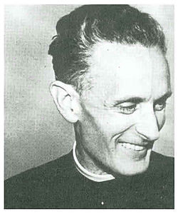

# Beato Carlo Gnocchi

**"O Pai dos Mutiladinhos."**

**Nascimento:** 25 de outubro de 1902, San Colombano al Lambro (Itália)
**Morte:** 28 de fevereiro de 1956, Milão (Itália)
**Beatificação:** 25 de outubro de 2009, pelo Papa Bento XVI
**Festa Litúrgica:** 25 de outubro

<TextToSpeech />

---

## Biografia

Carlo Gnocchi nasceu na província de Milão e foi ordenado sacerdote em 1925. Inicialmente, dedicou-se à formação de jovens como diretor espiritual. Durante a Segunda Guerra Mundial, alistou-se como capelão militar voluntário no batalhão Alpino "Val Tagliamento", servindo primeiro na frente grego-albanesa e depois na campanha da Rússia. Testemunhou os horrores da guerra e a trágica retirada das tropas italianas em 1943, onde quase morreu congelado.

Essa experiência o marcou profundamente. Prometeu a Deus que, se sobrevivesse, dedicaria sua vida às vítimas inocentes da guerra. Ao retornar à Itália, cumpriu sua promessa, acolhendo órfãos de guerra e, especialmente, as crianças mutiladas por bombardeios e minas terrestres (os chamados "mutilatini").

## Vida Pessoal e Obra

Padre Gnocchi fundou a "Pro Juventute" (agora Fundação Don Gnocchi), uma rede de centros de reabilitação para crianças deficientes e vítimas da guerra. Ele via o rosto de Cristo sofredor em cada criança ferida e lutou incansavelmente para lhes dar dignidade, educação e esperança.

Além de sua obra social, foi um prolífico escritor e educador, publicando obras sobre pedagogia e espiritualidade, como a famosa "Pedagogia da Dor Inocente", onde tentava dar um sentido cristão ao sofrimento das crianças.

## Milagres

O milagre aprovado para sua beatificação envolveu Sperandio Aldeni, um eletricista que sofreu um acidente gravíssimo em 1979. Ele recebeu uma descarga elétrica de alta voltagem que deveria tê-lo matado instantaneamente. No entanto, ele sobreviveu sem sequelas graves, atribuindo sua cura à intercessão de Don Gnocchi, a quem invocava.

## Curiosidades

1.  **Doação de Córneas:** Em seu leito de morte, Carlo Gnocchi pediu para doar suas córneas a duas crianças cegas de sua instituição, Silvio Colagrande e Amabile Battistello. Na época (1956), a doação de órgãos não era regulamentada na Itália, mas seu gesto abriu caminho para a legislação sobre transplantes no país.
2.  **Capelão Alpino:** É venerado pelos "Alpini" (tropas de montanha italianas) como um herói e santo protetor, lembrando sua coragem ao acompanhar os soldados na neve e no gelo da Rússia.
3.  **Processo Rápido:** Sua fama de santidade era tão grande que o processo de canonização começou pouco tempo após sua morte, impulsionado pela gratidão de milhares de pessoas que ele ajudou.

## Cidades por onde passou

Don Gnocchi atuou principalmente no norte da Itália e também esteve nas frentes de batalha.

<MiracleMap :items='[
  { lat: 45.1833, lng: 9.4833, title: "San Colombano al Lambro, Itália", description: "Cidade natal de Carlo Gnocchi." },
  { lat: 45.4642, lng: 9.1900, title: "Milão, Itália", description: "Onde estudou, fundou sua obra e faleceu." },
  { lat: 41.9028, lng: 12.4964, title: "Roma, Itália", description: "Onde buscou apoio do Papa Pio XII para sua obra." }
]' />

## Impacto Hoje

A Fundação Don Gnocchi continua ativa e é uma das maiores instituições de reabilitação e assistência social da Itália, atendendo milhares de pessoas com deficiência, idosos e doentes terminais. O legado de Carlo Gnocchi nos ensina que o sofrimento, quando unido a Cristo e transformado em amor, pode ser redentor. Seu gesto pioneiro de doação de órgãos continua a inspirar a solidariedade e a medicina. Ele é um modelo de caridade heroica em tempos de crise humanitária.
