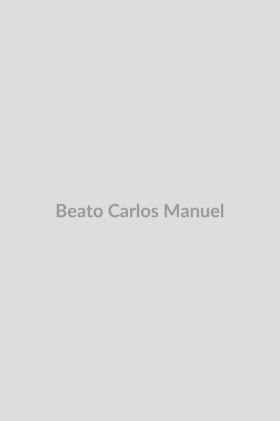

# Beato Carlos Manuel Rodríguez Santiago

**"Charlie: Apóstolo da Liturgia"**

**Nascimento:** 22 de novembro de 1918, Caguas, Porto Rico
**Morte:** 13 de julho de 1963, Caguas, Porto Rico
**Festa Litúrgica:** 13 de julho
**Beatificação:** 29 de abril de 2001, pelo Papa João Paulo II

<TextToSpeech />

---

## Biografia

Carlos Manuel Cecilio Rodríguez Santiago, conhecido carinhosamente como "Charlie", nasceu em Caguas, Porto Rico, em uma família profundamente católica. Desde jovem, enfrentou problemas de saúde (colite ulcerativa) que o impediram de completar seus estudos universitários e de seguir a vocação sacerdotal ou religiosa formal.

No entanto, Charlie não se deixou abater. Dedicou sua vida ao apostolado leigo, trabalhando como catequista e promovendo a renovação litúrgica muito antes do Concílio Vaticano II. Ele acreditava que a liturgia era o centro da vida cristã e que todos os fiéis deveriam participar ativamente dela.

## Vida Pessoal e Obra

Fundou o "Círculo de Liturgia e Cultura Cristã" em Porto Rico. Organizava "Dias de Vida Cristã" para estudantes universitários e professores, onde ensinava sobre a Fé e a importância da Vigília Pascal. Sua frase mais famosa é "Vivamos para essa Noite", referindo-se à Vigília Pascal, o centro do ano litúrgico.

Charlie trabalhava como tradutor e empregado de escritório na Universidade de Porto Rico para sustentar sua família e seu apostolado, gastando quase todo o seu salário na promoção do Evangelho.

## Milagres

O milagre aprovado para sua beatificação envolveu a cura de uma mulher diagnosticada com linfoma não-Hodgkin maligno em 1981. Após rezar pedindo a intercessão de Charlie, o tumor desapareceu completamente, sem explicação médica.

## Curiosidades

1.  **Primeiro Porto-riquenho:** É o primeiro porto-riquenho e o primeiro leigo do Caribe a ser beatificado.
2.  **Liturgia:** Antecipou muitas das reformas litúrgicas do Concílio Vaticano II, como o uso do vernáculo (língua do povo) e a participação ativa dos leigos.

## Cidades por onde passou

<MiracleMap :items='[
  { lat: 18.2341, lng: -66.0485, title: "Caguas, Porto Rico", description: "Cidade onde nasceu, viveu e faleceu." },
  { lat: 18.4064, lng: -66.0639, title: "Rio Piedras (San Juan), Porto Rico", description: "Onde trabalhou na Universidade de Porto Rico." }
]' />
