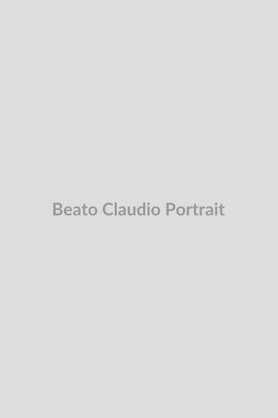

# Beato Cláudio Granzotto

    
    <i>"A arte para glorificar a Deus deve ser uma expressão de vida espiritual e não de glória vã."</i>

 

**Nascimento:** 23 de agosto de 1900 
**Morte:** 15 de agosto de 1947 
**Beatificação:** 20 de novembro de 1994 
**Festa Litúrgica:** 2 de setembro 

<TextToSpeech />

## Biografia

Riccardo Granzotto, posteriormente conhecido como Irmão Cláudio, nasceu no vilarejo de Santa Lúcia di Piave, província de Treviso, na Itália. Era o mais jovem de nove filhos de uma modesta e piedosa família camponesa. A sua infância foi marcada pela pobreza, exacerbada pela eclosão da Primeira Guerra Mundial, durante a qual teve de trabalhar intensamente nos campos desde muito jovem.

Apesar das duras condições de vida, Granzotto demonstrou uma inclinação notável para as artes. Graças aos incentivos de um padre local que reconheceu o seu dom, matriculou-se na Academia de Belas Artes de Veneza. Destacou-se pelo seu talento excepcional na escultura, formando-se com distinção e obtendo o diploma de escultor em 1929. Sua obra não era apenas uma manifestação técnica impecável, mas uma busca profunda por beleza que o elevou a uma compreensão contemplativa da fé. Suas esculturas religiosas ganharam rapidamente atenção e reconhecimento público.

Contudo, Granzotto sentiu que o verdadeiro chamado da sua vida não era o sucesso secular ou a fama artística, mas sim uma entrega total a Deus através da pobreza, obediência e castidade. Em 1933, no auge de sua florescente carreira, ele renunciou ao mundo das artes para ingressar na Ordem dos Frades Menores (Franciscanos), tomando o nome de Irmão Cláudio. Recusou a ordenação sacerdotal por considerar-se indigno do sacramento, preferindo a humildade e a simplicidade de ser um simples frade leigo.

A sua vida no convento foi caracterizada pela oração fervorosa, trabalho braçal, dedicação aos mais pobres e o emprego da sua arte em benefício da comunidade religiosa. Esculpiu belíssimas imagens da Virgem Maria, de Jesus Crucificado e de santos franciscanos que até hoje ornam várias igrejas da região do Vêneto, especialmente a Paróquia e o convento de Santa Lúcia de Chiampo, lugar onde viveu e trabalhou. Suas obras, longe de buscarem o aplauso do mundo, eram autênticos atos de oração plástica e catequese visual.

Irmão Cláudio padeceu de um tumor cerebral maligno nos seus últimos anos. Ele aceitou a doença e o sofrimento com resignação pacífica e uma união mística com as Dores de Cristo, oferecendo as suas dores pelos pecadores e pelo clero. Faleceu em 15 de agosto de 1947, no dia da Assunção de Nossa Senhora. O Beato foi reconhecido como um modelo perfeito da união entre a inspiração artística e o testemunho de uma vida inteiramente consagrada ao Senhor.

## Milagres

Em 1994, Cláudio Granzotto foi beatificado pelo Papa João Paulo II na Praça de São Pedro, no Vaticano, após o reconhecimento oficial de um milagre pela Igreja. Um menino que padecia de uma doença incurável em estágio avançado, a quem os médicos desenganaram afirmando que teria poucos dias de vida, recuperou-se subitamente. A família e amigos do menino oraram incessantemente, pedindo a intercessão do humilde Irmão Cláudio.

Numerosos outros relatos locais de intervenções miraculosas e curas sem explicação médica também cimentaram a sua veneração popular entre o povo do Vêneto e artistas que o consideram seu protetor celestial.

## Curiosidades

- O Beato Cláudio concebeu, modelou e ajudou a construir a famosa Gruta de Lourdes, situada no Santuário de Chiampo. Milhares de peregrinos visitam essa réplica impressionante anualmente em busca de paz e oração.
- Considerou a sua profissão não como meio para enriquecer ou para alimentar a vaidade pessoal, mas como o meio mais apto e sublime de que dispunha para se aproximar de Deus e de aproximar d'Ele as almas dos que admiravam os seus trabalhos.
- O seu nome de batismo "Riccardo" significa "Rei Corajoso", um traço evidente em sua ousada renúncia à glória material.

## Cidades por onde passou

- **Santa Lucia di Piave, Itália**: Local do seu nascimento, primeira infância e desenvolvimento de seus talentos iniciais.
- **Veneza, Itália**: Onde aperfeiçoou seu talento na célebre Academia de Belas Artes e iniciou sua carreira como escultor.
- **Chiampo, Itália**: Cidade onde ingressou na vida franciscana, servindo intensamente aos pobres e criando suas obras mais significativas, e também onde viria a falecer.

## Impacto Hoje

Hoje, o Beato Cláudio Granzotto é profundamente admirado por muitos como um modelo formidável para artistas católicos que lutam para harmonizar a sua vocação artística com uma vida espiritual autêntica e humilde. Suas esculturas permanecem expostas em várias paróquias, santuários e mosteiros, servindo de testemunho duradouro de uma arte que, de modo inigualável, se faz prece, levando os corações a contemplar os mistérios cristãos e a glória divina. O Santuário de Chiampo é hoje um importante centro de peregrinação no norte da Itália, onde milhares deixam seus pedidos e testemunhos de graças alcançadas.

<MiracleMap :items="[
    { title: 'Santa Lúcia di Piave, Itália', description: 'Onde o Beato Cláudio Granzotto nasceu e cresceu em uma família camponesa modesta.', lat: 45.8450, lng: 12.2858 },
    { title: 'Veneza, Itália', description: 'Sua formação e consagração inicial nas belas artes na Academia de Belas Artes de Veneza.', lat: 45.4408, lng: 12.3155 },
    { title: 'Chiampo, Itália', description: 'Onde ingressou na ordem Franciscana, criou obras incríveis, como a réplica da Gruta de Lourdes, e onde faleceu.', lat: 45.5457, lng: 11.2828 }
]" />
