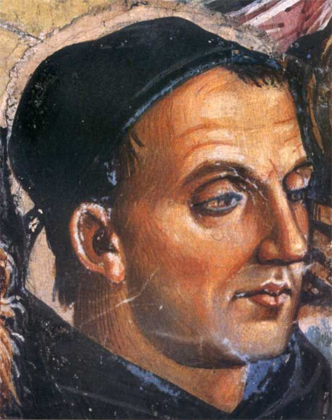
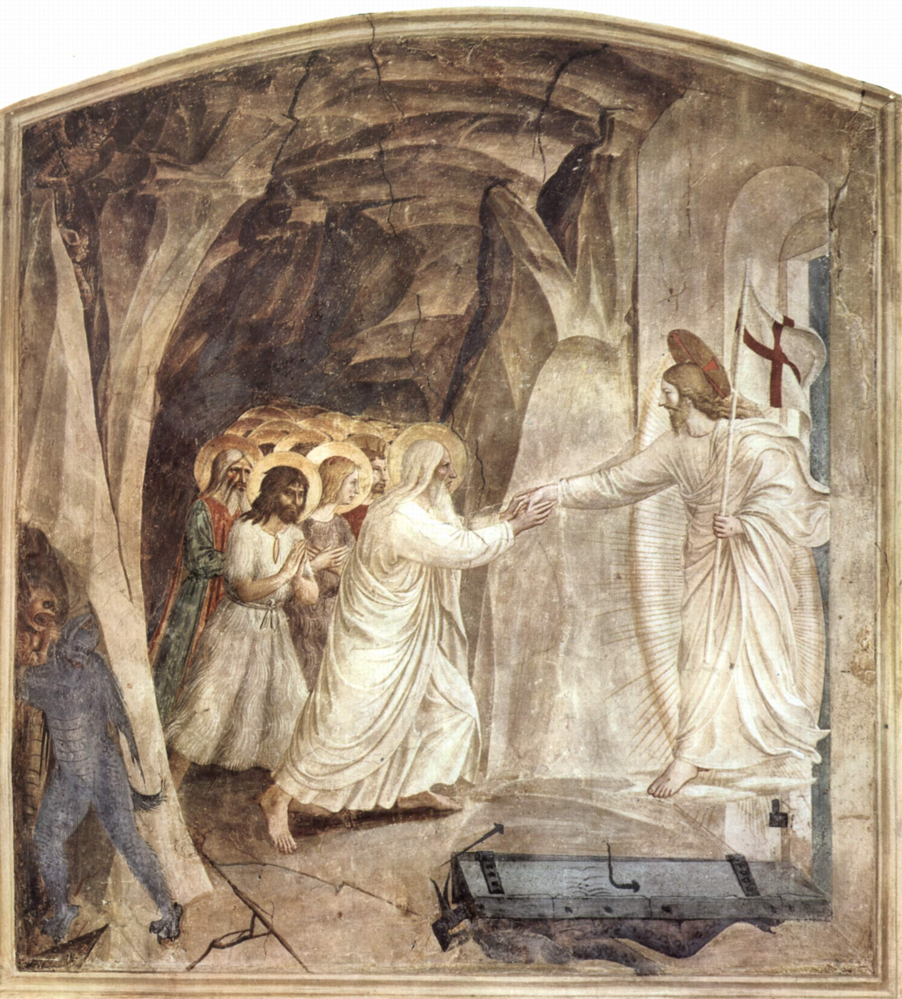

# Beato Fra Angelico (João de Fiesole)

**"Para pintar as coisas de Cristo, é preciso viver com Cristo."**

**Nascimento:** c. 1395, Rupecanina (perto de Fiesole), Itália
**Morte:** 18 de fevereiro de 1455, Roma, Itália
**Beatificação:** 3 de outubro de 1982, pelo Papa João Paulo II
**Festa Litúrgica:** 18 de fevereiro

<TextToSpeech />

---

## Biografia

Guido di Pietro, conhecido religiosamente como Fra Giovanni da Fiesole e popularmente como Fra Angelico ("Irmão Angélico"), foi um frade dominicano e um dos maiores pintores do início do Renascimento italiano. Entrou para a Ordem dos Pregadores (Dominicanos) em Fiesole.

Sua vida foi dedicada à oração e à arte. Ele via a pintura como um ofício sagrado, uma forma de pregação. Foi Prior do Convento de São Domingos em Fiesole. Sua fama de santidade e talento artístico o levou a ser chamado para trabalhar em Florença (Convento de São Marcos), Roma (Vaticano) e Orvieto.

## Vida Pessoal e Espiritualidade

Era conhecido por sua humildade e obediência. Vasari, biógrafo dos artistas, relata que ele nunca levantava o pincel sem fazer uma oração e que chorava copiosamente sempre que pintava a Crucificação. Recusou o arcebispado de Florença por humildade, sugerindo Santo Antonino em seu lugar.

## Milagres

Sua beatificação reconheceu o culto imemorial e a fama de santidade que o acompanhava desde a vida. Suas obras são consideradas "milagres de arte e fé", capazes de elevar a alma de quem as contempla. É o Padroeiro dos Artistas e dos Pintores.

## Curiosidades

1.  **Sem Retoques:** Diz-se que ele nunca retocava suas pinturas, acreditando que o resultado original era a vontade de Deus.
2.  **Túmulo:** Está sepultado na Basílica de Santa Maria sopra Minerva, em Roma.
3.  **Apelido:** O nome "Angelico" foi dado postumamente devido à beleza espiritual de suas figuras e à sua própria virtude.

## Cidades por onde passou

Fra Angelico viveu e trabalhou nos principais centros da Itália renascentista.

<MiracleMap :items='[
  { lat: 43.8069, lng: 11.2928, title: "Fiesole, Itália", description: "Onde entrou para a ordem dominicana e viveu muitos anos." },
  { lat: 43.7696, lng: 11.2558, title: "Florença, Itália", description: "Pintou os famosos afrescos do Convento de São Marcos." },
  { lat: 41.9028, lng: 12.4964, title: "Roma, Itália", description: "Trabalhou no Vaticano (Capela Nicolina) e onde faleceu." },
  { lat: 42.7167, lng: 12.1167, title: "Orvieto, Itália", description: "Pintou a Capela de San Brizio na Catedral." }
]' />

## Galeria de Arte Sacra

A arte de Fra Angelico é sua maior relíquia. Abaixo, uma de suas obras mais famosas.

*A Anunciação (Museu do Prado)*

## Impacto Hoje

Proclamado Padroeiro Universal dos Artistas por João Paulo II em 1984, Fra Angelico continua a inspirar quem busca a beleza como um caminho para Deus (Via Pulchritudinis). Sua arte serena e luminosa é um testemunho eterno da paz que vem da fé.
