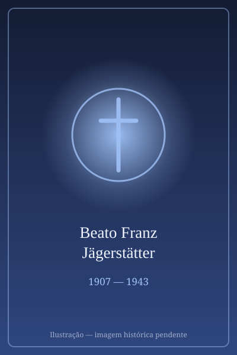

# Beato Franz Jägerstätter

> "Melhor obedecer a Deus do que aos homens."

- **Nascimento:** 20 de maio de 1907, Sankt Radegund, Áustria
- **Morte:** 9 de agosto de 1943, Brandemburgo, Alemanha
- **Beatificação:** 2007, pelo Papa Bento XVI
- **Festa Litúrgica:** 21 de maio

<TextToSpeech />

---

## Biografia

Franz Jägerstätter nasceu em 20 de maio de 1907, em St. Radegund, uma pequena aldeia da Alta Áustria, filho não reconhecido de uma camponesa. Adotou o sobrenome do padrasto, Heinrich Jägerstätter, que se casou com sua mãe quando ele tinha dez anos. Na juventude teve fama de rebelde — foi o primeiro da aldeia a ter uma motocicleta — e teve uma filha fora do casamento.

Em 1936 casou-se com Franziska Schwaninger, mulher de fé profunda, e o casal passou a lua de mel em Roma. O casamento marcou uma virada: Franz tornou-se sacristão da paróquia, passou a comungar diariamente e a ler intensamente a Bíblia e vidas de santos. Tiveram três filhas.

Foi o único habitante de St. Radegund a votar contra o *Anschluss*, a anexação da Áustria pela Alemanha nazista, em 1938. Recusou os benefícios do regime e afirmava que o nazismo era incompatível com a fé cristã. Convocado em 1940 e 1941, cumpriu períodos de instrução militar, mas concluiu que não poderia lutar por uma guerra que considerava injusta.

Em 1943, ao ser novamente convocado, apresentou-se em Enns e declarou objeção de consciência. Foi preso, transferido para Berlim e condenado à morte por subversão militar. Recusou até o fim as ofertas de trabalhar como enfermeiro militar para salvar a vida — entendia que isso implicaria o juramento a Hitler. Foi decapitado na prisão de Brandemburgo-Görden em 9 de agosto de 1943, aos 36 anos.

## Vida Pessoal e Consciência

Franz enfrentou a solidão de quem decide sozinho: o pároco, o bispo de Linz e os vizinhos tentaram dissuadi-lo, argumentando com o dever para com a família. Ele respondeu que não podia crer que Deus exigisse dele uma obediência contrária à consciência. As cartas trocadas com Franziska da prisão, publicadas décadas depois, são um dos testemunhos mais notáveis de fé e amor conjugal do século XX. Franziska viveu ainda mais de sessenta anos, viu o marido beatificado e morreu em 2013, aos cem anos.

## Milagres

Por ter sido reconhecido como mártir *in odium fidei*, a beatificação dispensou a comprovação de milagre. O decreto foi assinado por Bento XVI em 1º de junho de 2007, e a cerimônia realizou-se na catedral de Linz em 26 de outubro do mesmo ano, com a viúva e as filhas presentes. Sua causa é lembrada como um caso raro em que a Igreja reconheceu como mártir alguém executado por objeção de consciência ao serviço militar.

## Curiosidades

1. **Reabilitação tardia:** só em 1997 um tribunal alemão anulou formalmente a sentença de 1943. Por décadas, muitos conterrâneos o consideraram um desertor que abandonara a família.
2. **"Uma Vida Oculta":** o filme de Terrence Malick, apresentado em Cannes em 2019, levou sua história ao público mundial; o título vem de uma frase de George Eliot sobre os que vivem vidas ocultas e repousam em túmulos não visitados.
3. **Redescoberto por um sociólogo:** foi o americano Gordon Zahn quem, nos anos 1960, pesquisou seu caso e publicou o livro que tirou seu nome do esquecimento, influenciando o debate sobre objeção de consciência durante a Guerra do Vietnã.
4. **Padroeiro:** invocado pelos objetores de consciência e citado com frequência em documentos sobre a liberdade religiosa.

## Cidades por onde passou

Nasceu e viveu em St. Radegund, na Alta Áustria; foi instruído militarmente em Enns, preso em Linz e Berlim, e executado em Brandemburgo-Görden, na Alemanha.

<MiracleMap :items='[
  { lat: 48.077, lng: 12.89, type: "nascimento", title: "Sankt Radegund", description: "Sua aldeia natal e onde repousam suas cinzas." },
  { lat: 52.4125, lng: 12.5316, type: "morte", title: "Brandemburgo, Alemanha", description: "Local da morte (9 de agosto de 1943)." }
]' />

## Impacto Hoje

Jägerstätter é hoje uma das referências centrais do pensamento católico sobre objeção de consciência e sobre os limites da obediência à autoridade — citado em documentos episcopais, cursos de ética e no debate sobre serviço militar obrigatório. O Catecismo da Igreja Católica sustenta o direito à objeção de consciência, e seu caso é o exemplo histórico mais invocado. St. Radegund tornou-se destino de peregrinação, e a casa onde viveu abriga um memorial.
