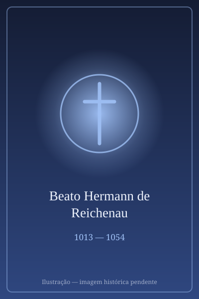

# Beato Hermann de Reichenau

> "O Gênio Paralisado, Cantor de Maria"

- **Nascimento:** 18 de julho de 1013 (Saulgau, Suábia, atual Alemanha)
- **Morte:** 24 de setembro de 1054 (Mosteiro de Reichenau, Alemanha)
- **Beatificação:** 1863, culto confirmado pelo Papa Pio IX
- **Festa Litúrgica:** 24 de setembro

<TextToSpeech />

---

## Biografia

Hermann de Reichenau (também conhecido como Hermannus Contractus, ou Hermano, o Aleijado) nasceu no seio de uma família nobre, os condes de Altshausen. Desde o nascimento, sofreu de uma doença grave, possivelmente paralisia cerebral infantil, esclerose lateral amiotrófica (ELA) ou atrofia muscular espinhal, que o deixou severamente incapacitado. Ele não conseguia andar, mal se movia e tinha grande dificuldade para falar.

Aos sete anos de idade, os seus pais confiaram-no aos monges beneditinos da Abadia de Reichenau, localizada numa ilha no Lago de Constança. Ali, apesar das suas severas limitações físicas, Hermann demonstrou uma mente brilhante. Foi educado sob o abade Berno e logo se tornou um dos maiores intelectuais da Europa no século XI.

Fez os votos monásticos e dedicou a sua vida ao estudo e à oração. Tornou-se um polímata notável: historiador, músico, matemático, astrónomo e poeta. Construiu instrumentos musicais e astronómicos, escreveu crónicas históricas e compôs hinos litúrgicos que perduram até hoje. A sua profunda devoção mariana transparecia nas suas composições e na sua capacidade de aceitar o sofrimento físico com extraordinária alegria espiritual.

## Milagres e Obra

A sua vida é frequentemente vista como um milagre de graça e resiliência, demonstrando o triunfo do espírito sobre as limitações da carne.

*   **Compositor Mariano:** É-lhe tradicionalmente atribuída a composição das duas mais famosas antífonas marianas da Igreja Católica: a "Salve Regina" (Salve Rainha) e a "Alma Redemptoris Mater".
*   **A Crónica Universal:** Escreveu o *Chronicon*, uma crónica que traça a história do mundo desde o nascimento de Cristo até à sua própria época, uma obra fundamental para a história da Europa Central.
*   **Astronomia e Matemática:** Introduziu e popularizou o uso do astrolábio no Ocidente cristão e escreveu tratados sobre geometria e matemática, ajudando a disseminar numerais indo-arábicos e conceitos avançados antes não compreendidos na região.

## Curiosidades

1.  **"O Aleijado":** O seu cognome "Contractus" (o Aleijado ou o Contorcido) foi adotado sem qualquer ressentimento; ele frequentemente se autodenominava assim nas suas obras com profunda humildade.
2.  **Amigo e Professor:** Apesar da sua dificuldade na fala, tornou-se um professor muito amado no mosteiro, sendo procurado por estudiosos de várias regiões pela sua sabedoria.
3.  **Habilidade Manual:** Incapaz de escrever com facilidade, desenvolveu métodos para ditar aos seus irmãos monges e, nalguns casos, utilizava instrumentos adaptados para conseguir realizar os seus trabalhos matemáticos.

## Cidades por onde passou

Toda a sua vida a partir dos sete anos foi passada no Mosteiro da Ilha de Reichenau, um dos centros culturais e espirituais mais importantes do Império Romano-Germânico na Idade Média.

<MiracleMap :items='[
  { lat: 48.0205, lng: 9.5019, type: "nascimento", title: "Saulgau, Alemanha", description: "Local de nascimento em 1013." },
  { lat: 47.6946, lng: 9.0620, type: "morte", title: "Mosteiro de Reichenau, Alemanha", description: "Onde viveu, estudou e faleceu em 1054." }
]' />

## Impacto Hoje

O Beato Hermann de Reichenau é um poderoso santo patrono para as pessoas com deficiência e para aqueles que sofrem de doenças crónicas e degenerativas, provando que o valor da vida humana não reside na sua utilidade física, mas na sua alma. As suas antífonas, especialmente a "Salve Rainha", são rezadas diariamente por milhões de católicos em todo o mundo.
