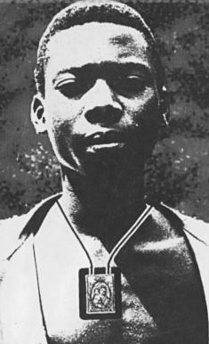

# Beato Isidoro Bakanja

    
    
"Se eu morrer, rezarei por ti no céu."

**Nascimento:** c. 1885, Bokendela, Congo 
**Morte:** 15 de Agosto de 1909, Busira, Congo 
**Beatificação:** 24 de Abril de 1994, pelo Papa João Paulo II 
**Festa Litúrgica:** 12 de Agosto (Carmelitas) / 15 de Agosto

---

<TextToSpeech />

## Biografia

Isidoro Bakanja nasceu na atual República Democrática do Congo, por volta de 1885, na tribo Boangi. Ainda jovem, deixou sua aldeia para trabalhar como pedreiro na cidade de Mbandaka. Lá, conheceu missionários trapistas e foi cativado pela fé cristã. Recebeu o batismo em 6 de maio de 1906, aos 18 anos, e a crisma no mesmo ano.

Isidoro tinha uma devoção profunda à Virgem Maria e usava constantemente o Escapulário de Nossa Senhora do Carmo, sinal visível de sua consagração. Ele não apenas vivia sua fé com fervor, mas também a partilhava com alegria, tornando-se um catequista natural entre seus colegas de trabalho.

### O Martírio do Escapulário

Isidoro foi trabalhar em uma plantação de seringueira operada por uma empresa colonial belga em Ikili. O administrador local, Van Cauter, era virulentamente anticatólico e proibia os trabalhadores de rezarem ou portarem objetos religiosos. Isidoro, no entanto, recusou-se a esconder sua fé. Ele continuou a rezar o terço e a usar seu escapulário abertamente.

Furioso com a desobediência e a influência de Isidoro sobre os outros trabalhadores, o administrador ordenou que ele tirasse o escapulário. Diante da recusa firme do jovem, Van Cauter mandou açoitá-lo. Isidoro foi despido e açoitado brutalmente com um chicote de pele de elefante cravejado de pregos (chicote *fimbo*). Ele recebeu mais de 100 golpes, que dilaceraram suas costas, expondo ossos e causando ferimentos profundos.

Após o espancamento, foi acorrentado e deixado em agonia, sem cuidados médicos. Quando um inspetor da empresa visitou a plantação, Isidoro conseguiu arrastar-se até ele para mostrar suas feridas. O inspetor ficou horrorizado e levou-o para buscar tratamento, mas a infecção já havia se generalizado (septicemia).

Durante seis meses de agonia, Isidoro rezava continuamente. Quando questionado se perdoava o homem que o torturou, ele respondeu com serenidade: **"Certamente que o perdoo. Quando eu estiver no céu, rezarei muito por ele"**. Ele morreu em 15 de agosto de 1909, solenidade da Assunção de Nossa Senhora, com o rosário nas mãos e o escapulário ao pescoço.

## Milagres e Curiosidades

### Um Mártir Moderno
Isidoro Bakanja é um exemplo poderoso de fé leiga e resistência pacífica. Ele não era padre nem religioso consagrado, mas um trabalhador simples que entendeu que sua fé não podia ser separada de sua vida diária.

### O Escapulário
Sua morte está intrinsecamente ligada à defesa do uso do Escapulário do Carmo. Ele é carinhosamente chamado de "Mártir do Escapulário".

### Cidades por onde passou

<MiracleMap :places="[
  { name: 'Mbandaka', lat: 0.0487, lng: 18.2603, description: 'Cidade onde Isidoro conheceu a fé cristã e foi batizado.' },
  { name: 'Busira', lat: -0.1983, lng: 19.8667, description: 'Local próximo onde Isidoro faleceu após meses de agonia.' }
]" />

## O Impacto Hoje

A beatificação de Isidoro Bakanja pelo Papa João Paulo II em 1994 trouxe à luz a história deste jovem mártir africano. Ele é um modelo para a juventude africana e para todos os leigos, lembrando que a santidade é acessível a todos e que a coragem cristã pode florescer nas circunstâncias mais adversas.

## Galeria de Imagens

| Imagem | Descrição |
| --- | --- |
|  | Retrato popular do Beato Isidoro Bakanja, mostrando-o com o escapulário e o rosário, símbolos de sua fé e martírio. |
