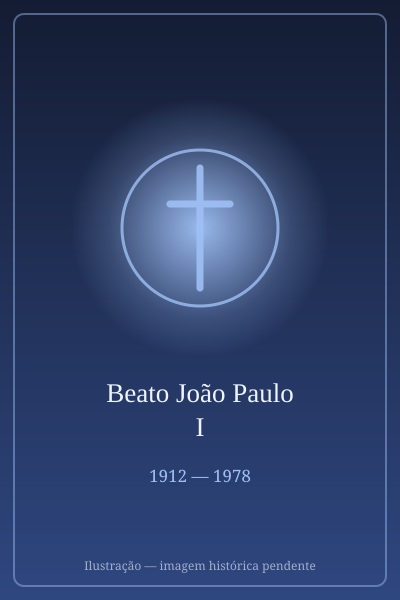

# Beato João Paulo I

> "O Papa do Sorriso."

- **Nascimento:** 17 de outubro de 1912, Canale d'Agordo, Itália
- **Morte:** 28 de setembro de 1978, Vaticano
- **Beatificação:** 2022, pelo Papa Francisco
- **Festa Litúrgica:** 26 de agosto

<TextToSpeech />

---

## Biografia

Albino Luciani nasceu em 17 de outubro de 1912, em Forno di Canale (hoje Canale d'Agordo), nas montanhas do Vêneto, filho de um operário socialista que emigrava sazonalmente para a Suíça e de uma mãe profundamente religiosa. Cresceu na pobreza dos vales alpinos — experiência que marcaria sua sensibilidade social e a simplicidade de sua linguagem.

Entrou no seminário aos onze anos e foi ordenado sacerdote em 1935. Doutorou-se em teologia na Universidade Gregoriana com uma tese sobre Antonio Rosmini. Foi vice-reitor do seminário de Belluno, vigário-geral da diocese e, em 1958, nomeado bispo de Vittorio Veneto por João XXIII. Participou de todas as sessões do Concílio Vaticano II.

Em 1969 foi nomeado Patriarca de Veneza e, em 1973, criado cardeal por Paulo VI. Ficou conhecido pela recusa das honras: vendeu a cruz peitoral de ouro para financiar obras de assistência e insistia em ser tratado com simplicidade.

Foi eleito Papa em 26 de agosto de 1978, no conclave mais rápido do século XX. Escolheu o nome duplo João Paulo, inédito na história, em homenagem aos dois antecessores. Morreu na noite de 28 de setembro de 1978, encontrado na manhã seguinte, após 33 dias de pontificado — um dos mais curtos da história.

## Vida Pessoal e Obra

Antes do papado, publicou *Ilustríssimos*, coleção de cartas dirigidas a personagens da literatura e da história — de Pinóquio a Charles Dickens —, exemplo de sua capacidade de falar de fé com humor e clareza. Como Papa, recusou a coroação com a tiara, substituída por uma missa de início do ministério petrino, e trocou o plural majestático pelo "eu" nas audiências. Ficou conhecido como *il Papa del sorriso*, o Papa do sorriso.

## Milagres

O milagre reconhecido para a beatificação foi a cura de Candela Giarda, uma menina de onze anos de Buenos Aires, na Argentina, que em 2011 sofria de encefalopatia epiléptica aguda com choque séptico, dada como irrecuperável. O pároco do hospital pediu que se rezasse pela intercessão de João Paulo I, e a criança recuperou-se de modo inexplicável para os médicos. O Papa Francisco autorizou o decreto em outubro de 2021, e a beatificação ocorreu na Praça de São Pedro em 4 de setembro de 2022.

## Curiosidades

1. **O nome duplo:** foi o primeiro Papa a usar dois nomes, marcando a intenção de manter a linha de João XXIII e Paulo VI e o rumo do Concílio.
2. **Sem coroação:** recusou a tiara e a *sedia gestatoria* — decisão que todos os seus sucessores mantiveram.
3. **Teorias e documentação:** sua morte repentina alimentou especulações por décadas; a positio da causa, publicada em 2016 após ampla pesquisa documental, concluiu por morte natural decorrente de infarto.
4. **A causa e o arquivo:** a documentação reunida pelo postulador deu origem a uma fundação vaticana dedicada a estudar seus escritos e seu breve pontificado.

## Cidades por onde passou

Nasceu em Canale d'Agordo, formou-se em Belluno e Roma, foi bispo de Vittorio Veneto e Patriarca de Veneza, e morreu no Vaticano.

<MiracleMap :items='[
  { lat: 46.3608, lng: 11.9136, type: "nascimento", title: "Canale d&#39;Agordo", description: "Sua cidade natal." },
  { lat: 41.9029, lng: 12.4534, type: "morte", title: "Cidade do Vaticano", description: "Onde exerceu seu breve pontificado. Local da morte (28 de setembro de 1978)." }
]' />

## Impacto Hoje

João Paulo I é lembrado como o Papa que introduziu no papado um estilo despojado e coloquial, antecipando gestos que se tornariam comuns décadas depois. A recusa da tiara e da coroação mudou permanentemente o rito de início do pontificado. Seus escritos, sobretudo *Ilustríssimos*, continuam a ser reeditados como exemplo de catequese acessível, e Canale d'Agordo tornou-se destino de peregrinação, com um museu dedicado à sua vida.
