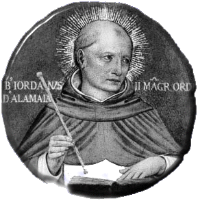

> "O primeiro sucessor de São Domingos e caçador de almas"

**Nascimento**: c. 1190, Borgentreich (Westfália), Sacro Império Romano-Germânico 
**Morte**: 13 de fevereiro de 1237, num naufrágio na costa da Síria 
**Beatificação**: 10 de maio de 1828, pelo Papa Leão XII 
**Festa Litúrgica**: 13 de fevereiro 

<TextToSpeech />

## Biografia
Jordão nasceu por volta de 1190 na região da Saxônia (atual Alemanha), em uma família nobre, possivelmente os Condes de Eberstein. Em 1210, ele foi para Paris, o maior centro intelectual da Europa na época, para estudar teologia e matemática. Foi lá que ele conheceu São Domingos de Gusmão, o fundador da recém-criada Ordem dos Pregadores (Dominicanos), cuja pregação fervorosa e estilo de vida mendicante o cativaram profundamente.

Em 1220, atraído pelo ideal dominicano de contemplação e pregação para a salvação das almas, ele recebeu o hábito da Ordem das mãos do próprio São Domingos. Sua inteligência e carisma foram rapidamente reconhecidos. Pouco tempo depois de entrar para a Ordem, participou do primeiro Capítulo Geral em Bolonha, e no ano seguinte (1221), foi nomeado o primeiro Prior Provincial da Lombardia.

Após a morte prematura de São Domingos em 1221, Jordão foi eleito, no Capítulo Geral de 1222, como o segundo Mestre Geral da Ordem dos Pregadores. Ele liderou a Ordem com notável habilidade por quinze anos, durante os quais a ordem experimentou uma expansão extraordinária. Sob sua liderança, foram fundadas quatro novas províncias, e ele estabeleceu conventos nas principais cidades universitárias da Europa (Paris, Bolonha e Oxford).

Jordão era conhecido como um recrutador incomparável, ganhando o apelido de "caçador de almas". Calcula-se que ele tenha atraído mais de mil jovens, em sua maioria professores e estudantes universitários de talento excepcional (incluindo o futuro Santo Alberto Magno), para a vida dominicana, cativando-os com seus sermões ardentes e sua personalidade compassiva e alegre. Em 1237, ao retornar de uma visitação aos mosteiros dominicanos na Terra Santa, o navio em que viajava naufragou na costa da Síria, resultando em sua morte.

## Milagres
Embora Jordão não fosse especialmente conhecido por milagres espetaculares durante sua vida – seu maior "milagre" foi considerado sua extraordinária capacidade de conversão e atração vocacional –, diversos relatos surgiram após sua morte.
* O primeiro milagre reconhecido ocorreu no próprio naufrágio que o vitimou. Diz a tradição que, enquanto o navio afundava durante a violenta tempestade e muitos passageiros entravam em pânico, o rosto de Jordão brilhava com uma luz sobrenatural. Após o naufrágio, seu corpo emanava um odor suave de santidade e, milagrosamente, quase todos os seus companheiros de viagem, exceto ele e dois frades que estavam com ele, sobreviveram – o que foi interpretado como ele tendo se oferecido como sacrifício para salvar os outros, ou como proteção de suas preces no último momento.
* Outro milagre a ele atribuído foi a multiplicação de pães num convento na Lombardia, onde a comida escasseou e ele, com profunda confiança na Divina Providência, mandou os frades sentarem-se à mesa vazia, que foi prontamente servida por benfeitores desconhecidos (em algumas versões, por anjos) que bateram à porta.

## Curiosidades
1. **Primeiro biógrafo:** Jordão escreveu o *Libellus de principiis Ordinis Praedicatorum* (Livrinho sobre os Princípios da Ordem dos Pregadores), que é a principal fonte histórica sobre a vida de São Domingos e os primeiros dias da Ordem.
2. **Correspondência notável:** Ele manteve uma bela e afetuosa correspondência espiritual com a Beata Diana d'Andalò, fundadora do mosteiro dominicano feminino de Santa Inês em Bolonha. As cerca de 50 cartas que sobreviveram revelam a ternura, a profundidade psicológica e a visão da amizade espiritual dentro do ideal dominicano.
3. **Mente Matemática:** Antes de sua ordenação, Jordão estudou matemática e é considerado por alguns estudiosos medievais o autor de alguns tratados sobre geometria. Ele utilizava sua inteligência analítica de forma afiada tanto na administração da Ordem quanto nas sutilezas da pregação.
4. **O Salve Regina:** Foi Jordão da Saxônia quem instituiu a bela tradição (que perdura até hoje) de os dominicanos cantarem solenemente o *Salve Regina* em procissão após as Completas (a última oração do dia), um costume adotado inicialmente para acalmar frades que estavam sofrendo com a opressão de demônios.

## Cidades por onde passou
<MiracleMap :markers="[
  { lat: 51.5700, lng: 9.2400, title: 'Borgentreich, Alemanha', description: 'Local onde nasceu, na região da Saxônia.' },
  { lat: 48.8566, lng: 2.3522, title: 'Paris, França', description: 'Onde estudou teologia, conheceu São Domingos e mais tarde pregou ativamente na universidade.' },
  { lat: 44.4949, lng: 11.3426, title: 'Bolonha, Itália', description: 'Onde São Domingos faleceu e onde Jordão participou dos Capítulos Gerais e guiou Diana d\'Andalò.' },
  { lat: 34.0000, lng: 35.0000, title: 'Costa da Síria', description: 'Local aproximado do naufrágio no qual perdeu a vida em 1237, ao retornar da Terra Santa.' }
]" />

## Impacto Hoje
O impacto do Beato Jordão da Saxônia perdura principalmente através da Ordem Dominicana, que ele consolidou estrutural e intelectualmente. Se Domingos foi o fundador carismático, Jordão foi o grande organizador e multiplicador. O fato de ele ter focado sua pregação no meio universitário moldou irrevogavelmente a identidade dominicana como uma ordem profundamente intelectual e erudita – pavimentando o caminho para gigantes como Santo Tomás de Aquino.
Hoje, ele é reconhecido e venerado não-oficialmente como o **padroeiro das vocações** na Família Dominicana, sendo constantemente invocado por priores e promotores vocacionais para atrair novos jovens para o carisma da Ordem. Suas cartas a Diana continuam sendo lidas como um testemunho clássico de amizade cristã saudável, e a tradição do canto da Salve Rainha continua a ecoar todas as noites nos conventos dominicanos do mundo inteiro.
