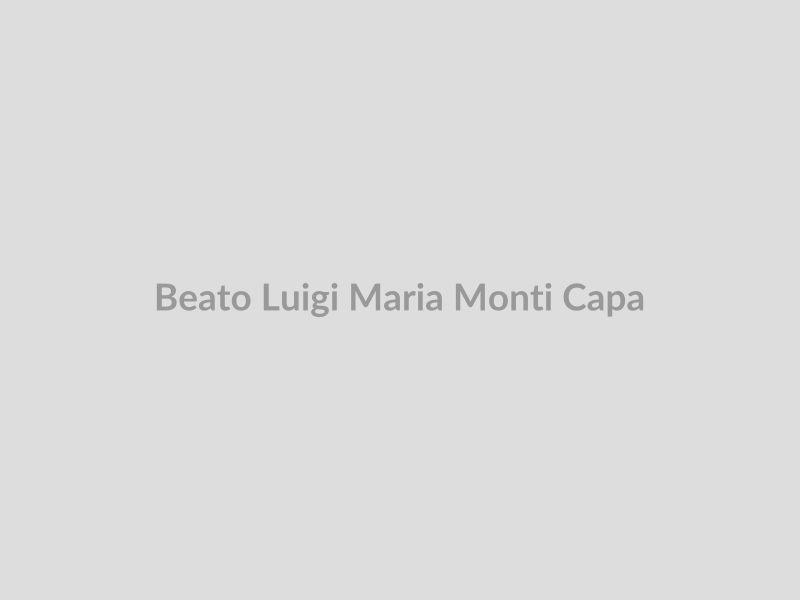

# Beato Luigi Maria Monti

> "A caridade é o fogo que aquece e ilumina; sem ela, tudo é escuridão e frio."

- **Nascimento:** 24 de julho de 1825
- **Morte:** 1 de outubro de 1900
- **Beatificação:** 9 de novembro de 2003
- **Festa Litúrgica:** 1 de outubro

<TextToSpeech />

## Biografia

Luigi Maria Monti nasceu em Bovisio Masciago, próximo a Milão, Itália, em 24 de julho de 1825, no Reino Lombardo-Vêneto. Era o oitavo dos onze filhos de uma família profundamente católica. Aos doze anos, com a morte do pai, Luigi teve que abandonar a escola e começou a trabalhar como aprendiz de carpinteiro para ajudar no sustento da família. Durante sua juventude, tornou-se um artesão habilidoso em madeira, mas a sua verdadeira vocação começou a manifestar-se quando reuniu um grupo de jovens aprendizes e artesãos da sua cidade, na sua oficina de carpintaria.

Eles chamaram a si mesmos de "Companhia do Sagrado Coração". Reuniam-se ao anoitecer para rezar, cantar hinos, estudar o Evangelho e assistir aos doentes e necessitados do vilarejo. O fervor espiritual desses jovens incomodou as autoridades austríacas locais e alguns anticlericais da época, que, suspeitando de conspiração política, os denunciaram. Em 1851, Luigi e seus companheiros foram presos sob falsas acusações, permanecendo encarcerados por mais de dois meses antes de serem libertados e inocentados por falta de provas. Essa experiência de cárcere aguçou ainda mais a sua empatia pelos marginalizados e doentes.

Após entrar em contato com o sacerdote Luigi Dossi, Luigi Monti entrou no noviciado da Congregação dos Filhos de Maria Imaculada, fundada por Ludovico Pavoni (São Ludovico Pavoni). No entanto, o seu diretor espiritual percebeu nele o carisma de fundador e inspirou-o a seguir um caminho próprio. Apoiado pelo seu confessor e com profunda devoção à Imaculada Conceição, Luigi Monti partiu para Roma e fundou a Congregação dos Filhos da Imaculada Conceição em 1857. A princípio, o instituto focava no serviço e no cuidado da enfermagem nos hospitais romanos. Em 1858, ele e os primeiros irmãos começaram a trabalhar no grande Hospital Santo Spirito em Roma, o mais importante da cidade, onde Luigi aprimorou não só a sua enfermagem empírica mas também se diplomou como flebotomista (enfermeiro especialista em tirar sangue e pequenas intervenções).

Mais tarde na vida, ao conhecer órfãos desesperados cujos pais morreram nas epidemias, ampliou o carisma da sua congregação para incluir o acolhimento, cuidado e educação de órfãos, fundando uma grande casa para eles em Saronno, perto de Milão. Frade leigo durante toda a vida, Luigi recusou a ordenação sacerdotal por pura humildade, preferindo ser chamado simplesmente de "Irmão Luigi".

O Beato Luigi Maria Monti faleceu em Saronno no dia 1 de outubro de 1900, consumido por décadas de cuidado ininterrupto aos doentes, com as mãos dadas aos seus amados órfãos. Foi beatificado pelo Papa João Paulo II em 2003.

## Milagres

Em 1961, o camponês italiano Giovanni Ferrisi foi repentinamente acometido por fortes dores abdominais. Após exames em Saronno, os médicos diagnosticaram uma peritonite difusa causada por perfuração intestinal, acompanhada de septicemia gravíssima. A situação era desesperadora e a morte iminente, considerada inevitável pela equipe médica.

A esposa e as filhas de Giovanni começaram a rezar intensamente, pedindo a intercessão do Irmão Luigi Maria Monti e colocando uma de suas relíquias sob o travesseiro do moribundo. Inexplicavelmente, da noite para o dia, a febre desapareceu, a peritonite regrediu completamente, o tecido intestinal regenerou-se e os sinais de infecção sumiram sem deixar sequelas, num processo de cura súbita, perfeita e duradoura. Este foi o milagre oficial aceito pelo Vaticano para a sua elevação aos altares.

## Curiosidades

1. **A Companhia dos "Frades do Bosque":** O grupo de jovens artesãos liderado por Luigi em Bovisio era conhecido pejorativamente no vilarejo como "os frades do bosque". Contudo, as suas noites passadas em oração e cuidando dos doentes transformaram a ofensa num título de glória para eles.
2. **Flebotomista Papal:** Em Roma, Luigi Monti destacou-se tanto nas suas habilidades médicas e dedicação que o Papa Pio IX, que o estimava muito, referia-se a ele como o "Belo Enfermeiro". Ele obteve o diploma de flebotomista da prestigiada universidade romana "La Sapienza", trabalhando não apenas com a caridade espiritual, mas com conhecimento médico de ponta para a sua época.
3. **Pai dos Órfãos:** Durante as epidemias de varíola e cólera do final do século XIX, vendo a quantidade imensa de crianças vagando pelas ruas após a morte dos pais, o Irmão Luigi comprou terras e fundou aldeias inteiras para eles. Tornou-se pai de centenas de órfãos que o tratavam afetuosamente por "Papà Luigi".

## Cidades por onde passou

- Bovisio Masciago (Itália)
- Milão (Itália)
- Roma (Itália)
- Saronno (Itália)

## Impacto Hoje

O legado do Beato Luigi Maria Monti está vivo através da Congregação dos Filhos da Imaculada Conceição, que se expandiu por mais de vinte países, da Europa à África, da Ásia às Américas. Fiel ao carisma do fundador, a congregação opera hospitais modernos (como o "Istituto Dermopatico dell'Immacolata" em Roma), dispensários médicos em zonas de extrema pobreza, e também lares de acolhimento e escolas para crianças órfãs e abandonadas.

A figura de Luigi Monti representa um ideal poderoso para os profissionais de saúde modernos: a fusão da competência profissional técnica (ele buscou diploma na universidade para melhor atender) com a terna caridade cristã, mostrando que o paciente nos leitos não precisa apenas de medicamentos, mas de amor fraternal e dignidade.

<MiracleMap :items='[
  { lat: 45.6108, lng: 9.1469, type: "nascimento", title: "Bovisio Masciago, Itália", description: "Nasceu e trabalhou como carpinteiro." },
  { lat: 41.9028, lng: 12.4964, type: "vida", title: "Roma, Itália", description: "Onde fundou a congregação e trabalhou como enfermeiro no Hospital Santo Spirito." },
  { lat: 45.6264, lng: 9.0347, type: "morte", title: "Saronno, Itália", description: "Fundou grandes orfanatos e faleceu em 1900." },
  { lat: 45.6265, lng: 9.0348, type: "milagre", title: "Milagre em Saronno", description: "Cura milagrosa de Giovanni Ferrisi de uma grave peritonite." }
]' />

## Galeria

|  |  |
| :---: | :---: |
| *Retrato de Beato Luigi Maria Monti.* | *Beato Luigi Maria Monti.* |
