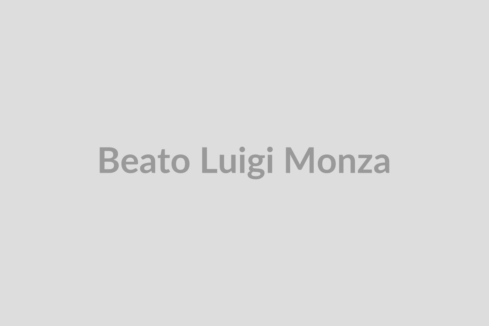

# Beato Luigi Monza

**"Fundador do Instituto Secular das Pequenas Apóstolas da Caridade"**

**Nascimento:** 22 de junho de 1898, Cislago (Itália) 
**Morte:** 28 de setembro de 1954, Milão (Itália) 
**Festa Litúrgica:** 28 de setembro 
**Beatificação:** 30 de abril de 2006, pelo Papa Bento XVI 

---

<TextToSpeech />

## Biografia

Luigi Monza nasceu em Cislago, na província de Varese, Itália. Vindo de uma família de camponeses, conheceu a pobreza e o trabalho árduo desde cedo. Ingressou no seminário da diocese de Milão aos 18 anos, tendo que interromper seus estudos para prestar o serviço militar durante a Primeira Guerra Mundial. Após retornar ao seminário, foi ordenado sacerdote em 1925.

Como jovem sacerdote, Pe. Luigi se destacou pelo seu entusiasmo e dedicação pastoral, especialmente com os jovens, criando oratórios e grupos de escoteiros. Durante o regime fascista na Itália, enfrentou grande oposição devido à sua forte defesa da liberdade e dos direitos dos jovens à educação católica. Chegou a ser preso por alguns meses injustamente acusado de instigar atividades antifascistas.

Sua experiência de prisão apenas fortaleceu sua fé. Mais tarde, foi nomeado pároco em Lecco, onde seu trabalho caritativo floresceu. Em 1937, inspirado pelo desejo de trazer o amor de Deus aos locais mais distantes e necessitados da sociedade moderna, ele fundou o Instituto Secular das Pequenas Apóstolas da Caridade. Este grupo de leigas consagradas dedica-se a viver a caridade cristã no meio do mundo, cuidando de pessoas com deficiência, doentes e marginalizados.

Ele faleceu de um ataque cardíaco fulminante em 1954, enquanto atuava como pároco em Lecco.

## Milagres

O milagre que levou à beatificação do Pe. Luigi Monza ocorreu em 1965 e envolveu a cura inexplicável de uma jovem mulher italiana, que sofria de um grave tumor que havia se espalhado e estava desenganada pelos médicos. Após orações pedindo a intercessão de Pe. Luigi, a mulher recuperou a saúde de forma completa e duradoura.

## Curiosidades

1.  **Fundação e Medicina:** Para apoiar o trabalho do Instituto, ele fundou "La Nostra Famiglia" (A Nossa Família), uma rede de centros de reabilitação e cuidados de saúde especializados para crianças com deficiência, que cresceu exponencialmente e hoje é uma das mais importantes instituições da Itália neste setor.
2.  **Oposição Política:** Sua firme postura moral e educacional o colocou em conflito direto com o regime fascista italiano, que tentava monopolizar a educação e o tempo livre da juventude, mostrando sua coragem cívica além da religiosa.
3.  **Vida Diária como Missão:** O cerne da sua espiritualidade era que não era necessário fugir do mundo para ser santo. Ele acreditava firmemente que a santidade podia e devia ser alcançada no ambiente cotidiano, no trabalho, na família e na sociedade secular.

## Cidades por onde passou

- Cislago, Itália (Nascimento)
- Milão, Itália (Seminário, Ordenação, Prisão e Falecimento)
- Lecco, Itália (Pároco e local de intensa fundação caritativa)

## Impacto Hoje

O impacto de Beato Luigi Monza é imensurável, principalmente no campo da saúde e reabilitação infantil através da instituição "La Nostra Famiglia". O Instituto das Pequenas Apóstolas da Caridade expandiu-se além da Itália e hoje está presente no Brasil, Sudão, Equador, entre outros países. Eles continuam a viver o carisma de Pe. Luigi, combinando excelência profissional, especialmente na reabilitação neuromotora e psiquiátrica de crianças, com um profundo testemunho de caridade cristã no meio do mundo moderno.

<MiracleMap :items='[
  { lat: 45.6565, lng: 8.9723, title: "Cislago, Itália", description: "Local de nascimento de Beato Luigi Monza em 1898." },
  { lat: 45.4642, lng: 9.1900, title: "Milão, Itália", description: "Onde estudou, foi ordenado sacerdote e passou meses preso pelo regime fascista." },
  { lat: 45.8566, lng: 9.3976, title: "Lecco, Itália", description: "Onde atuou como pároco e impulsionou as fundações de caridade." }
]' />
