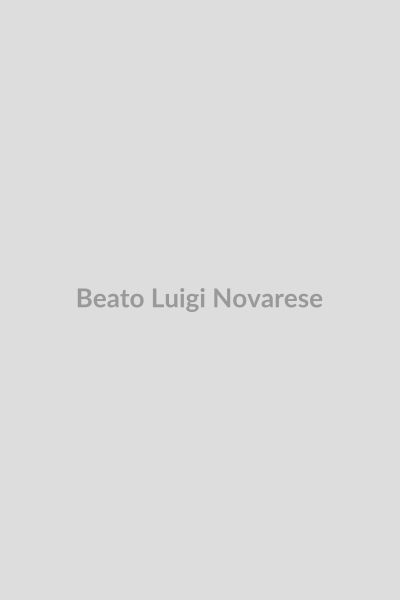

# Beato Luigi Novarese

    
    

        

            
“O doente deve ser o autor do seu próprio apostolado.”

        

        

            
<strong>Nascimento:</strong> 29 de julho de 1914 (Casale Monferrato, Itália) 
            <strong>Morte:</strong> 20 de julho de 1984 (Rocca Priora, Itália) 
            <strong>Beatificação:</strong> 11 de maio de 2013 
            <strong>Festa Litúrgica:</strong> 20 de julho

        

    

<TextToSpeech />

## Biografia

Luigi Novarese nasceu em Casale Monferrato, Piemonte, no dia 29 de julho de 1914. Vindo de uma família humilde, foi o último de nove filhos. Quando era ainda muito jovem, o pai faleceu devido a uma pneumonia. Em 1923, com apenas nove anos de idade, Luigi foi diagnosticado com uma coxalgia grave (tuberculose óssea no quadril), que o forçou a passar grande parte da sua infância e adolescência imobilizado, sofrendo fortes dores.

Sua mãe não mediu esforços para ajudá-lo, mas os médicos não davam grandes esperanças. A reviravolta aconteceu em 1931, quando, após uma novena dedicada a São João Bosco e Nossa Senhora Auxiliadora, e uma carta escrita comoventemente a São João Bosco pedindo sua intercessão, Luigi ficou inexplicavelmente curado. Esta cura milagrosa marcou profundamente a sua vida e a sua visão sobre o sofrimento.

Com a saúde restaurada, Luigi entrou para o seminário. Ele foi ordenado sacerdote em Roma, na Basílica de São João de Latrão, em 17 de dezembro de 1938. Devido aos anos em que esteve doente, ele conhecia intimamente a realidade do sofrimento, sentindo um chamado especial para ajudar aqueles que, como ele, experimentavam a dor.

## Obra e Vida Pessoal

Trabalhando na Secretaria de Estado do Vaticano a partir de 1942 a pedido do Mons. Giovanni Battista Montini (futuro Papa Paulo VI), Pe. Luigi começou a organizar iniciativas pioneiras de assistência pastoral e espiritual aos enfermos. A sua intuição fundamental era revolucionária para a época: o doente não deveria ser visto apenas como um objeto de caridade ou de cuidados, mas como um sujeito ativo, um apóstolo, capaz de oferecer seu próprio sofrimento pelo bem da Igreja e da salvação do mundo.

Ele fundou diversas organizações, conhecidas como as "Obras Silenciosas". A primeira foi a "Liga Sacerdotal Mariana" (1943), seguida pelo "Centro Voluntário do Sofrimento" (CVS) em 1947, os "Silenciosos Operários da Cruz" (1950) e a "Irmandade dos Doentes" (1952).

Ao longo da sua vida, ele organizou numerosos encontros de doentes com os Papas, e organizou as primeiras peregrinações de trem de pessoas gravemente enfermas para santuários marianos como Lourdes. A espiritualidade mariana foi o centro de toda a sua ação, especialmente as mensagens de Nossa Senhora de Fátima.

## Milagres

O milagre que abriu caminho para a sua beatificação foi reconhecido em dezembro de 2011 pelo Papa Bento XVI. Tratava-se da cura cientificamente inexplicável de uma mulher italiana chamada Graziella Paderno. Acometida de uma gravíssima infecção após uma cirurgia abdominal, Graziella estava em estado terminal e sem esperanças de sobrevivência pela medicina. Amigos e membros do Centro Voluntário do Sofrimento iniciaram uma novena pedindo a intercessão do fundador, Luigi Novarese. Em pouco tempo, a mulher se recuperou de forma completa e definitiva, o que os médicos não puderam explicar com base nas leis da natureza.

## Curiosidades

- **A carta para Dom Bosco:** Quando estava doente aos dezessete anos e já desenganado pelos médicos, os colegas de Luigi escreveram ao reitor-mor dos salesianos, Pe. Rinaldi, pedindo uma oração no santuário de Nossa Senhora Auxiliadora, em Turim. Além disso, Luigi, junto com os jovens do oratório, fez a novena. Quando foi dada como certa a necessidade de amputar a perna, sua mãe chamou um fotógrafo para registrar sua imagem ainda com as duas pernas; pouco tempo depois, no dia seguinte ao término da novena a Dom Bosco, ele se levantou da cama completamente curado.
- **Encontros no Vaticano:** Sob sua liderança, em 1952 o Papa Pio XII permitiu que o Centro Voluntário do Sofrimento (CVS) fizesse uma missa no pátio do Belvedere e um encontro histórico onde pela primeira vez milhares de doentes e pessoas em cadeiras de rodas tiveram acesso e audiência com o Papa no interior do Vaticano.
- **Construção:** Pe. Luigi, não satisfeito em cuidar apenas espiritualmente, empenhou-se na construção e fundação de vários centros de reabilitação física e espiritual, unindo ciência médica de ponta ao apoio pastoral de maneira inédita na Itália pós-guerra.

## Cidades por onde passou

- **Casale Monferrato:** Sua cidade natal, onde nasceu e sofreu sua dolorosa doença.
- **Roma:** Onde estudou, foi ordenado e trabalhou longamente na Secretaria de Estado do Vaticano, consolidando o seu trabalho com as associações.
- **Lourdes:** Promoveu inúmeras e frequentes peregrinações com doentes, mudando o foco dessas viagens de "busca pela cura física" para "valorização do sofrimento".
- **Rocca Priora (Valleluogo):** Local próximo a Roma, onde faleceu e onde manteve um centro de repouso e espiritualidade fundamental para suas obras.

<MiracleMap :items="[
  { title: 'Casale Monferrato', lat: 45.1378, lng: 8.4526, description: 'Cidade natal de Luigi Novarese e local de sua juventude marcada pela doença.' },
  { title: 'Roma', lat: 41.9028, lng: 12.4964, description: 'Local de seus estudos, ordenação e trabalho incansável nas fundações das Obras.' },
  { title: 'Lourdes', lat: 43.0915, lng: -0.0457, description: 'Destino de inúmeras peregrinações de doentes lideradas por Pe. Luigi.' },
  { title: 'Rocca Priora', lat: 41.7915, lng: 12.7667, description: 'Local de seu falecimento em 1984.' }
]" />

## Impacto Hoje

Hoje, o Beato Luigi Novarese é recordado como o "Apóstolo dos Doentes". O "Centro Voluntário do Sofrimento" (CVS) e os "Silenciosos Operários da Cruz" operam não apenas na Itália, mas em diversos países ao redor do mundo, do Brasil à Polônia, da Colômbia à África. A sua mensagem revolucionária – de que a pessoa que sofre não é um peso para a sociedade, mas um recurso espiritual ativo e indispensável – influenciou toda a pastoral da saúde da Igreja Católica contemporânea. O Papa João Paulo II chamou-o de "o apóstolo dos doentes, apóstolo no sofrimento".

## Galeria de Imagens

| Imagem | Descrição |
| --- | --- |
|  | Retrato do Beato Luigi Novarese. |
