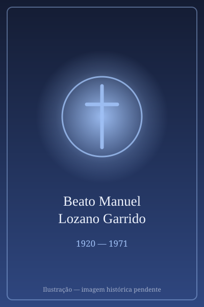

# Beato Manuel Lozano Garrido

> "Lolo, o santo jornalista."

- **Nascimento:** 9 de agosto de 1920, Linares, Espanha
- **Morte:** 3 de novembro de 1971, Linares, Espanha
- **Beatificação:** 2010, pelo Papa Bento XVI
- **Festa Litúrgica:** 3 de novembro

<TextToSpeech />

---

## Biografia

Manuel Lozano Garrido, conhecido como Lolo, nasceu em 9 de agosto de 1920, em Linares, na província de Jaén, Andaluzia. Cresceu numa família católica e integrou desde jovem a Ação Católica local. Durante a Guerra Civil Espanhola, aos dezesseis anos, foi preso por levar clandestinamente a Eucaristia a fiéis em uma cidade onde o culto havia sido proibido — episódio que marcou sua vida.

Aos vinte e dois anos começou a sentir os sintomas de uma espondilite anquilosante progressiva, agravada por problemas circulatórios. Aos vinte e oito estava em cadeira de rodas, e a partir dali a doença avançou de modo implacável: perdeu a mobilidade quase completa e, nos últimos nove anos de vida, também a visão.

Foi nessa condição que construiu sua obra. Escreveu nove livros e centenas de artigos para jornais e revistas espanhóis, ditando os textos à irmã Lucía quando já não podia escrever nem ver. Fundou a revista *Sinai*, dirigida a doentes, e manteve correspondência com leitores de toda a Espanha. Morreu em Linares, em 3 de novembro de 1971, aos 51 anos.

## Vida Pessoal e Obra

Lolo recusou tratar sua condição como tragédia. Escreveu que o sofrimento, aceito, "faz a alma crescer para dentro", e sua produção jornalística é notável pela ausência de autocomiseração: escrevia sobre atualidade, cultura, esporte, política. Foi membro da Associação da Imprensa de Jaén e recebeu em vida o prêmio Bravo, da Conferência Episcopal Espanhola, pelo conjunto de sua obra.

## Milagres

O milagre reconhecido para a beatificação foi a cura de uma mulher espanhola que sofria de uma grave lesão ocular com prognóstico de cegueira irreversível e recuperou a visão após orações à sua intercessão — coincidência não passou despercebida, tratando-se de um beato que morrera cego. Bento XVI autorizou o decreto, e a beatificação ocorreu em Linares, em 12 de junho de 2010.

## Curiosidades

1. **Primeiro jornalista leigo beatificado:** é o primeiro profissional leigo da imprensa elevado aos altares, e sua causa foi acompanhada de perto pelas associações de jornalistas espanholas.
2. **"Lolo":** o apelido de infância acabou virando seu nome público e figura na documentação oficial da causa.
3. **Nove livros sem enxergar:** os últimos títulos foram inteiramente ditados, já cego e praticamente imóvel.
4. **Padroeiro:** invocado pelos jornalistas, escritores e pessoas com deficiência.

## Cidades por onde passou

Nasceu, escreveu e morreu em Linares, na província de Jaén, onde está sepultado.

<MiracleMap :items='[
  { lat: 38.0942, lng: -3.6349, type: "nascimento", title: "Linares", description: "Local de nascimento (9 de agosto de 1920)." },
  { lat: 38.0942, lng: -3.6349, type: "morte", title: "Linares", description: "Cidade onde viveu e morreu." }
]' />

## Impacto Hoje

Lolo tornou-se o patrono informal do jornalismo católico de língua espanhola, e associações profissionais na Espanha e na América Latina promovem prêmios com seu nome. Sua obra é citada nas pastorais da saúde e da pessoa com deficiência como um raro caso de alguém que produziu intensamente a partir de uma limitação extrema. Em Linares, a casa onde viveu foi transformada em centro de estudos sobre sua vida.
