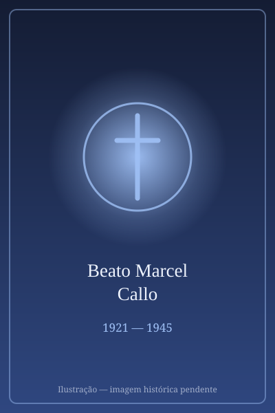

# Beato Marcel Callo

> "Missionário no campo de concentração."

- **Nascimento:** 6 de dezembro de 1921, Rennes, França
- **Morte:** 19 de março de 1945, Mauthausen, Áustria
- **Beatificação:** 1987, pelo Papa João Paulo II
- **Festa Litúrgica:** 19 de março

<TextToSpeech />

---

## Biografia

Marcel Callo nasceu em 6 de dezembro de 1921, em Rennes, na Bretanha francesa, segundo de nove filhos de uma família operária. Aos treze anos deixou a escola e tornou-se aprendiz de tipógrafo. Entrou para os escoteiros e, logo depois, para a Juventude Operária Católica (JOC), o movimento fundado por Joseph Cardijn que formava jovens trabalhadores para a ação cristã no ambiente de trabalho.

Tornou-se um militante ativo: dirigia reuniões, organizava atividades e defendia os colegas na gráfica onde trabalhava. Em 1942 ficou noivo de Marguerite Derniaux, com quem planejava casar-se depois da guerra. Em março de 1943, sua irmã Madeleine morreu num bombardeio aliado sobre Rennes.

Semanas depois, foi convocado para o Serviço de Trabalho Obrigatório (STO) na Alemanha. Poderia ter fugido, como muitos jovens franceses; decidiu ir, dizendo à família: "Não vou como trabalhador, vou como missionário". Trabalhou numa fábrica de munições em Zella-Mehlis, na Turíngia, onde organizou grupos de oração, conseguiu que um sacerdote celebrasse missa em francês e reanimou os companheiros deportados.

Foi preso pela Gestapo em 19 de abril de 1944. Consta na acusação que era "demasiado católico". Passou pelas prisões de Gotha e Flossenbürg e foi enviado ao campo de concentração de Mauthausen, onde morreu de esgotamento e disenteria em 19 de março de 1945, aos 23 anos.

## Vida Pessoal e Espiritualidade

Marcel escreveu à noiva e à família cartas que se tornaram a base de sua causa: nelas, descreve a decisão de partir como um chamado, o esforço para manter a alegria e a certeza de que a fé só tem sentido se sustentar os companheiros. Um médico deportado que o assistiu nos últimos dias declarou tê-lo visto "com o olhar de um santo". João Paulo II o beatificou em 4 de outubro de 1987, como mártir.

## Milagres

Reconhecido mártir *in odium fidei*, sua beatificação não exigiu milagre — a Congregação para as Causas dos Santos concluiu que fora preso e morto precisamente por sua atividade religiosa entre os trabalhadores deportados. Desde então, sua intercessão é invocada especialmente por jovens trabalhadores e movimentos de juventude operária.

## Curiosidades

1. **"Vou como missionário":** a frase dita à família ao embarcar para a Alemanha tornou-se o lema de seus grupos de devoção.
2. **Escotismo:** foi escoteiro antes de entrar na JOC, e a Federação do Escotismo Francês o considera um de seus patronos.
3. **Companheiros de causa:** foi beatificado no mesmo período em que a Igreja reconheceu outros jovens da JOC mortos em campos nazistas, entre eles o austríaco Karl Leisner.
4. **Padroeiro:** dos jovens trabalhadores, dos escoteiros, dos tipógrafos e dos deportados.

## Cidades por onde passou

Nasceu e cresceu em Rennes, na França; foi deportado para Zella-Mehlis, na Turíngia, passou pelas prisões de Gotha e Flossenbürg e morreu no campo de Mauthausen, na Áustria.

<MiracleMap :items='[
  { lat: 48.1173, lng: -1.6778, type: "nascimento", title: "Rennes, França", description: "Local de nascimento (6 de dezembro de 1921)." },
  { lat: 48.2403, lng: 14.5008, type: "morte", title: "Mauthausen", description: "Campo de concentração onde foi martirizado." }
]' />

## Impacto Hoje

Marcel Callo é a figura de referência da Juventude Operária Católica no mundo inteiro e é lembrado nas celebrações do Primeiro de Maio em muitas dioceses francesas. Sua história é usada na pastoral juvenil para falar de fé vivida no ambiente de trabalho e de fidelidade em contextos hostis. Em Mauthausen, hoje memorial e museu, seu nome figura entre os dos religiosos e militantes cristãos mortos no campo.
