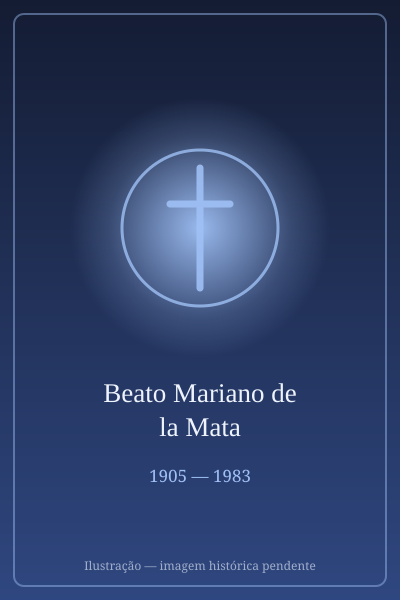

# Beato Mariano de la Mata

> "O mensageiro da caridade."

- **Nascimento:** 31 de dezembro de 1905, Barrio de la Puebla, Espanha
- **Morte:** 5 de abril de 1983, São Paulo, Brasil
- **Beatificação:** 2006, pelo Papa Bento XVI
- **Festa Litúrgica:** 5 de novembro

<TextToSpeech />

---

## Biografia

Mariano de la Mata Aparicio nasceu em 31 de dezembro de 1905, em Barrio de la Puebla, na província de Palência, Espanha, numa família numerosa e devota — três de seus irmãos também seguiram a vida religiosa. Entrou muito jovem no colégio dos agostinianos de Valladolid e professou na Ordem de Santo Agostinho em 1922.

Foi ordenado sacerdote em 1931 e, no ano seguinte, enviado ao Brasil, onde permaneceria pelo resto da vida — 57 anos ao todo. Trabalhou no Colégio São José, em São Paulo, e depois no Colégio Santo Agostinho, exercendo funções de professor, ecônomo e diretor espiritual.

Sua atuação mais lembrada, porém, foi fora da sala de aula. Percorria diariamente hospitais, favelas e casas de família da capital paulista, levando a comunhão aos doentes, conseguindo remédios, consultas e emprego para quem o procurava. Mantinha uma agenda de necessitados e usava sua rede de ex-alunos para atender pedidos. Ficou conhecido como "o padre que nunca dizia não".

Morreu em São Paulo, em 5 de fevereiro de 1983, aos 77 anos, depois de anos de trabalho ininterrupto apesar de problemas cardíacos.

## Vida Pessoal e Obra

Padre Mariano vivia com extrema simplicidade e distribuía tudo o que recebia. Recolhia alimentos e roupas, organizava campanhas e visitava presos. Testemunhas do processo descreveram sua rotina como uma peregrinação diária pela cidade, sempre a pé ou de ônibus. Foi beatificado por João Paulo II na Praça de São Pedro, em 5 de novembro de 2006 — o primeiro agostiniano que trabalhou no Brasil a ser elevado aos altares.

## Milagres

O milagre reconhecido para a beatificação foi a cura de uma criança brasileira, ocorrida em São Paulo, considerada cientificamente inexplicável pela consulta médica do Vaticano. O decreto foi promulgado em 2006, abrindo caminho para a cerimônia realizada no mesmo ano.

## Curiosidades

1. **Cinquenta e sete anos no Brasil:** chegou aos 26 anos e nunca mais voltou a viver na Espanha, tornando-se, na prática, um religioso brasileiro.
2. **A caderneta:** carregava sempre um caderno com nomes e pedidos, que consultava para não esquecer ninguém — objeto hoje conservado como relíquia.
3. **Rede de ex-alunos:** usava sistematicamente os contatos formados no colégio para conseguir vagas em hospitais e empregos para os pobres.
4. **Padroeiro:** invocado pelos educadores, pelos agentes de pastoral da saúde e pelos imigrantes.

## Cidades por onde passou

Nasceu em Barrio de la Puebla, na província de Palência, formou-se em Valladolid e viveu de 1932 a 1983 em São Paulo, onde está sepultado na igreja do Colégio Santo Agostinho.

<MiracleMap :items='[
  { lat: 42.0095, lng: -4.5289, type: "nascimento", title: "Barrio de la Puebla, Espanha", description: "Local de nascimento (31 de dezembro de 1905)." },
  { lat: -23.5505, lng: -46.6333, type: "morte", title: "São Paulo", description: "Cidade onde serviu por muitos anos. Local da morte (5 de abril de 1983)." }
]' />

## Impacto Hoje

Padre Mariano é lembrado em São Paulo como figura da caridade urbana anterior às grandes estruturas assistenciais — alguém que atendia caso a caso, pela cidade inteira. Os agostinianos mantêm no Brasil obras educativas e sociais que se reclamam de seu exemplo, e sua sepultura, na Vila Prudente, recebe visitantes regularmente. Sua causa também é lembrada como testemunho da presença dos missionários espanhóis na formação da Igreja paulista do século XX.
