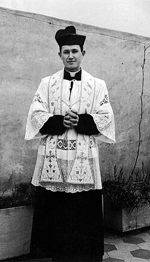

# Beato Miroslav Bulešić

> "Meu Deus, eu te ofereço toda a minha vida por meu rebanho."

- **Nascimento:** 13 de maio de 1920, Zabroni (Svetvinčenat), Reino da Itália 
- **Morte:** 24 de agosto de 1947, Lanišće, PR Croácia, Iugoslávia 
- **Beatificação:** 28 de setembro de 2013, pelo Papa Francisco (presidida pelo Cardeal Angelo Amato) 
- **Festa Litúrgica:** 24 de agosto 

<TextToSpeech />

---

## Biografia

Miroslav Bulešić foi um sacerdote católico croata nascido na Ístria, em 1920. Estudou em Roma na Pontifícia Universidade Gregoriana, sendo ordenado padre em 1943, durante o auge da Segunda Guerra Mundial. Retornou à sua terra natal (então marcada por intensos conflitos de fronteira e ideológicos) para assumir paróquias locais.

Tornou-se rapidamente conhecido como um pastor zeloso e corajoso, renovando a vida paroquial por meio de atividades pastorais bem organizadas e promovendo ativamente a recepção frequente dos sacramentos entre os jovens. Em um período pós-guerra onde o regime comunista iugoslavo oprimia a Igreja, Miroslav tornou-se um crítico vocal da perseguição religiosa e do comunismo.

No dia 24 de agosto de 1947, após administrar o sacramento da Crisma na paróquia de Lanišće junto ao delegado episcopal, militantes comunistas invadiram a casa paroquial. Miroslav foi brutalmente assassinado por ódio à fé (in odium fidei), esfaqueado no pescoço. Suas últimas palavras registradas, encontradas em seu diário, revelaram sua disposição ao martírio: "A minha vingança é o perdão".

## Milagres e Martírio

Como mártir da Igreja, o milagre que o elevou aos altares foi a entrega de sua própria vida em testemunho de sua fé inabalável em Cristo, perdoando seus algozes. O reconhecimento do martírio "in odium fidei" dispensou a necessidade de um milagre físico para sua beatificação.

## Curiosidades

1. **Testamento Espiritual:** Em seu diário pessoal, ele expressou várias vezes que estava disposto a morrer por seus paroquianos, demonstrando uma profunda espiritualidade de entrega e perdão.
2. **Beatificação em Pula:** A cerimônia de sua beatificação ocorreu na monumental Arena de Pula, na Croácia, reunindo milhares de fiéis para honrar o mártir croata.
3. **Mártir da Ístria:** Ele é frequentemente invocado como o padroeiro dos sacerdotes perseguidos e um símbolo da resistência cristã croata frente ao totalitarismo do século XX.

## Cidades por onde passou

O mapa abaixo reúne os lugares ligados a Beato Miroslav Bulešić:

<MiracleMap :items='[
  { lat: 45.0883, lng: 13.8817, type: "nascimento", title: "Svetvinčenat, Croácia", description: "Local de nascimento (Zabroni) e onde hoje está seu principal santuário." },
  { lat: 41.8986, lng: 12.4831, type: "milagre", title: "Roma, Itália", description: "Onde estudou teologia na Pontifícia Universidade Gregoriana." },
  { lat: 45.3983, lng: 14.1167, type: "morte", title: "Lanišće, Croácia", description: "Local do seu martírio em 24 de agosto de 1947." },
  { lat: 44.8683, lng: 13.8481, type: "milagre", title: "Pula, Croácia", description: "Local de sua beatificação em 2013, na Arena de Pula." }
]' />

## Impacto Hoje

O sacrifício do Beato Miroslav Bulešić permanece como um testemunho poderoso de amor e perdão contra o ódio e a perseguição política. Ele inspira os católicos da Croácia e de todo o mundo a permanecerem firmes na fé, valorizarem os sacramentos e orarem pela conversão de seus inimigos.
