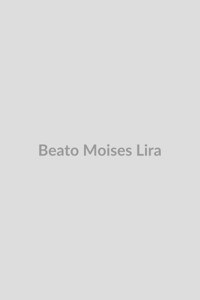

# Beato Moisés Lira

**"É preciso saber viver e conviver."**

**Nascimento:** 16 de setembro de 1893, Maragogi, Alagoas (Brasil)
**Morte:** 25 de outubro de 1950, Rio de Janeiro (Brasil)
**Festa Litúrgica:** 25 de outubro
**Beatificação:** 14 de setembro de 2024, pelo Papa Francisco

<TextToSpeech />

---

## Biografia

Moisés Lira de Andrade nasceu em Maragogi, no litoral de Alagoas. De família humilde, sentiu o chamado ao sacerdócio e ingressou na Congregação dos Missionários Oblatos de Maria Imaculada (OMI). Foi ordenado sacerdote em 1922, sendo o primeiro Oblato brasileiro.

Exerceu seu ministério com grande zelo missionário, dedicando-se especialmente aos pobres e doentes. Em 1938, fundou a Congregação das Missionárias de Nossa Senhora das Dores, em Minas Gerais, com o objetivo de auxiliar o clero e trabalhar nas obras sociais e educativas. Passou seus últimos anos no Rio de Janeiro, onde faleceu com fama de santidade.

## Vida Pessoal e Espiritualidade

Padre Moisés era conhecido por sua alegria contagiante e por sua bondade no confessionário, sendo chamado de "Apóstolo do Confessionário". Sua espiritualidade era centrada na filiação divina: viver como filho amado de Deus. Ele ensinava que a santidade consiste em fazer bem as pequenas coisas do dia a dia, com muito amor.

Era um homem de oração profunda, mas de ação concreta. Acolhia a todos sem distinção, com um sorriso que desarmava os corações mais endurecidos.

## Milagres

O milagre que permitiu sua beatificação ocorreu em 2013, na cidade de Quitandinha (PR). Uma gestante, diagnosticada com hidropsia fetal grave (acúmulo de líquido no corpo do feto), recebeu a notícia de que o bebê não sobreviveria. A avó da criança rezou com fé pedindo a intercessão do Padre Moisés Lira.

Contra todos os prognósticos médicos, o líquido desapareceu completamente e o menino, Gabriel, nasceu saudável e sem sequelas. O caso foi estudado por médicos e teólogos do Vaticano, que concluíram não haver explicação científica para a cura.

## Curiosidades

1.  **Pioneiro:** Foi o primeiro brasileiro a se tornar membro dos Oblatos de Maria Imaculada.
2.  **Frase:** Sua frase "É preciso saber viver" tornou-se um lema para muitos que o seguiam, incentivando uma vida de virtude e equilíbrio.
3.  **Devoção:** Tinha uma profunda devoção a Nossa Senhora das Dores, a quem confiou sua nova congregação.

## Cidades por onde passou

Do Nordeste ao Sudeste, o Beato Moisés Lira deixou marcas de santidade.

<MiracleMap :items='[
  { lat: -9.0122, lng: -35.2225, title: "Maragogi, Alagoas", description: "Cidade natal do Beato Moisés Lira." },
  { lat: -22.6631, lng: -45.0111, title: "Cachoeira Paulista, SP", description: "Local onde fez parte de sua formação e viveu no seminário." },
  { lat: -22.9068, lng: -43.1729, title: "Rio de Janeiro, RJ", description: "Cidade onde exerceu grande parte de seu ministério e onde faleceu." },
  { lat: -19.9167, lng: -43.9345, title: "Belo Horizonte, MG", description: "Região onde fundou a Congregação das Missionárias de Nossa Senhora das Dores." }
]' />

## Impacto Hoje

A beatificação de Moisés Lira em 2024 renovou o interesse por sua vida e obra. Ele é um modelo de sacerdote, confessor e pai espiritual. Sua congregação continua ativa em vários estados do Brasil, perpetuando seu carisma de servir com alegria e simplicidade. Ele nos lembra que a santidade é acessível a todos e que a bondade é a maior força transformadora do mundo.
