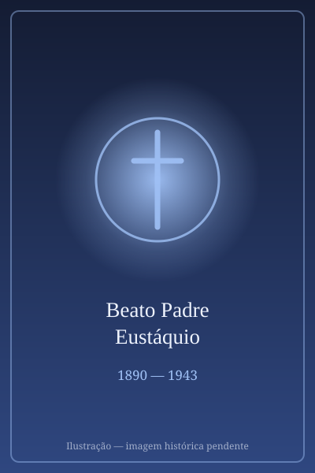

# Beato Padre Eustáquio

> "Saúde e paz."

- **Nascimento:** 3 de novembro de 1890, Aarle-Rixtel, Holanda
- **Morte:** 30 de agosto de 1943, Belo Horizonte, Brasil
- **Beatificação:** 2006, pelo Papa Bento XVI
- **Festa Litúrgica:** 30 de agosto

<TextToSpeech />

---

## Biografia

Humberto van Lieshout nasceu em 3 de novembro de 1890, em Aarle-Rixtel, nos Países Baixos, filho de agricultores. Entrou na Congregação dos Sagrados Corações de Jesus e Maria e recebeu o nome religioso de Eustáquio. Foi ordenado sacerdote em 1919, já com o desejo declarado de partir para as missões.

Chegou ao Brasil em 1924 e foi destinado ao Espírito Santo e depois a Minas Gerais. Trabalhou em Poá e Agudos, no interior paulista, e a partir de 1941 fixou-se em Belo Horizonte, na paróquia de Nossa Senhora da Boa Viagem e depois na igreja dos Sagrados Corações, no bairro que hoje leva seu nome.

Foi um confessor incansável: passava horas no confessionário e recebia filas que se estendiam pela rua. Ficou conhecido pela capacidade de aconselhar e por curas atribuídas à sua bênção, o que atraiu multidões de todo o estado. A fama incomodava-o; pedia que os fiéis atribuíssem tudo a Deus e a Nossa Senhora.

Adoeceu de leucemia e morreu em Belo Horizonte, em 30 de agosto de 1943, aos 52 anos. Seu funeral parou a cidade.

## Vida Pessoal e Espiritualidade

Padre Eustáquio nunca perdeu o sotaque holandês, o que virava motivo de brincadeira nas homilias. Vivia com austeridade extrema, dormia pouco e jejuava com frequência. Sua devoção central era a Nossa Senhora da Boa Viagem, e o gesto que o caracterizava era a bênção individual, dada um a um. Foi beatificado por João Paulo II em 15 de junho de 2006, em cerimônia realizada em Belo Horizonte.

## Milagres

O milagre reconhecido para a beatificação foi a cura de Divina Aparecida de Paula, mineira que sofria de um tumor cerebral inoperável e se restabeleceu completamente após orações à sua intercessão. Ainda em vida, porém, o padre já era procurado por relatos de curas: os registros da paróquia e os depoimentos do processo reúnem centenas de casos atribuídos à sua bênção, sobretudo entre doentes que vinham do interior mineiro.

## Curiosidades

1. **Um bairro com seu nome:** o bairro Padre Eustáquio, em Belo Horizonte, é uma das poucas regiões urbanas brasileiras batizadas com o nome de um beato ainda antes da beatificação.
2. **Filas de confissão:** relatos da época descrevem filas que dobravam quarteirões, com fiéis chegando de trem de outras cidades.
3. **Holandês do sertão:** aprendeu português na estrada, atendendo comunidades rurais, e usava as expressões do interior mineiro nas pregações.
4. **Padroeiro:** invocado pelos doentes, pelos confessores e pelos imigrantes.

## Cidades por onde passou

Nasceu em Aarle-Rixtel, nos Países Baixos; no Brasil, atuou no Espírito Santo, em Poá e Agudos (SP) e, sobretudo, em Belo Horizonte, onde morreu e está sepultado.

<MiracleMap :items='[
  { lat: 51.5083, lng: 5.6167, type: "nascimento", title: "Aarle-Rixtel, Holanda", description: "Local de nascimento (3 de novembro de 1890)." },
  { lat: -19.9167, lng: -43.9345, type: "morte", title: "Igreja Padre Eustáquio (BH)", description: "Local da morte (30 de agosto de 1943)." },
  { lat: -19.9167, lng: -43.9345, type: "tumulo", title: "Igreja Padre Eustáquio (BH)", description: "Santuário onde se encontra seu túmulo." }
]' />

## Impacto Hoje

O Santuário Padre Eustáquio, em Belo Horizonte, é um dos maiores centros de peregrinação de Minas Gerais, com missas de cura e romarias que reúnem milhares de fiéis todos os meses. Sua devoção é especialmente forte entre doentes e famílias do interior mineiro, e a Congregação dos Sagrados Corações mantém no Brasil obras que se reclamam de seu exemplo missionário.
