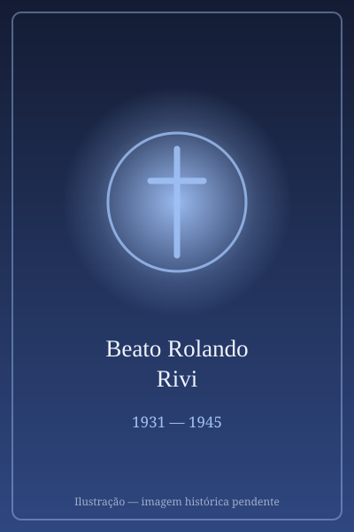

# Beato Rolando Rivi

> "Eu sou de Jesus."

- **Nascimento:** 7 de janeiro de 1931, San Valentino, Itália
- **Morte:** 13 de abril de 1945, Monchio, Itália
- **Beatificação:** 2013, pelo Papa Francisco
- **Festa Litúrgica:** 13 de abril

<TextToSpeech />

---

## Biografia

Rolando Rivi nasceu em 7 de janeiro de 1931, em San Valentino di Castellarano, na província de Reggio Emilia, no norte da Itália, filho de agricultores. Desde criança era assíduo à igreja e servia como coroinha. Aos onze anos entrou para o seminário menor de Marola, onde se destacou pela alegria e pela devoção — sonhava tornar-se missionário.

Em 1944, com o avanço da guerra, o seminário foi ocupado por tropas alemãs e os alunos foram enviados de volta às suas casas. Rolando continuou a estudar sozinho e fez questão de manter a batina, mesmo com a região dominada por grupos partigiani de orientação comunista, hostis ao clero. Aos que o aconselhavam a tirá-la, respondia que era o sinal de que pertencia a Jesus.

Em 10 de abril de 1945, foi sequestrado enquanto estudava num bosque perto de casa. Ficou três dias em cativeiro numa casa abandonada, foi espancado e torturado. Em 13 de abril, foi levado a um bosque em Piane di Monchio, obrigado a cavar a própria cova e morto com dois tiros. Tinha catorze anos. O corpo foi encontrado dias depois pelo pároco; a batina havia sido tomada de dele e usada como bola por seus algozes.

## Vida Pessoal e Espiritualidade

Rolando escrevia num caderno os propósitos que se impunha: comungar, visitar o Santíssimo, evitar a preguiça. A frase que a família guardou dele resume sua decisão: "Estes vestidos são o sinal de que eu sou de Jesus". Um dos assassinos declarou anos depois, em processo, que o mataram porque "seria um padre no futuro".

## Milagres

Foi reconhecido mártir *in odium fidei* — o decreto foi assinado por Bento XVI em 27 de março de 2013 —, o que dispensou a comprovação de milagre. A beatificação ocorreu em Modena, em 5 de outubro de 2013. Desde a morte, a comunidade de San Valentino registra graças atribuídas à sua intercessão, e seu túmulo na igreja da aldeia tornou-se local de peregrinação, sobretudo de seminaristas e jovens.

## Curiosidades

1. **O mais jovem mártir italiano do pós-guerra:** tinha catorze anos, e sua causa levantou debate sobre a violência anticlerical no chamado "triângulo da morte" da Emília-Romanha entre 1945 e 1946.
2. **A batina preservada:** a veste que usava, recuperada anos depois, é conservada como relíquia.
3. **Reconhecimento tardio:** por décadas o caso permaneceu silenciado por razões políticas locais; a causa só foi aberta em 2006.
4. **Padroeiro:** invocado pelos seminaristas e pela pastoral vocacional.

## Cidades por onde passou

Nasceu e viveu em San Valentino di Castellarano, estudou no seminário de Marola e foi morto em Piane di Monchio, todas na região da Emília-Romanha, na Itália.

<MiracleMap :items='[
  { lat: 44.5964, lng: 10.7483, type: "nascimento", title: "San Valentino", description: "Local de nascimento (7 de janeiro de 1931)." },
  { lat: 44.2833, lng: 10.55, type: "morte", title: "Monchio, Itália", description: "Local da morte (13 de abril de 1945)." },
  { lat: 44.5964, lng: 10.7483, type: "tumulo", title: "San Valentino", description: "Onde viveu e onde estão suas relíquias." }
]' />

## Impacto Hoje

Rolando Rivi tornou-se patrono informal dos seminários italianos, e sua história é apresentada na pastoral vocacional como exemplo de coerência num adolescente. Sua beatificação ajudou a trazer para o debate público italiano a memória da violência anticlerical no imediato pós-guerra, tema que permanecia pouco discutido. San Valentino recebe romarias anuais no aniversário de sua morte.
