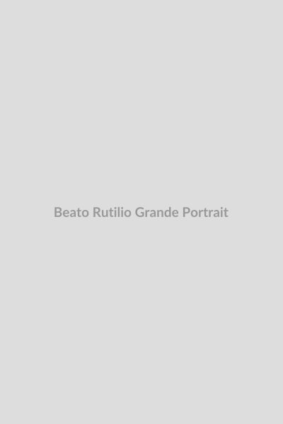

# Beato Rutilio Grande

**"O Evangelho tem que criar raízes nas realidades do povo."**

**Nascimento:** 5 de julho de 1928, El Paisnal, El Salvador 
**Morte:** 12 de março de 1977, Aguilares, El Salvador 
**Beatificação:** 22 de janeiro de 2022, pelo Papa Francisco (rito presidido pelo Cardeal Gregorio Rosa Chávez) 
**Festa Litúrgica:** 12 de março 

---

<TextToSpeech />

## Biografia

Rutilio Grande García nasceu em El Paisnal, uma pequena cidade em El Salvador, em uma família humilde. Na juventude, sentiu o chamado para o sacerdócio e entrou no seminário menor de San Salvador, ingressando posteriormente na Companhia de Jesus (Jesuítas) em 1945. Foi ordenado sacerdote em 1959.

Durante seus anos de formação e primeiros anos de sacerdócio, Rutilio estudou no Equador, Espanha e Bélgica. Ao retornar a El Salvador, trabalhou como formador no seminário, onde conheceu e se tornou um grande amigo e confidente de Óscar Romero (futuro São Óscar Romero).

Em 1972, assumiu como pároco da cidade de Aguilares, onde iniciou um intenso trabalho pastoral. Rutilio Grande não via a fé desvinculada da realidade de extrema pobreza e injustiça social em que viviam os camponeses (campesinos) de sua paróquia. Inspirado pelo Concílio Vaticano II e pela Conferência de Medellín, ele promoveu as Comunidades Eclesiais de Base (CEBs), incentivando os camponeses a lerem a Bíblia e a aplicarem seus ensinamentos em suas vidas cotidianas, conscientizando-os sobre seus direitos e dignidade.

Sua pregação denunciando as injustiças estruturais, a concentração de terras e a repressão governamental o tornou alvo dos poderosos locais e de esquadrões da morte. No dia 12 de março de 1977, enquanto viajava de jipe de Aguilares para El Paisnal para celebrar a missa, Rutilio Grande, acompanhado pelo catequista Manuel Solórzano e pelo jovem Nelson Rutilio Lemus, foi emboscado e brutalmente assassinado a tiros.

Sua morte chocou a nação e teve um impacto decisivo em seu amigo, o Arcebispo Óscar Romero, marcando o início da forte postura profética de Romero em defesa dos oprimidos, que também culminaria em seu martírio.

## Vida Pessoal

Padre Rutilio era descrito como um homem profundamente humano, bem-humorado, simples e muito próximo do povo. Apesar de sua formação intelectual sólida na Europa, ele nunca perdeu a conexão com suas raízes rurais. Falava a linguagem dos camponeses, comia com eles e compartilhava de suas lutas diárias.

Sua espiritualidade era centrada na Eucaristia e na convicção de que Jesus Cristo se identifica com os pobres e marginalizados. A amizade entre ele e São Óscar Romero foi uma das mais significativas na história recente da Igreja Latino-Americana; Romero frequentemente se aconselhava com Rutilio e via nele um modelo pastoral a ser seguido.

## Milagres

Sendo reconhecido como mártir (morto *in odium fidei* - por ódio à fé), a Igreja Católica dispensa a exigência de um milagre para a sua beatificação. O grande "milagre" reconhecido em sua vida é o de ter dado a própria vida por amor a Deus e ao seu povo, inspirando uma profunda conversão pastoral em muitos, incluindo São Óscar Romero, e mantendo viva a fé do povo salvadorenho durante os anos sombrios da guerra civil.

Sua intercessão, no entanto, é constantemente invocada por aqueles que lutam por justiça social e pelos defensores dos direitos humanos.

## Curiosidades

*   **A "Conversão" de Romero:** A morte de Rutilio Grande é frequentemente citada como o catalisador da "conversão" pastoral de São Óscar Romero, que, diante do cadáver do amigo, prometeu seguir seu exemplo de defesa incansável dos pobres.
*   **Companheiros de Martírio:** Rutilio não foi beatificado sozinho; ele foi elevado aos altares junto com seus dois companheiros leigos de martírio: Manuel Solórzano, de 72 anos, e Nelson Rutilio Lemus, de 16 anos.
*   **Primeiro Jesuíta Mártir:** Ele foi o primeiro padre jesuíta assassinado durante o violento período de repressão em El Salvador, prefigurando o martírio dos jesuítas da UCA em 1989.
*   **Homilia Profética:** Um mês antes de sua morte, ele pregou uma homilia famosa (o Sermão de Apopa), onde denunciou que até mesmo levar a Bíblia era considerado subversivo no país, prevendo que logo seria perigoso ser cristão.

## Cidades por onde passou

*   **El Paisnal, El Salvador:** Sua cidade natal e local para onde se dirigia no dia de seu martírio.
*   **Quito, Equador:** Onde realizou parte de seus estudos e noviciado jesuíta.
*   **Oña, Espanha:** Onde estudou teologia.
*   **Bruxelas, Bélgica:** Onde completou estudos no Instituto Internacional Lúmen Vitae.
*   **Aguilares, El Salvador:** A paróquia onde desenvolveu seu trabalho pastoral revolucionário e perto de onde foi assassinado.

## Impacto Hoje

O legado do Beato Rutilio Grande é um farol para a Igreja engajada na Doutrina Social. Ele personifica a "Igreja em saída" e a "opção preferencial pelos pobres", temas centrais do pontificado do Papa Francisco.

Sua vida e morte lembram ao mundo que a fé autêntica exige um compromisso ativo com a justiça e a dignidade humana. Em El Salvador e em toda a América Latina, ele é venerado como um profeta que deu a voz (e a vida) aos sem-voz, inspirando novas gerações de agentes pastorais, ativistas de direitos humanos e líderes comunitários a lutarem por um mundo mais justo e equitativo.

<MiracleMap :items='[{ lat: 14.0044, lng: -89.1764, title: "Aguilares, El Salvador", description: "Paróquia do Beato Rutilio Grande e localidade próxima ao seu martírio." }, { lat: 14.0531, lng: -89.2153, title: "El Paisnal, El Salvador", description: "Sua cidade natal, destino de sua viagem no dia 12 de março de 1977." }, { lat: 13.6929, lng: -89.2182, title: "San Salvador, El Salvador", description: "Local do seminário onde lecionou e atuou no início do sacerdócio." }]' />
