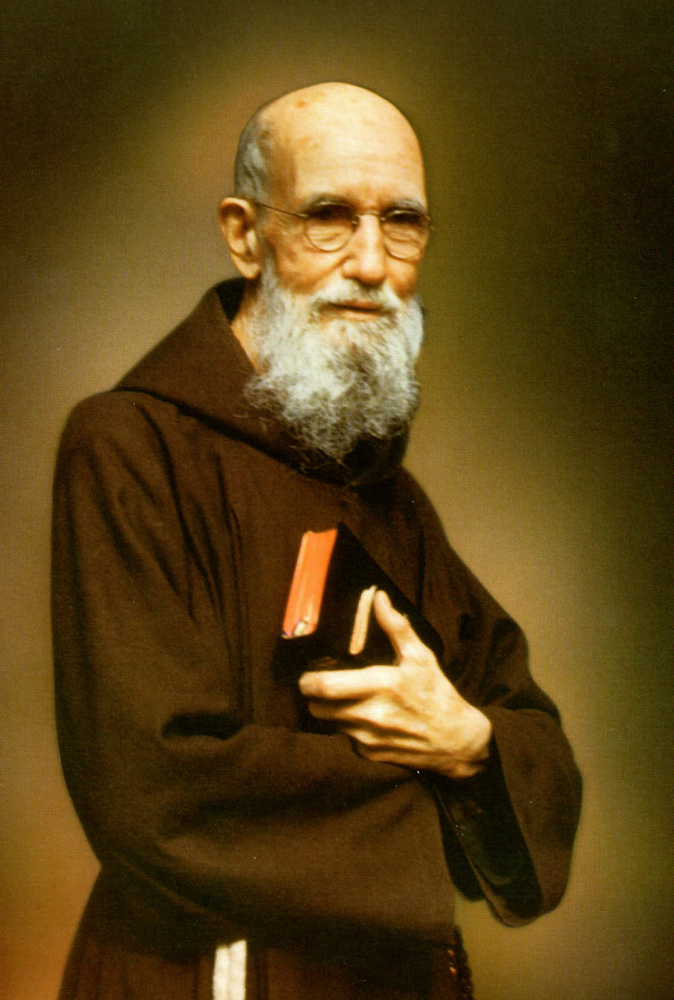

# Beato Solanus Casey

**"O Porteiro de Deus"**

**Nascimento:** 25 de novembro de 1870, Oak Grove, Wisconsin, EUA
**Morte:** 31 de julho de 1957, Detroit, Michigan, EUA
**Festa Litúrgica:** 30 de julho
**Beatificação:** 18 de novembro de 2017, em Detroit

<TextToSpeech />

---

## Biografia

Bernard Francis Casey nasceu em uma fazenda em Oak Grove, Wisconsin, filho de imigrantes irlandeses. Foi o sexto de dezesseis filhos. Desde jovem, sentiu o chamado para o sacerdócio, mas teve dificuldades com os estudos devido à barreira do idioma (as aulas eram em alemão ou latim) e a uma educação anterior limitada.

Entrou para a Ordem dos Frades Menores Capuchinhos em Detroit e recebeu o nome religioso de Solanus. Devido às suas notas baixas, foi ordenado como "sacerdote simplex", o que significava que ele podia celebrar a Missa, mas não tinha permissão para pregar sermões doutrinários ou ouvir confissões.

Por causa dessas restrições, foi designado para ser o porteiro do mosteiro em Nova York e, mais tarde, em Detroit. Foi nessa função humilde que Solanus encontrou sua verdadeira vocação.

## Vida Pessoal e Espiritualidade

Como porteiro, Solanus atendia a todos que batiam à porta do mosteiro: pobres, doentes, angustiados e curiosos. Ele os ouvia com paciência infinita, oferecia conselhos simples e prometia rezar por eles. Sua espiritualidade era marcada por uma confiança absoluta na Providência Divina e uma gratidão constante. Sua frase favorita era: "Dê graças a Deus antecipadamente" (*Thank God ahead of time*).

Ele tinha um grande amor pela música e tocava violino para os outros frades, embora dizem que não tocava muito bem. Amava também a natureza e cuidava das abelhas do mosteiro.

## Milagres

Logo, as pessoas começaram a relatar que as orações do Frei Solanus eram atendidas de forma milagrosa. Curas inexplicáveis, resoluções de problemas familiares e financeiros e conversões aconteciam com frequência após uma conversa com ele ou após serem "inscritos" na Seraphic Mass Association (Associação de Missas Seráficas).

Para sua beatificação, o Vaticano reconheceu a cura milagrosa de Paula Medina Zarate, uma mulher do Panamá que sofria de uma doença genética incurável na pele (ictiose). Enquanto rezava no túmulo de Solanus em Detroit, em 2012, ela sentiu um calor intenso e sua pele começou a se curar instantaneamente.

## Curiosidades

1.  **Sacerdote Simplex:** O fato de não poder confessar ou pregar acabou sendo uma bênção, pois o deixou livre para passar o dia todo atendendo o povo na portaria.
2.  **Violino:** Ele costumava tocar violino diante do Santíssimo Sacramento nas noites de Natal, cantando canções irlandesas para o Menino Jesus.
3.  **Detroit:** É uma figura icônica em Detroit. Seu funeral reuniu milhares de pessoas e o trânsito parou por quilômetros.

## Cidades por onde passou

<MiracleMap :items='[
  { lat: 44.7570, lng: -92.5152, title: "Oak Grove, Wisconsin", description: "Local de nascimento de Bernard Casey (Beato Solanus)." },
  { lat: 42.3526, lng: -83.0115, title: "Detroit, Michigan", description: "Mosteiro de São Boaventura, onde serviu como porteiro por muitos anos e onde está seu túmulo." },
  { lat: 40.9312, lng: -73.8987, title: "Yonkers, Nova York", description: "Serviu como porteiro no mosteiro local." },
  { lat: 40.8792, lng: -85.4953, title: "Huntington, Indiana", description: "Noviciado Capuchinho onde viveu seus últimos anos." },
  { lat: 46.7208, lng: -92.1041, title: "Superior, Wisconsin", description: "Sua primeira designação após a ordenação." }
]' />

## Impacto Hoje

A vida do Beato Solanus Casey é um testemunho poderoso de que a santidade não depende de grandes feitos intelectuais ou posições de poder, mas de amor e serviço humilde no cotidiano. O Centro Solanus Casey em Detroit atrai peregrinos de todo o mundo. Sua mensagem de "agradecer a Deus antecipadamente" ressoa com muitos que buscam esperança em tempos difíceis.
