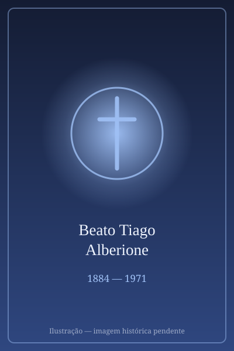

# Beato Tiago Alberione

> "O apóstolo da comunicação."

- **Nascimento:** 4 de abril de 1884, San Lorenzo di Fossano, Itália
- **Morte:** 26 de novembro de 1971, Roma, Itália
- **Beatificação:** 2003, pelo Papa João Paulo II
- **Festa Litúrgica:** 26 de novembro

<TextToSpeech />

---

## Biografia

Giacomo Alberione nasceu em 4 de abril de 1884, em San Lorenzo di Fossano, no Piemonte, numa família de camponeses. Entrou no seminário de Alba aos dezesseis anos. Na noite que separou o século XIX do XX — a vigília de 31 de dezembro de 1900 —, passou horas em adoração diante do Santíssimo na catedral de Alba e teve, segundo seu próprio relato, uma intuição decisiva: o novo século exigiria que a Igreja falasse ao mundo com os instrumentos do mundo.

Foi ordenado sacerdote em 1907 e trabalhou como diretor espiritual do seminário e jornalista diocesano. Em 20 de agosto de 1914, fundou em Alba a Escola Tipográfica Pequeno Operário, primeira semente da Sociedade de São Paulo: uma congregação de religiosos que seriam ao mesmo tempo sacerdotes e tipógrafos, jornalistas, editores.

A partir dela nasceu a chamada Família Paulina: as Filhas de São Paulo (1915), as Pias Discípulas do Divino Mestre (1924), as Irmãs Pastorinhas (1938), as Irmãs Apostolinas (1959), além de quatro institutos seculares e uma associação de leigos — dez fundações no total. Enfrentou desconfiança eclesiástica e crises graves de saúde, mas a obra se espalhou pelos cinco continentes. Participou do Concílio Vaticano II e morreu em Roma, em 26 de novembro de 1971, aos 87 anos, com a bênção de Paulo VI, que o visitou no leito de morte.

## Vida Pessoal e Obra

Alberione escreveu que a Família Paulina deveria "viver o Evangelho integralmente" e "dar Jesus Cristo ao mundo" pelos meios mais rápidos e eficazes de cada época — imprensa, cinema, rádio, televisão e, previa ele, o que viesse depois. Fundou jornais, revistas, editoras e estúdios cinematográficos. Era homem de poucas palavras, considerado austero e obstinado; a expressão que resumia seu método era "santidade e apostolado com os meios modernos".

## Milagres

O milagre reconhecido para a beatificação foi a cura de Josephine Anne Cheah, uma jovem malaia que sofria de leucemia mieloide aguda e se restabeleceu de modo inexplicável após orações à sua intercessão. João Paulo II o beatificou na Praça de São Pedro em 27 de abril de 2003.

## Curiosidades

1. **A noite do século:** a adoração de 31 de dezembro de 1900 é celebrada pela Família Paulina como o momento fundador de todo o carisma.
2. **Dez fundações:** poucos fundadores na história da Igreja deram origem a tantas congregações e institutos distintos.
3. **Paulo VI sobre ele:** ao visitá-lo em 1969, o Papa disse que Alberione havia dado à Igreja "novos instrumentos para se exprimir, novos meios para dar vigor e amplitude ao seu apostolado".
4. **Padroeiro:** invocado pelos comunicadores, editores, livreiros e profissionais dos meios digitais.

## Cidades por onde passou

Nasceu em San Lorenzo di Fossano, formou-se e fundou sua obra em Alba, no Piemonte, e viveu os últimos anos em Roma, onde morreu e está sepultado na cripta do Santuário Rainha dos Apóstolos.

<MiracleMap :items='[
  { lat: 44.55, lng: 7.7167, type: "nascimento", title: "San Lorenzo di Fossano, Itália", description: "Local de nascimento (4 de abril de 1884)." },
  { lat: 41.844, lng: 12.478, type: "morte", title: "Santuário Rainha dos Apóstolos (Roma)", description: "Local da morte (26 de novembro de 1971)." },
  { lat: 41.844, lng: 12.478, type: "tumulo", title: "Santuário Rainha dos Apóstolos (Roma)", description: "Onde está seu túmulo." }
]' />

## Impacto Hoje

A Família Paulina está presente em mais de cinquenta países e mantém algumas das maiores editoras católicas do mundo — no Brasil, as Edições Paulinas e a Paulus nasceram desse carisma. Sua intuição de que a evangelização deve usar os meios de comunicação de cada época é hoje lugar-comum na pastoral, mas era radical em 1914. Por isso é frequentemente apresentado como precursor da reflexão da Igreja sobre mídia e cultura digital.
