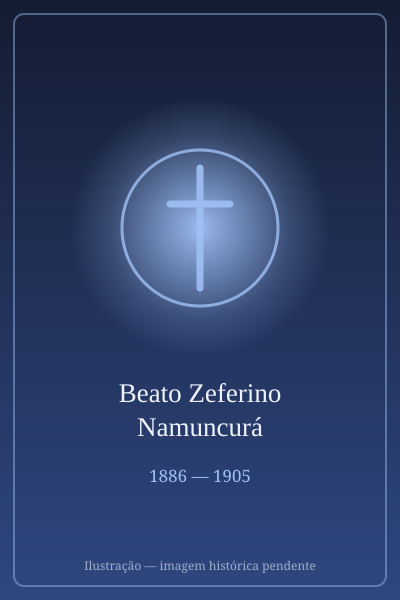

# Beato Zeferino Namuncurá

> "O lírio da Patagônia."

- **Nascimento:** 26 de agosto de 1886, Chimpay, Argentina
- **Morte:** 11 de maio de 1905, Roma, Itália
- **Beatificação:** 2007, pelo Papa Bento XVI
- **Festa Litúrgica:** 26 de agosto

<TextToSpeech />

---

## Biografia

Ceferino Namuncurá nasceu em 26 de agosto de 1886, em Chimpay, à beira do rio Negro, na Patagônia argentina. Era filho de Manuel Namuncurá, o último grande cacique mapuche a resistir ao avanço do Estado argentino na chamada Conquista do Deserto, e de Rosario Burgos. Nasceu, portanto, no momento em que seu povo perdia terras e autonomia.

Aos onze anos foi levado a Buenos Aires para estudar. Depois de uma experiência difícil numa escola estatal, o pai pediu aos salesianos que o acolhessem, e ele entrou no Colégio Pio IX de Almagro. Ali encontrou seu caminho: quis tornar-se sacerdote, dizendo que queria "ser útil ao meu povo". Aprendeu rapidamente, tocava instrumentos e destacava-se pela alegria e pela disciplina.

Adoeceu de tuberculose. Buscando um clima melhor e melhores condições de estudo, foi levado por Monsenhor Cagliero à Itália em 1904. Estudou em Turim e Roma, chegou a ser recebido em audiência pelo Papa Pio X e ingressou no colégio salesiano de Villa Sora, em Frascati. A doença, porém, avançou. Morreu no Hospital Fatebenefratelli, na Ilha Tiberina, em Roma, em 11 de maio de 1905, aos dezoito anos.

## Vida Pessoal e Espiritualidade

Ceferino é lembrado como *el lirio de la Patagonia*. Seu propósito era claro e repetido nas cartas: preparar-se para voltar e servir aos mapuches. Sua espiritualidade era a salesiana de Dom Bosco — alegria, trabalho e devoção a Maria Auxiliadora. Foi beatificado em Chimpay, sua terra natal, em 11 de novembro de 2007, diante de dezenas de milhares de pessoas, muitas delas indígenas.

## Milagres

O milagre reconhecido para a beatificação foi a cura de Valeria Herrera, uma mulher argentina de Córdoba que em 2000 sofria de um carcinoma uterino avançado com metástases e se restabeleceu de modo inexplicável após orações à sua intercessão. Bento XVI autorizou o decreto em 2007.

## Curiosidades

1. **Filho do último cacique:** seu pai, Manuel Namuncurá, foi o principal líder mapuche na resistência final à ocupação da Patagônia.
2. **Repatriado em 2009:** seus restos, sepultados na Itália e depois em Fortín Mercedes, foram transladados para Chimpay, atendendo a um pedido antigo das comunidades mapuches.
3. **Devoção popular:** é um dos beatos mais venerados da Argentina, com forte presença entre povos indígenas do Cone Sul.
4. **Padroeiro:** invocado pelos jovens indígenas, pelos estudantes e pelos doentes de tuberculose.

## Cidades por onde passou

Nasceu em Chimpay, na Patagônia argentina, estudou em Buenos Aires, viajou para a Itália e morreu em Roma; seus restos repousam hoje novamente em Chimpay.

<MiracleMap :items='[
  { lat: -39.1667, lng: -66.15, type: "nascimento", title: "Chimpay", description: "Local de nascimento e peregrinação na Argentina." },
  { lat: 41.9028, lng: 12.4964, type: "morte", title: "Roma, Itália", description: "Local da morte (11 de maio de 1905)." }
]' />

## Impacto Hoje

Ceferino é a principal figura da inculturação do Evangelho entre os povos originários do Cone Sul e um símbolo de dignidade indígena para as comunidades mapuches. Sua beatificação, celebrada em território patagônico e com participação de lideranças indígenas, e o traslado de seus restos em 2009 tornaram-se marcos do reconhecimento dessa memória. O santuário de Chimpay recebe romarias todos os anos em agosto.
