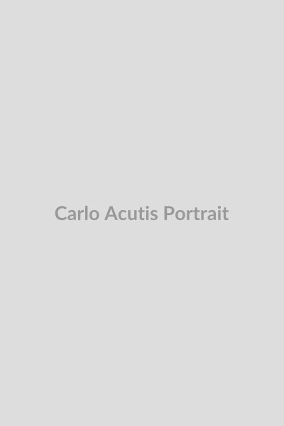

# Beato Carlo Acutis

> "A Eucaristia é a minha autoestrada para o céu."

**Nascimento**: 3 de maio de 1991 
**Morte**: 12 de outubro de 2006 
**Beatificação**: 10 de outubro de 2020 
**Festa Litúrgica**: 12 de outubro 

<TextToSpeech />

## Biografia

Carlo Acutis nasceu em Londres, no Reino Unido, de pais italianos, e pouco depois sua família mudou-se para Milão, na Itália. Desde cedo, demonstrou uma profunda devoção religiosa e um grande interesse pela informática. Ele utilizou seu talento com a tecnologia para criar um site catalogando todos os milagres eucarísticos reconhecidos pelo mundo, sendo frequentemente chamado de "O padroeiro da internet" e o primeiro beato "millennial".

Apesar de vir de uma família não muito praticante na época, o amor de Carlo pela Eucaristia e pela Virgem Maria contagiou todos ao seu redor. Ajudava os pobres, defendia os amigos vítimas de bullying e vivia uma vida adolescente comum, mas profundamente enraizada em sua fé cristã. Em outubro de 2006, aos 15 anos, foi diagnosticado com leucemia aguda (tipo M3), oferecendo seus sofrimentos por Deus, pelo Papa e pela Igreja. Faleceu poucos dias depois, deixando um grande testemunho de fé juvenil.

## Milagres

O milagre que levou à beatificação de Carlo Acutis ocorreu no Brasil, no dia 12 de outubro de 2013. Um menino de quatro anos, chamado Matheus, natural de Campo Grande (Mato Grosso do Sul), que sofria de uma grave anomalia congênita no pâncreas (pâncreas anular), foi curado miraculosamente após tocar em uma relíquia de Carlo Acutis (um pedaço de sua camiseta) e pedir: "Para parar de vomitar". A anomalia no pâncreas, que não permitia que ele se alimentasse de comida sólida, desapareceu completamente.

Um segundo milagre reconhecido, que abriu caminho para a sua futura canonização, envolveu uma jovem costarriquenha que se recuperou de um grave trauma craniano em 2022, após sua mãe orar no túmulo de Carlo, em Assis.

## Curiosidades

* **Padroeiro da Internet**: Carlo tinha um dom extraordinário para a programação e criou exposições virtuais de milagres eucarísticos, aparições marianas e anjos, que viajaram o mundo inteiro em formato de exposição física após a sua morte.
* **Corpo intacto**: Quando seu túmulo foi aberto em Assis, seu corpo foi encontrado em estado de conservação extraordinário e atualmente está exposto à veneração usando roupas normais de adolescente: jeans, um moletom e tênis Nike.
* **Amigo dos pobres**: Usava suas mesadas para comprar sacos de dormir e alimentos para os moradores de rua que viviam próximos a sua casa em Milão.

## Cidades por onde passou

* Londres, Reino Unido (Nascimento)
* Milão, Itália (Cresceu e viveu)
* Assis, Itália (Passava as férias e pediu para ser enterrado)

## Impacto Hoje

Hoje, Carlo Acutis é um dos beatos mais populares e influentes entre os jovens, mostrando que é possível ser santo usando a internet e a tecnologia de maneira positiva, servindo como uma grande inspiração. Ele modernizou o conceito de santidade e mostra que ela é alcançável nos dias atuais, vivendo de forma simples, alegre e focada no serviço. A sua exposição de Milagres Eucarísticos continua a ser visitada por milhões ao redor do globo.

<MiracleMap :items="[
  { title: 'Londres, Reino Unido', description: 'Nascimento de Carlo Acutis.', lat: 51.5074, lng: -0.1278 },
  { title: 'Milão, Itália', description: 'Viveu a maior parte de sua vida.', lat: 45.4642, lng: 9.1900 },
  { title: 'Assis, Itália', description: 'Túmulo exposto e local de peregrinação.', lat: 43.0758, lng: 12.6186 },
  { title: 'Campo Grande, Brasil', description: 'Local do milagre da beatificação de Matheus.', lat: -20.4428, lng: -54.6464 }
]" />
