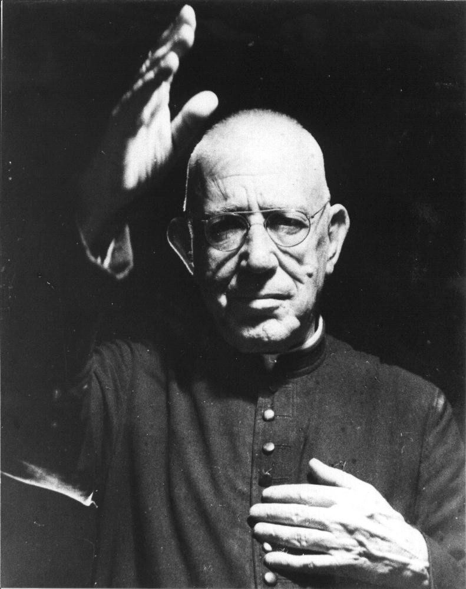
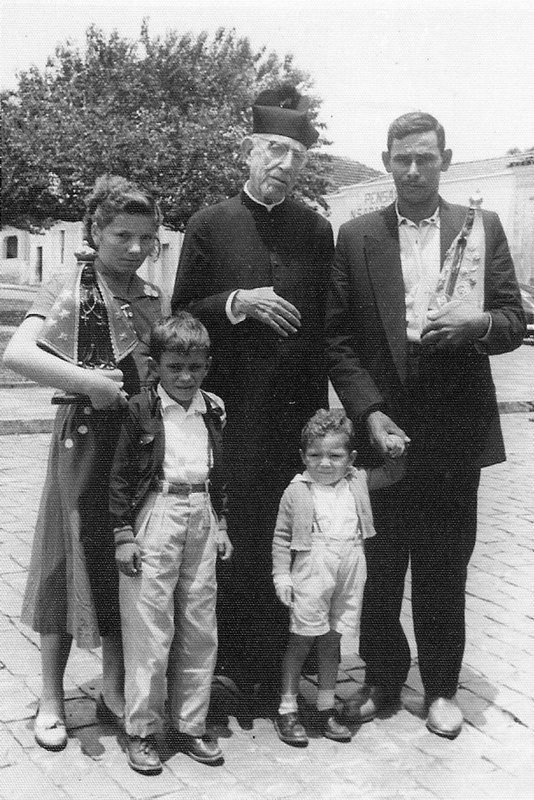
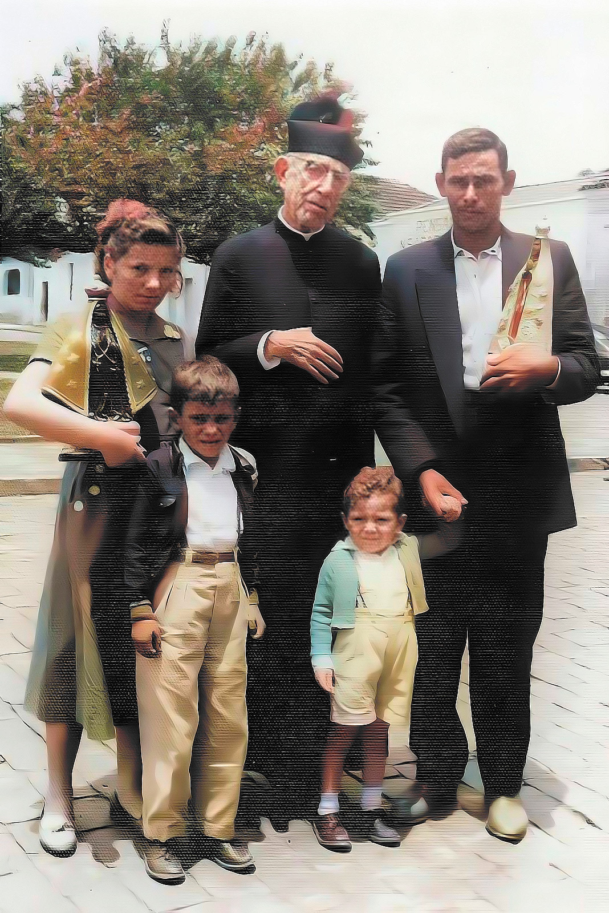
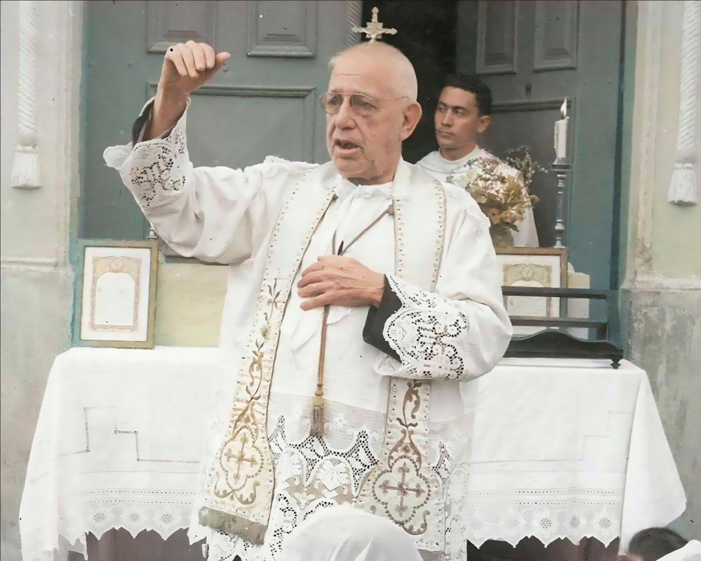

# Padre Donizetti Tavares de Lima

**"O Taumaturgo de Tambaú"**

**Nascimento:** 3 de janeiro de 1882, Cássia (MG)
**Morte:** 16 de junho de 1961, Tambaú (SP)
**Festa Litúrgica:** 16 de junho
**Beatificação:** 23 de novembro de 2019, pelo Papa Francisco

---

Padre Donizetti Tavares de Lima foi um proeminente sacerdote católico brasileiro conhecido não apenas por sua devoção religiosa, mas também por sua influência e história de vida marcantes. Neste documento, exploraremos sua biografia e algumas curiosidades interessantes sobre ele.

## Biografia

Nascido em 3 de janeiro de 1882, em Cássia, Minas Gerais, Padre Donizetti era o filho de família humilde. Desde cedo, ele demonstrou uma inclinação para a fé e o serviço religioso. Foi ordenado sacerdote em 12 de julho de 1908, e sua jornada espiritual o levou a vários locais.

### Tambaú

Uma parte significativa da vida de Padre Donizetti foi dedicada à cidade de Tambaú, em São Paulo. Foi lá que ele estabeleceu sua presença pastoral e desenvolveu um profundo vínculo com a comunidade local.

## Curiosidades

A vida de Padre Donizetti é repleta de curiosidades e eventos notáveis:

### Humildade e Compromisso

- Padre Donizetti era conhecido por sua humildade e devoção à fé. Ele viveu uma vida simples, apesar de sua crescente fama como sacerdote.

### Atração de Fiéis

- Sua carisma e dedicação atraíram inúmeros fiéis, que buscavam suas bênçãos e conselhos espirituais.

### O Dom das Bênçãos

- Padre Donizetti distribuía bênçãos diariamente da janela de sua casa, tornando-se uma figura central na vida espiritual da cidade.

### Beatificação

- Padre Donizetti foi beatificado pela Igreja Católica, um reconhecimento de sua importância espiritual e devoção à causa religiosa.

### Legado Duradouro

- Mesmo após sua morte em 1961, o legado de Padre Donizetti continua a influenciar e inspirar as gerações atuais, mantendo viva a memória de seu compromisso com a fé e o serviço à comunidade.

Padre Donizetti de Tambaú é lembrado não apenas por seus serviços religiosos, mas também por sua humildade, carisma e dedicação àqueles que buscavam apoio espiritual em sua presença.

*[Fonte de Referência](https://pt.wikipedia.org/wiki/Donizetti_Tavares_de_Lima)*

## Milagres

Ao longo de sua vida e mesmo após sua morte, diversos milagres foram atribuídos à intercessão do Padre Donizetti. Abaixo, alguns dos mais notáveis:

### Bilocação

- **Descrição:** Este é um fenômeno no qual uma pessoa aparece em dois lugares ao mesmo tempo. Há relatos de que o Padre Donizetti foi visto em locais diferentes ao mesmo tempo.
- **Referência:** [Wikipedia - Donizetti Tavares de Lima](https://pt.wikipedia.org/wiki/Donizetti_Tavares_de_Lima)

## Milagre do Braguinha

- **Descrição:** Braguinha era um famoso jogador que sofria de osteocondrite, uma doença que ataca ossos e articulações causando rigidez dos movimentos e dor. Ele andava com aparelho nas pernas até que, após um milagre atribuído ao Padre Donizetti, ele foi visto jogando futebol instantes após o milagre.
- **Referência:** [Idemais - Conheça a curiosa história do Padre Donizetti](https://idemais.com.br/noticias/conheca-a-curiosa-historia-do-padre-donizetti/)

## Milagre da Corrente

- **Descrição:** Este milagre envolveu uma menina que estava muito agitada e gritando. Quando os pais da menina removeram uma corrente a pedido do Padre Donizetti, a menina se acalmou e parou de gritar.
- **Referência:** [O Município - Beatificação de Padre Donizetti traz à tona milagres atribuídos ao sacerdote](https://www.omunicipio.jor.br/wordpress/2019/04/12/beatificacao-de-padre-donizetti-traz-a-tona-milagres-atribuidos-ao-sacerdote/)

Padre Donizetti distribuía bênçãos diariamente da janela de sua casa, atraindo milhares de fiéis que buscavam cura física e espiritual. Ele atribuía os milagres à intercessão de Nossa Senhora Aparecida e dizia: "Eu não curo ninguém. Quem cura é Deus."

## Levitação

- **Descrição:** Há relatos de que o Padre Donizetti foi visto levitando, ou seja, elevando-se do chão contra a força da gravidade.
- **Referência:** [Wikipedia - Donizetti Tavares de Lima](https://pt.wikipedia.org/wiki/Donizetti_Tavares_de_Lima)

## Milagre da Cura de um Menino com Pé Torto Congênito Bilateral

- **Descrição:** Este milagre foi responsável pela beatificação do Padre Donizetti. O menino, Bruno Henrique Arruda de Oliveira, nasceu com uma deformidade que atinge os membros inferiores, conhecida como "pé torto congênito bilateral." A cura foi instantânea, completa, duradoura e inexplicável à luz da medicina.
- **Referência:** [G1 Globo - Milagres do Padre Donizetti: conheça a cura reconhecida pela Igreja e outros 2 relatos de fiéis](https://g1.globo.com/sp/sao-carlos-regiao/noticia/2019/11/20/milagres-do-padre-donizetti-conheca-a-cura-reconhecida-pela-igreja-e-outros-2-relatos-de-fieis.ghtml)

## Milagre do Vendedor de Vinho

- **Descrição:** Um vendedor de vinhos que sofria de problemas nas articulações do joelho solicitou uma bênção ao Padre Donizetti e obteve sua cura.
- **Referência:** [Poços Ja - Padre Donizetti será beatificado por milagre em vendedor de Poços de Caldas](https://www.pocosja.com.br/cidade/2019/04/08/padre-donizetti-sera-beatificado-por-milagre-em-vendedor-de-pocos-de-caldas/)

## O Milagre da Velha Milionária (Milagre de Tambaú)

- **Descrição:** Este é provavelmente o milagre mais famoso, e até acabou se tornando música: o milagre da velha milionária, ou "milagre de Tambaú," como ficou conhecido. Uma senhora rica que tinha que usar muletas foi até o Padre e após receber a bênção ficou curada. Como gratidão, quis entregar ao Padre um bracelete de ouro e diamantes, o qual Padre Donizetti não aceitou e recomendou-lhe que o oferecesse à primeira pessoa que encontrasse no caminho. A primeira pessoa que encontrou foi uma mendiga negra e muito pobre e, por isso, em vez de dar o bracelete deu 5 réis. Porém, mais à frente voltou a ficar paralítica. Dizem que essa mulher negra era Nossa Senhora Aparecida.
- **Referência:** [Wikipedia - Donizetti Tavares de Lima](https://pt.wikipedia.org/wiki/Donizetti_Tavares_de_Lima)

## Milagre da Ressurreição de uma Criança

- **Descrição:** Um milagre relatado por Antônio Cândido de Souza, que narrou que seu filho, Alberto Luiz de Souza, voltou à vida após estar morto durante 10 minutos, pela invocação do nome de Nossa Senhora Aparecida e do Padre Donizetti.
- **Referência:** [Jornal da Franca - Padre Donizetti: um dos nomes mais conhecidos da igreja morou em Franca](https://www.jornaldafranca.com.br/padre-donizetti-um-dos-nomes-mais-conhecidos-da-igreja-morou-em-franca/)

## Galeria de Imagens e Restaurações

| Original | Restaurada/Colorizada |
| :---: | :---: |
|  |  |
|  |  |
|  |  |
|  |  |
