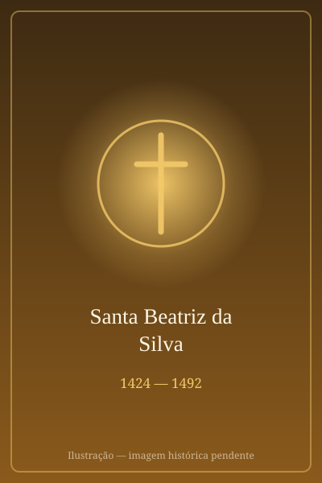

# Santa Beatriz da Silva

> "Nossa Senhora ordenou-me que eu fundasse uma ordem em sua honra, com vestes brancas e azuis."

- **Nascimento:** 1424, Ceuta, Portugal (hoje pertencente à Espanha)
- **Morte:** 16 de agosto de 1492, Toledo, Espanha
- **Canonização:** 3 de outubro de 1976, pelo Papa Paulo VI
- **Festa Litúrgica:** 17 de agosto

<TextToSpeech />

---

## Biografia

Santa Beatriz da Silva nasceu em Ceuta, no Norte de África, numa família nobre portuguesa que era próxima da realeza. Ela era irmã do Beato Amadeu da Silva. Na sua juventude, mudou-se para a corte em Tordesilhas como dama de companhia da rainha Isabel de Portugal, esposa do rei D. João II de Castela.

Beatriz era conhecida por sua extrema beleza, o que gerou ciúmes na rainha Isabel. Segundo a tradição, por ciúmes, a rainha trancou Beatriz num baú ou num quarto escuro e sem comida, com a intenção de que ela morresse. Durante os três dias em que esteve presa, a Virgem Maria apareceu a Beatriz, vestida de branco com um manto azul, segurando o Menino Jesus, e pediu que ela fundasse uma nova ordem religiosa dedicada à sua Imaculada Conceição.

Após ser libertada de forma milagrosa por intervenção do seu tio, Beatriz fugiu para Toledo, ocultando o seu rosto com um véu para o resto da vida, para que sua beleza não causasse mais problemas nem a distraísse do seu compromisso com Deus. Em Toledo, ela viveu cerca de quarenta anos num mosteiro cisterciense sem ser monja, apenas como recolhida, dedicando-se à oração e à penitência.

Mais tarde, com o apoio da rainha Isabel, a Católica (filha da rainha que a havia aprisionado), Beatriz fundou a Ordem da Imaculada Conceição (as Monjas Concepcionistas) em 1484, e recebeu a aprovação papal em 1489. Ela faleceu pouco antes da profissão religiosa formal de sua comunidade.

## Milagres

Em vida, Beatriz vivenciou a aparição de Nossa Senhora enquanto estava aprisionada pela Rainha Isabel de Portugal, e segundo a tradição, Nossa Senhora lhe forneceu luz e alimento místico durante aqueles dias. Ela também relatou outras visões de Maria e do Menino Jesus.

Quando Beatriz estava no leito de morte, foi relatado que, ao tirarem o véu do seu rosto para administrar a unção dos enfermos, o seu rosto irradiou uma luz brilhante e uma estrela apareceu sobre a sua testa, permanecendo ali até o momento da sua morte.

Para sua canonização em 1976, o milagre reconhecido pelo Papa Paulo VI foi a cura cientificamente inexplicável de um doente grave por intercessão direta de Beatriz da Silva.

## Curiosidades

1.  **Sempre com Véu:** Após fugir da corte de Tordesilhas, cobriu o rosto com um véu branco durante toda a sua vida, para não ser motivo de vaidade ou ciúmes.
2.  **Perdão:** Ela perdoou a rainha Isabel de Portugal que tentou matá-la e, paradoxalmente, foi a filha desta rainha (Isabel, a Católica) quem a ajudou a fundar sua ordem religiosa anos depois.
3.  **Hábito Azul e Branco:** As cores do hábito das monjas Concepcionistas (túnica e escapulário brancos e manto azul) foram indicadas pela própria Nossa Senhora e prefiguram o dogma da Imaculada Conceição, proclamado séculos mais tarde.

## Impacto Hoje

Santa Beatriz da Silva é lembrada por seu profundo amor e devoção à Imaculada Conceição de Maria, muito antes de o dogma ser oficialmente proclamado pela Igreja. A Ordem da Imaculada Conceição que ela fundou espalhou-se rapidamente e ainda hoje existem centenas de mosteiros concepcionistas pelo mundo, dedicados à oração contemplativa e à honra da pureza de Maria.

## Cidades por onde passou

<MiracleMap :items='[
  { lat: 35.8894, lng: -5.3213, type: "nascimento", title: "Ceuta, Portugal/Espanha", description: "Local de nascimento de Santa Beatriz, em uma nobre família portuguesa." },
  { lat: 41.5008, lng: -5.0006, type: "vida", title: "Tordesilhas, Espanha", description: "Onde serviu como dama de companhia e onde foi trancada e teve a visão de Nossa Senhora." },
  { lat: 39.8628, lng: -4.0273, type: "morte", title: "Toledo, Espanha", description: "Onde se refugiou, viveu em oração, fundou a Ordem da Imaculada Conceição e onde faleceu." }
]' />
